# 03 資料模型設計

版本 v0.2 | 日期 2026-06-02 | 狀態 draft | 對應 PRD v0.3 | 專案 synergy（repo 根）

---

## 目錄

1. [設計原則](#1-設計原則)
2. [ER 圖](#2-er-圖)
3. [逐表定義](#3-逐表定義)
   - 3.1 tenants
   - 3.2 distributors
   - 3.3 brands
   - 3.4 brand_products
   - 3.5 contacts
   - 3.6 contact_interactions
   - 3.7 life_events
   - 3.8 samples
   - 3.9 sample_followups
   - 3.10 message_drafts
   - 3.11 voice_clips
   - 3.12 objection_templates
   - 3.13 objection_responses
   - 3.14 questionnaire_templates
   - 3.15 questionnaire_links
   - 3.16 questionnaire_responses
   - 3.17 recruitment_stages
   - 3.18 compliance_lexicon
   - 3.19 compliance_checks
   - 3.20 emotion_readings
   - 3.21 salesy_alerts
   - 3.22 today_tasks
   - 3.23 learning_logs
   - 3.24 consents
   - 3.25 data_requests
   - 3.26 subscriptions
   - 3.27 usage_quotas
   - 3.28 official_accounts
   - 3.29 inbound_messages
4. [pgvector 用途](#4-pgvector-用途)
5. [租戶隔離策略](#5-租戶隔離策略)
6. [資料分類與合規](#6-資料分類與合規)
7. [索引與效能](#7-索引與效能)
8. [遷移策略](#8-遷移策略)

---

## 1. 設計原則

### 1.1 多租戶 + 品牌無關抽象

Care Copilot 從 Day 1 採用「品牌無關（brand-agnostic）」的資料模型設計，雖然 Phase I Pilot 僅服務 Synergy 一個品牌，但租戶（tenant）與品牌（brand）概念從一開始就分離，避免未來擴展時大規模重構。

```
tenant（品牌總部租戶）
  └── brand（旗下品牌，可多個）
        └── brand_products（品牌產品清單）
              └── 合規可宣稱清單（allowed_claims）
distributor（直銷商，屬於 tenant）
  └── contacts（活檔案，屬於 distributor + tenant）
```

**三層隔離原則**：

| 層次 | 隔離機制 | 說明 |
|---|---|---|
| 租戶層 | `tenant_id` + RLS | 不同品牌/公司的資料完全隔離 |
| 直銷商層 | `distributor_id` + RLS | 同一租戶內不同直銷商資料隔離 |
| 客戶層 | contacts.distributor_id | 活檔案歸屬單一直銷商，不共享 |

v1 不建品牌後台 UI，`tenants` / `brands` / `brand_products` 由管理員直接操作資料庫或透過後台 seed 腳本建立。

### 1.2 活檔案欄位可空、漸進累積

`contacts` 表所有非必要欄位（`health_concerns`、`family_info`、`job_info`、`interests` 等）設計為 **nullable**，允許直銷商邊使用邊補資料。系統不強制填完欄位才能使用其他功能。

```
建立 contact 時最少只需要：display_name（必填）
其他欄位由以下四種入口漸進累積：
  1. 手動填寫（前端表單）
  2. 貼上 LINE 對話文字（POST /contacts/{id}/parse-text）
  3. 上傳截圖（POST /contacts/{id}/parse-image）
  4. 語音備忘（POST /contacts/{id}/parse-audio）
```

### 1.3 草稿模式硬限制（不可違反）

資料模型中所有草稿類型（`message_drafts`、`voice_clips`、`objection_responses` 的回應欄位）**只存草稿內容，永遠不存「已發送」狀態**。`adopted` 欄位代表「直銷商已複製使用」，而非「系統已代送」。後端不存在任何「自動發送」的欄位或狀態值。

### 1.4 合規掃描 100% 記錄

所有外送草稿類型在直銷商取得前，必須先通過 `compliance_sidecar`，結果寫入 `compliance_checks`。此表為稽核依據，保留期不得低於 3 年（見第 6 章）。

### 1.5 AI 層整合介面（沿用既有框架，本次不重新設計）

資料模型為 AI 層提供以下掛載點：

| 掛載點 | 資料表 | AI 層讀取欄位 | AI 層寫入欄位 |
|---|---|---|---|
| 活檔案 Insight 生成 | contacts | health_concerns, family_info, job_info, interests, contact_embedding | — |
| 情緒感測輸入 | contact_interactions | summary, raw_input | → emotion_readings |
| 草稿生成上下文 | contacts + contact_interactions | 最近 5 筆 summary | → message_drafts |
| 合規掃描 | compliance_lexicon | term, risk_level, category | → compliance_checks |
| 學習紀錄寫入 | learning_logs | — | event_type, metadata |
| 成本計量 | usage_quotas | ai_cost_usd_today | ai_cost_usd_today（累加） |

---

## 2. ER 圖

以下 Mermaid erDiagram 涵蓋全部 29 個實體及其關係（含 LINE 整合的 official_accounts、inbound_messages）。為可讀性，省略部分索引欄位，完整欄位定義見第 3 章。

```mermaid
erDiagram
    tenants {
        uuid id PK
        text name
        text slug
        text plan
        boolean is_active
        timestamptz created_at
        timestamptz updated_at
    }

    distributors {
        uuid id PK
        uuid tenant_id FK
        text email
        text password_hash
        text display_name
        text role
        text plan
        timestamptz plan_expires_at
        boolean is_active
        integer care_streak
        timestamptz created_at
        timestamptz updated_at
    }

    brands {
        uuid id PK
        uuid tenant_id FK
        text name
        text industry
        text compliance_lexicon_version
        timestamptz created_at
    }

    brand_products {
        uuid id PK
        uuid brand_id FK
        uuid tenant_id FK
        text name
        text sku
        text_arr allowed_claims
        boolean is_active
        timestamptz created_at
    }

    contacts {
        uuid id PK
        uuid distributor_id FK
        uuid tenant_id FK
        text display_name
        text phone
        text_arr health_concerns
        jsonb family_info
        jsonb job_info
        text_arr interests
        text communication_pref
        text relationship_type
        timestamptz last_interaction_at
        timestamptz dormant_since
        text recruitment_stage
        text current_emotion
        timestamptz emotion_updated_at
        integer salesy_streak_count
        vector contact_embedding
        boolean is_archived
        text line_user_id
        text source
        timestamptz assigned_at
        timestamptz created_at
        timestamptz updated_at
    }

    contact_interactions {
        uuid id PK
        uuid contact_id FK
        uuid distributor_id FK
        uuid tenant_id FK
        text interaction_type
        text channel
        text summary
        text raw_input
        boolean is_salesy
        boolean ai_processed
        timestamptz occurred_at
        timestamptz created_at
    }

    life_events {
        uuid id PK
        uuid contact_id FK
        uuid distributor_id FK
        uuid tenant_id FK
        text event_type
        date event_date
        text description
        boolean is_recurring
        text source
        timestamptz notified_at
        timestamptz created_at
    }

    samples {
        uuid id PK
        uuid contact_id FK
        uuid distributor_id FK
        uuid tenant_id FK
        uuid product_id FK
        text product_name
        timestamptz sent_at
        text status
        boolean converted
        timestamptz converted_at
        text notes
        timestamptz created_at
        timestamptz updated_at
    }

    sample_followups {
        uuid id PK
        uuid sample_id FK
        uuid tenant_id FK
        timestamptz followup_at
        text followup_type
        text status
        uuid draft_id FK
        timestamptz notified_at
        timestamptz created_at
    }

    message_drafts {
        uuid id PK
        uuid contact_id FK
        uuid distributor_id FK
        uuid tenant_id FK
        text tone
        text channel
        text content
        jsonb prompt_context
        text compliance_status
        uuid compliance_check_id FK
        boolean adopted
        timestamptz adopted_at
        text model_used
        integer latency_ms
        timestamptz sent_at
        text delivery_method
        text line_message_id
        uuid in_reply_to_inbound_id FK
        timestamptz created_at
    }

    voice_clips {
        uuid id PK
        uuid draft_id FK
        uuid distributor_id FK
        uuid tenant_id FK
        text voice_style
        text language
        integer duration_seconds
        text storage_url
        text provider
        numeric cost_usd
        timestamptz downloaded_at
        timestamptz expires_at
        timestamptz created_at
    }

    objection_templates {
        uuid id PK
        uuid tenant_id FK
        text key
        text label_zh
        text description
        boolean is_active
        integer sort_order
    }

    objection_responses {
        uuid id PK
        uuid contact_id FK
        uuid distributor_id FK
        uuid tenant_id FK
        uuid objection_template_id FK
        text objection_text
        text response_empathy
        text response_question
        text response_invite
        text adopted_style
        timestamptz adopted_at
        text model_used
        timestamptz created_at
    }

    questionnaire_templates {
        uuid id PK
        uuid tenant_id FK
        text name
        text version
        jsonb questions
        boolean is_active
        timestamptz created_at
    }

    questionnaire_links {
        uuid id PK
        uuid template_id FK
        uuid contact_id FK
        uuid distributor_id FK
        uuid tenant_id FK
        text token
        timestamptz expires_at
        timestamptz filled_at
        boolean is_active
        timestamptz created_at
    }

    questionnaire_responses {
        uuid id PK
        uuid link_id FK
        uuid contact_id FK
        uuid tenant_id FK
        jsonb answers
        text ai_summary
        text care_angle
        text compliance_status
        timestamptz submitted_at
        timestamptz processed_at
        timestamptz created_at
    }

    recruitment_stages {
        uuid id PK
        uuid contact_id FK
        uuid distributor_id FK
        uuid tenant_id FK
        text stage
        timestamptz stage_entered_at
        jsonb stage_history
        text notes
        timestamptz updated_at
        timestamptz created_at
    }

    compliance_lexicon {
        uuid id PK
        uuid brand_id FK
        uuid tenant_id FK
        text term
        text risk_level
        text category
        text suggestion
        text version
        boolean is_active
        text reviewed_by
        timestamptz reviewed_at
    }

    compliance_checks {
        uuid id PK
        uuid distributor_id FK
        uuid tenant_id FK
        text source_type
        uuid source_id
        text input_text
        text result
        text_arr triggered_terms
        text suggestion
        integer latency_ms
        boolean overridden
        text override_reason
        timestamptz created_at
    }

    emotion_readings {
        uuid id PK
        uuid contact_id FK
        uuid distributor_id FK
        uuid tenant_id FK
        text input_text
        text emotion
        numeric confidence
        text model_used
        boolean overridden_by_user
        text overridden_emotion
        integer latency_ms
        timestamptz created_at
    }

    salesy_alerts {
        uuid id PK
        uuid contact_id FK
        uuid distributor_id FK
        uuid tenant_id FK
        timestamptz triggered_at
        integer salesy_count
        boolean acknowledged
        boolean dismissed
        text dismiss_reason
        uuid care_draft_id FK
        timestamptz created_at
    }

    today_tasks {
        uuid id PK
        uuid distributor_id FK
        uuid tenant_id FK
        uuid contact_id FK
        date task_date
        integer priority
        text source_type
        uuid source_id
        text reason
        text cta_label
        text status
        timestamptz completed_at
        timestamptz created_at
    }

    learning_logs {
        uuid id PK
        uuid distributor_id FK
        uuid tenant_id FK
        text event_type
        text source_type
        uuid source_id
        jsonb metadata
        timestamptz created_at
    }

    consents {
        uuid id PK
        uuid contact_id FK
        uuid distributor_id FK
        uuid tenant_id FK
        text consent_type
        boolean granted
        text source
        timestamptz granted_at
        timestamptz revoked_at
        timestamptz created_at
    }

    data_requests {
        uuid id PK
        uuid contact_id FK
        uuid distributor_id FK
        uuid tenant_id FK
        text request_type
        text status
        timestamptz due_at
        timestamptz completed_at
        text export_url
        timestamptz created_at
    }

    subscriptions {
        uuid id PK
        uuid distributor_id FK
        uuid tenant_id FK
        text plan
        text status
        timestamptz current_period_start
        timestamptz current_period_end
        numeric amount_usd
        text payment_provider
        text external_subscription_id
        timestamptz created_at
        timestamptz updated_at
    }

    usage_quotas {
        uuid id PK
        uuid distributor_id FK
        uuid tenant_id FK
        date quota_date
        integer contacts_total
        integer drafts_used_today
        integer voice_used_today
        numeric ai_cost_usd_today
        integer drafts_limit
        integer voice_limit
        integer contacts_limit
        numeric cost_limit_usd
        timestamptz created_at
        timestamptz updated_at
    }

    official_accounts {
        uuid id PK
        uuid tenant_id FK
        text provider
        text line_channel_id
        text channel_secret_ref
        text channel_access_token_ref
        integer assignment_cursor
        boolean is_active
        timestamptz created_at
        timestamptz updated_at
    }

    inbound_messages {
        uuid id PK
        uuid tenant_id FK
        uuid official_account_id FK
        uuid contact_id FK
        uuid distributor_id FK
        text line_message_id
        text text
        timestamptz received_at
        text status
        uuid reply_draft_id FK
        timestamptz created_at
    }

    tenants ||--o{ distributors : "has"
    tenants ||--o{ brands : "has"
    tenants ||--o{ brand_products : "has"
    tenants ||--o{ contacts : "scopes"
    tenants ||--o{ compliance_lexicon : "defines"

    distributors ||--o{ contacts : "owns"
    distributors ||--o{ contact_interactions : "logs"
    distributors ||--o{ life_events : "tracks"
    distributors ||--o{ samples : "manages"
    distributors ||--o{ message_drafts : "generates"
    distributors ||--o{ voice_clips : "creates"
    distributors ||--o{ objection_responses : "records"
    distributors ||--o{ questionnaire_links : "issues"
    distributors ||--o{ recruitment_stages : "tracks"
    distributors ||--o{ compliance_checks : "checked_by"
    distributors ||--o{ emotion_readings : "receives"
    distributors ||--o{ salesy_alerts : "receives"
    distributors ||--o{ today_tasks : "has"
    distributors ||--o{ learning_logs : "generates"
    distributors ||--o{ consents : "manages"
    distributors ||--o{ data_requests : "handles"
    distributors ||--o{ subscriptions : "holds"
    distributors ||--o{ usage_quotas : "tracked_by"

    brands ||--o{ brand_products : "lists"
    brands ||--o{ compliance_lexicon : "customizes"

    contacts ||--o{ contact_interactions : "has"
    contacts ||--o{ life_events : "has"
    contacts ||--o{ samples : "receives"
    contacts ||--o{ message_drafts : "receives"
    contacts ||--o{ objection_responses : "triggers"
    contacts ||--o{ questionnaire_links : "sent_to"
    contacts ||--o{ questionnaire_responses : "fills"
    contacts ||--o{ recruitment_stages : "has_one"
    contacts ||--o{ emotion_readings : "has"
    contacts ||--o{ salesy_alerts : "triggers"
    contacts ||--o{ today_tasks : "appears_in"
    contacts ||--o{ consents : "grants"
    contacts ||--o{ data_requests : "requests"

    samples ||--o{ sample_followups : "schedules"
    sample_followups }o--o| message_drafts : "pre_generates"

    message_drafts ||--o{ voice_clips : "voices"
    message_drafts }o--o| compliance_checks : "last_checked_by"

    salesy_alerts }o--o| message_drafts : "pre_generates_care"

    questionnaire_templates ||--o{ questionnaire_links : "uses"
    questionnaire_links ||--o| questionnaire_responses : "fills"

    objection_templates ||--o{ objection_responses : "used_in"

    brand_products }o--o| samples : "referenced_by"

    tenants ||--o{ official_accounts : "has"
    official_accounts ||--o{ inbound_messages : "receives"
    contacts ||--o{ inbound_messages : "sends"
    distributors ||--o{ inbound_messages : "assigned_to"
    inbound_messages }o--o| message_drafts : "reply_drafted_as"
```



---

## 3. 逐表定義

> **通用約束**：
> - 所有 `id` 欄位為 `uuid`，預設值 `gen_random_uuid()`，資料層以前綴區分類型（如 `ctc_`）。假設：前綴透過應用層在 service 建立記錄時拼接，資料庫層儲存純 UUID。
> - 所有 `created_at` 預設 `now()`，不可更新（`IMMUTABLE`）。
> - 所有 `updated_at` 透過 trigger 自動維護。
> - 時區：所有 `timestamptz` 欄位存 UTC。
> - Schema 名稱：`care`（獨立 schema 與 `public` 隔離）。

---

### 3.1 tenants（品牌租戶）

**用途**：多品牌隔離頂層實體，Day 1 抽象，v1 UI 不暴露。一個 tenant 對應一個直銷品牌的組織（如 Synergy Taiwan）。

**ID 前綴**：`tnt_`

```sql
CREATE TABLE care.tenants (
    id          uuid PRIMARY KEY DEFAULT gen_random_uuid(),
    name        text NOT NULL,
    slug        text NOT NULL UNIQUE,
    plan        text NOT NULL DEFAULT 'design_partner'
                CHECK (plan IN ('freemium','pro','pro_plus','leader_team','top_leader','design_partner')),
    is_active   boolean NOT NULL DEFAULT true,
    created_at  timestamptz NOT NULL DEFAULT now(),
    updated_at  timestamptz NOT NULL DEFAULT now()
);
```

| 欄位 | 型別 | 約束 | 說明 |
|---|---|---|---|
| id | uuid | PK | 主鍵 |
| name | text | NOT NULL | 品牌名稱，例：Synergy Taiwan |
| slug | text | NOT NULL, UNIQUE | URL-friendly 識別碼，例：synergy-tw |
| plan | text | NOT NULL, CHECK | 訂閱方案 enum（見 H.7） |
| is_active | boolean | NOT NULL DEFAULT true | 是否啟用 |
| created_at | timestamptz | NOT NULL DEFAULT now() | 建立時間 UTC |
| updated_at | timestamptz | NOT NULL DEFAULT now() | 最後更新 UTC |

**索引**：
- `UNIQUE (slug)`（已含於 DDL）

**RLS Policy**：
- `tenants` 本身不套用 RLS（僅 superadmin 操作）；下游表透過 `tenant_id` FK 強制隔離。

---

### 3.2 distributors（直銷商用戶）

**用途**：直銷商帳號，FastAPI 自建 JWT 認證。同一 tenant 下可有多個 distributor。

**ID 前綴**：`usr_`

```sql
CREATE TABLE care.distributors (
    id               uuid PRIMARY KEY DEFAULT gen_random_uuid(),
    tenant_id        uuid NOT NULL REFERENCES care.tenants(id),
    email            text NOT NULL,
    password_hash    text NOT NULL,
    display_name     text NOT NULL,
    role             text NOT NULL DEFAULT 'distributor'
                     CHECK (role IN ('distributor','leader')),
    phone            text,
    plan             text NOT NULL DEFAULT 'freemium'
                     CHECK (plan IN ('freemium','pro','pro_plus','leader_team','top_leader','design_partner')),
    plan_expires_at  timestamptz,
    is_active        boolean NOT NULL DEFAULT true,
    locale           text NOT NULL DEFAULT 'zh-TW',
    care_streak      integer NOT NULL DEFAULT 0,
    created_at       timestamptz NOT NULL DEFAULT now(),
    updated_at       timestamptz NOT NULL DEFAULT now()
);
```

| 欄位 | 型別 | 約束 | 說明 |
|---|---|---|---|
| id | uuid | PK | 主鍵 |
| tenant_id | uuid | NOT NULL, FK → tenants.id | 所屬租戶，RLS 隔離依據 |
| email | text | NOT NULL | 登入 email（沿用） |
| password_hash | text | NOT NULL | bcrypt 密碼雜湊，FastAPI 自建 JWT 登入用 |
| display_name | text | NOT NULL | 顯示名稱 |
| role | text | NOT NULL, CHECK | distributor / leader |
| phone | text | nullable | 手機（可選） |
| plan | text | NOT NULL, CHECK | 個人訂閱方案 enum |
| plan_expires_at | timestamptz | nullable | 方案到期時間 |
| is_active | boolean | NOT NULL DEFAULT true | 帳號是否啟用 |
| locale | text | NOT NULL DEFAULT 'zh-TW' | 語系 |
| care_streak | integer | NOT NULL DEFAULT 0 | 連續關懷天數（Care Streak） |
| created_at | timestamptz | NOT NULL DEFAULT now() | — |
| updated_at | timestamptz | NOT NULL DEFAULT now() | — |

**索引**：
```sql
CREATE INDEX idx_distributors_tenant_id ON care.distributors(tenant_id);
CREATE UNIQUE INDEX idx_distributors_email ON care.distributors(email);
```

**RLS Policy**：
```sql
-- 直銷商只能讀取自己的記錄
CREATE POLICY dist_select ON care.distributors
    FOR SELECT USING (
        id = current_setting('app.current_tenant_id', true)::uuid
    );

-- 直銷商只能更新自己的記錄
CREATE POLICY dist_update ON care.distributors
    FOR UPDATE USING (
        id = current_setting('app.current_tenant_id', true)::uuid
    );
```
後端在每次交易開始時注入：三個 session 變數 `app.current_tenant_id` / `app.current_distributor` / `app.current_role`（見 §5.1）；應用以非 BYPASSRLS 的 DB role 連線。

---

### 3.3 brands（品牌）

**用途**：直銷商歸屬的品牌（Synergy / doTERRA / Young Living 等）。一個 tenant 可有多個品牌（例：Synergy 旗下分拆不同產品線）。

**ID 前綴**：`brd_`

```sql
CREATE TABLE care.brands (
    id                          uuid PRIMARY KEY DEFAULT gen_random_uuid(),
    tenant_id                   uuid NOT NULL REFERENCES care.tenants(id),
    name                        text NOT NULL,
    industry                    text NOT NULL DEFAULT 'health_direct_sales',
    compliance_lexicon_version  text NOT NULL DEFAULT 'v1.0',
    created_at                  timestamptz NOT NULL DEFAULT now()
);
```

| 欄位 | 型別 | 約束 | 說明 |
|---|---|---|---|
| id | uuid | PK | 主鍵 |
| tenant_id | uuid | NOT NULL, FK | 所屬租戶 |
| name | text | NOT NULL | 品牌名稱 |
| industry | text | NOT NULL DEFAULT 'health_direct_sales' | v1 固定 health_direct_sales |
| compliance_lexicon_version | text | NOT NULL | 綁定合規詞庫版本 |
| created_at | timestamptz | NOT NULL DEFAULT now() | — |

**索引**：
```sql
CREATE INDEX idx_brands_tenant_id ON care.brands(tenant_id);
```

**RLS Policy**：
```sql
-- 同租戶下的 distributor 可讀取品牌資料
CREATE POLICY brand_select ON care.brands
    FOR SELECT USING (
        tenant_id = current_setting('app.current_tenant_id', true)::uuid
    );
```

---

### 3.4 brand_products（品牌產品）

**用途**：品牌產品清單，供合規可宣稱清單與草稿參考使用。由管理員 seed，不提供直銷商端 UI 編輯。

**ID 前綴**：`prd_`

```sql
CREATE TABLE care.brand_products (
    id              uuid PRIMARY KEY DEFAULT gen_random_uuid(),
    brand_id        uuid NOT NULL REFERENCES care.brands(id),
    tenant_id       uuid NOT NULL REFERENCES care.tenants(id),
    name            text NOT NULL,
    sku             text,
    allowed_claims  text[] NOT NULL DEFAULT '{}',
    is_active       boolean NOT NULL DEFAULT true,
    created_at      timestamptz NOT NULL DEFAULT now()
);
```

| 欄位 | 型別 | 約束 | 說明 |
|---|---|---|---|
| id | uuid | PK | — |
| brand_id | uuid | NOT NULL, FK → brands.id | 所屬品牌 |
| tenant_id | uuid | NOT NULL, FK → tenants.id | RLS 依據 |
| name | text | NOT NULL | 產品名稱 |
| sku | text | nullable | 品牌方 SKU |
| allowed_claims | text[] | NOT NULL DEFAULT '{}' | 合規可宣稱清單（正面清單） |
| is_active | boolean | NOT NULL DEFAULT true | 是否上架 |
| created_at | timestamptz | NOT NULL DEFAULT now() | — |

**索引**：
```sql
CREATE INDEX idx_brand_products_brand_id ON care.brand_products(brand_id);
CREATE INDEX idx_brand_products_tenant_id ON care.brand_products(tenant_id);
```

**RLS Policy**：同 `brands`，同租戶可讀。

---

### 3.5 contacts（活檔案）

**用途**：直銷商的客戶/潛在招募對象，T01 關係記憶活檔案核心實體。欄位設計為可空、漸進累積。

**ID 前綴**：`ctc_`

**PII 標註**：`display_name`、`phone`、`family_info`、`job_info` 為 PII，見第 6 章加密策略。

```sql
CREATE TABLE care.contacts (
    id                   uuid PRIMARY KEY DEFAULT gen_random_uuid(),
    distributor_id       uuid NOT NULL REFERENCES care.distributors(id),
    tenant_id            uuid NOT NULL REFERENCES care.tenants(id),
    display_name         text NOT NULL,
    phone                text,                    -- PII，application-level 加密
    health_concerns      text[] DEFAULT '{}',
    family_info          jsonb DEFAULT '{}',      -- PII
    job_info             jsonb DEFAULT '{}',      -- PII
    interests            text[] DEFAULT '{}',
    communication_pref   text CHECK (communication_pref IN ('line','whatsapp','ig_dm','email')),
    relationship_type    text CHECK (relationship_type IN
                             ('friend','acquaintance','prospect','customer','recruit_prospect')),
    last_interaction_at  timestamptz,
    dormant_since        timestamptz,             -- 30 天無互動自動計算
    recruitment_stage    text CHECK (recruitment_stage IN
                             ('warm_list','exposure','invitation','signed')),
    current_emotion      text CHECK (current_emotion IN ('stressed','neutral','happy')),
    emotion_updated_at   timestamptz,
    salesy_streak_count  integer NOT NULL DEFAULT 0,
    contact_embedding    vector(1536),            -- pgvector，text-embedding-3-small
    is_archived          boolean NOT NULL DEFAULT false,
    line_user_id         text,                    -- LINE OA 內唯一識別碼（nullable）
    source               text NOT NULL DEFAULT 'manual'
                         CHECK (source IN ('line_oa','manual')),
    assigned_at          timestamptz,             -- 輪派指派時間
    created_at           timestamptz NOT NULL DEFAULT now(),
    updated_at           timestamptz NOT NULL DEFAULT now()
);
```

| 欄位 | 型別 | 約束 | 說明 |
|---|---|---|---|
| id | uuid | PK | — |
| distributor_id | uuid | NOT NULL, FK | 擁有者 |
| tenant_id | uuid | NOT NULL, FK | RLS 依據 |
| display_name | text | NOT NULL | 客戶顯示名稱（PII） |
| phone | text | nullable | 手機（PII，加密存） |
| health_concerns | text[] | DEFAULT '{}' | 健康關注標籤陣列 |
| family_info | jsonb | DEFAULT '{}' | 家庭資訊（PII，自由結構） |
| job_info | jsonb | DEFAULT '{}' | 工作資訊（PII，自由結構） |
| interests | text[] | DEFAULT '{}' | 興趣標籤 |
| communication_pref | text | nullable, CHECK | 溝通偏好 enum |
| relationship_type | text | nullable, CHECK | 關係分類 enum |
| last_interaction_at | timestamptz | nullable | 最後互動時間（觸發器自動更新） |
| dormant_since | timestamptz | nullable | 沉睡起始時間（APScheduler 每日計算） |
| recruitment_stage | text | nullable, CHECK | 招募階段 enum |
| current_emotion | text | nullable, CHECK | 情緒感測最新值 enum |
| emotion_updated_at | timestamptz | nullable | 情緒最後更新時間 |
| salesy_streak_count | integer | NOT NULL DEFAULT 0 | 連續推銷則數 |
| contact_embedding | vector(1536) | nullable | 活檔案語意 embedding |
| is_archived | boolean | NOT NULL DEFAULT false | 軟刪除 |
| line_user_id | text | nullable | LINE OA 的 userId（同一 OA 內唯一） |
| source | text | NOT NULL DEFAULT 'manual', CHECK | 來源：line_oa / manual |
| assigned_at | timestamptz | nullable | 輪派指派時間（LINE OA 新客戶輪派時寫入） |
| created_at | timestamptz | NOT NULL DEFAULT now() | — |
| updated_at | timestamptz | NOT NULL DEFAULT now() | — |

**索引**：
```sql
CREATE INDEX idx_contacts_distributor_id ON care.contacts(distributor_id);
CREATE INDEX idx_contacts_tenant_id ON care.contacts(tenant_id);
CREATE INDEX idx_contacts_last_interaction_at ON care.contacts(last_interaction_at);
CREATE INDEX idx_contacts_is_archived ON care.contacts(is_archived) WHERE is_archived = false;
-- pgvector HNSW 索引（語意搜尋）
CREATE INDEX idx_contacts_embedding ON care.contacts
    USING hnsw (contact_embedding vector_cosine_ops)
    WITH (m = 16, ef_construction = 64);
-- LINE OA 來訊時快速查找聯絡人（partial index，只為 line_oa 來源建立）
CREATE UNIQUE INDEX idx_contacts_line_user_id
    ON care.contacts(tenant_id, line_user_id)
    WHERE line_user_id IS NOT NULL;
```

**RLS Policy**：
```sql
-- distributor：只能存取自己的 contacts
CREATE POLICY contact_distributor ON care.contacts
    FOR ALL
    USING (
        current_setting('app.current_role', true) = 'distributor'
        AND distributor_id = current_setting('app.current_distributor', true)::uuid
        AND tenant_id = current_setting('app.current_tenant_id', true)::uuid
    );

-- leader：可讀取同租戶所有 contacts（含改派用），不可跨租戶
CREATE POLICY contact_leader ON care.contacts
    FOR ALL
    USING (
        current_setting('app.current_role', true) = 'leader'
        AND tenant_id = current_setting('app.current_tenant_id', true)::uuid
    );
```

> **session 變數約定**：FastAPI 在每筆 DB 交易開始前注入三個 SET LOCAL：
> - `app.current_tenant_id` = JWT 中的 tenant_id
> - `app.current_distributor` = JWT 中的 distributor_id（JWT sub）
> - `app.current_role` = JWT 中的 role（`distributor` 或 `leader`）
>
> 舊有 `app.current_tenant` 欄位已廢棄，遷移期間兩者並存，待全面切換後移除。

**觸發器**：
```sql
-- 新增 contact_interaction 時自動更新 last_interaction_at
CREATE OR REPLACE FUNCTION care.update_contact_last_interaction()
RETURNS TRIGGER AS $$
BEGIN
    UPDATE care.contacts
    SET last_interaction_at = NEW.occurred_at,
        updated_at = now()
    WHERE id = NEW.contact_id;
    RETURN NEW;
END;
$$ LANGUAGE plpgsql;

CREATE TRIGGER trg_update_contact_last_interaction
AFTER INSERT ON care.contact_interactions
FOR EACH ROW EXECUTE FUNCTION care.update_contact_last_interaction();
```

---

### 3.6 contact_interactions（互動記錄）

**用途**：直銷商與客戶的每次互動紀錄，是活檔案的歷史脈絡來源，也是太業務員計數的依據。

**ID 前綴**：`itr_`

**PII 標註**：`raw_input` 含對話原文，為高敏感 PII，application-level 加密存。

```sql
CREATE TABLE care.contact_interactions (
    id               uuid PRIMARY KEY DEFAULT gen_random_uuid(),
    contact_id       uuid NOT NULL REFERENCES care.contacts(id) ON DELETE CASCADE,
    distributor_id   uuid NOT NULL REFERENCES care.distributors(id),
    tenant_id        uuid NOT NULL REFERENCES care.tenants(id),
    interaction_type text NOT NULL CHECK (interaction_type IN (
                         'message_sent','voice_sent','sample_given','in_person_meet',
                         'call','questionnaire_sent','note_added',
                         'text_parsed','image_parsed','audio_parsed')),
    channel          text CHECK (channel IN ('line','whatsapp','ig_dm','email','in_person','other')),
    summary          text,
    raw_input        text,   -- PII，application-level 加密
    is_salesy        boolean NOT NULL DEFAULT false,
    ai_processed     boolean NOT NULL DEFAULT false,
    occurred_at      timestamptz NOT NULL DEFAULT now(),
    created_at       timestamptz NOT NULL DEFAULT now()
);
```

| 欄位 | 型別 | 約束 | 說明 |
|---|---|---|---|
| id | uuid | PK | — |
| contact_id | uuid | NOT NULL, FK, CASCADE | — |
| distributor_id | uuid | NOT NULL, FK | — |
| tenant_id | uuid | NOT NULL, FK | RLS |
| interaction_type | text | NOT NULL, CHECK | 互動類型 enum（見 H.8） |
| channel | text | nullable, CHECK | 管道 |
| summary | text | nullable | 互動摘要（AI 或手填） |
| raw_input | text | nullable | 原始輸入（PII，加密存） |
| is_salesy | boolean | NOT NULL DEFAULT false | 是否為推銷型互動 |
| ai_processed | boolean | NOT NULL DEFAULT false | 是否已過 AI 處理 |
| occurred_at | timestamptz | NOT NULL DEFAULT now() | 互動發生時間 |
| created_at | timestamptz | NOT NULL DEFAULT now() | — |

**索引**：
```sql
CREATE INDEX idx_contact_interactions_contact_id ON care.contact_interactions(contact_id);
CREATE INDEX idx_contact_interactions_distributor_id ON care.contact_interactions(distributor_id);
CREATE INDEX idx_contact_interactions_occurred_at ON care.contact_interactions(occurred_at DESC);
-- 太業務員計數用：近期推銷則數查詢
CREATE INDEX idx_contact_interactions_salesy ON care.contact_interactions(contact_id, is_salesy, occurred_at DESC);
```

**RLS Policy**：同 `contacts`，`distributor_id = current_setting('app.current_distributor', true)::uuid AND tenant_id = ...`

---

### 3.7 life_events（生活事件）

**用途**：從互動中抽取的客戶生活事件，驅動 T02 生活事件雷達。AI 層（沿用既有框架）負責從 `contact_interactions.raw_input` 抽取事件，寫入此表。

**ID 前綴**：`evt_`

```sql
CREATE TABLE care.life_events (
    id             uuid PRIMARY KEY DEFAULT gen_random_uuid(),
    contact_id     uuid NOT NULL REFERENCES care.contacts(id) ON DELETE CASCADE,
    distributor_id uuid NOT NULL REFERENCES care.distributors(id),
    tenant_id      uuid NOT NULL REFERENCES care.tenants(id),
    event_type     text NOT NULL CHECK (event_type IN (
                       'birthday','anniversary','baby_birth','job_change','health_topic','custom')),
    event_date     date,
    description    text,
    is_recurring   boolean NOT NULL DEFAULT false,
    source         text NOT NULL CHECK (source IN ('manual','ai_extracted','questionnaire')),
    notified_at    timestamptz,
    created_at     timestamptz NOT NULL DEFAULT now()
);
```

| 欄位 | 型別 | 約束 | 說明 |
|---|---|---|---|
| id | uuid | PK | — |
| contact_id | uuid | NOT NULL, FK, CASCADE | — |
| distributor_id | uuid | NOT NULL, FK | — |
| tenant_id | uuid | NOT NULL, FK | RLS |
| event_type | text | NOT NULL, CHECK | 事件類型 enum |
| event_date | date | nullable | 事件日期（可僅年月） |
| description | text | nullable | 事件描述 |
| is_recurring | boolean | NOT NULL DEFAULT false | 是否每年重複 |
| source | text | NOT NULL, CHECK | 來源 |
| notified_at | timestamptz | nullable | 最近一次產生今日卡的時間 |
| created_at | timestamptz | NOT NULL DEFAULT now() | — |

**索引**：
```sql
CREATE INDEX idx_life_events_contact_id ON care.life_events(contact_id);
-- 今日 5 件事生日提醒查詢：往後 7 天有生日的聯絡人
CREATE INDEX idx_life_events_type_date ON care.life_events(event_type, event_date);
```

**RLS Policy**：同 `contacts`

---

### 3.8 samples（樣品記錄）

**用途**：T07 樣品追蹤，記錄樣品發出與結果，建立後自動觸發 `sample_followups` 建立。

**ID 前綴**：`smp_`

```sql
CREATE TABLE care.samples (
    id              uuid PRIMARY KEY DEFAULT gen_random_uuid(),
    contact_id      uuid NOT NULL REFERENCES care.contacts(id) ON DELETE CASCADE,
    distributor_id  uuid NOT NULL REFERENCES care.distributors(id),
    tenant_id       uuid NOT NULL REFERENCES care.tenants(id),
    product_id      uuid REFERENCES care.brand_products(id),
    product_name    text,
    sent_at         timestamptz NOT NULL DEFAULT now(),
    status          text NOT NULL DEFAULT 'sent'
                    CHECK (status IN (
                        'sent','followed_up_48h','followed_up_72h',
                        'followed_up_7d','converted','not_converted','cancelled')),
    converted       boolean NOT NULL DEFAULT false,
    converted_at    timestamptz,
    notes           text,
    created_at      timestamptz NOT NULL DEFAULT now(),
    updated_at      timestamptz NOT NULL DEFAULT now()
);
```

| 欄位 | 型別 | 約束 | 說明 |
|---|---|---|---|
| id | uuid | PK | — |
| contact_id | uuid | NOT NULL, FK, CASCADE | — |
| distributor_id | uuid | NOT NULL, FK | — |
| tenant_id | uuid | NOT NULL, FK | RLS |
| product_id | uuid | nullable, FK → brand_products.id | 可選 |
| product_name | text | nullable | 產品名稱（手填備用） |
| sent_at | timestamptz | NOT NULL DEFAULT now() | 發出時間 |
| status | text | NOT NULL DEFAULT 'sent', CHECK | 樣品狀態 enum（見 H.5） |
| converted | boolean | NOT NULL DEFAULT false | 是否轉換為購買 |
| converted_at | timestamptz | nullable | 轉換時間 |
| notes | text | nullable | 備註 |
| created_at | timestamptz | NOT NULL DEFAULT now() | — |
| updated_at | timestamptz | NOT NULL DEFAULT now() | — |

**索引**：
```sql
CREATE INDEX idx_samples_contact_id ON care.samples(contact_id);
CREATE INDEX idx_samples_distributor_id ON care.samples(distributor_id);
-- 待跟進查詢
CREATE INDEX idx_samples_status ON care.samples(distributor_id, status) WHERE status = 'sent';
```

**RLS Policy**：同 `contacts`

**後置觸發器**（APScheduler 替代方案，假設：v1 用 APScheduler 排程，不用 DB trigger）：
- 建立 sample 後，`sample_service.py` 同步建立三筆 `sample_followups`（48h / 72h / 7d）。

---

### 3.9 sample_followups（樣品跟進提醒）

**用途**：APScheduler 排定的跟進提醒記錄，`followup_at` 到期時觸發今日 5 件事卡片。

**ID 前綴**：`sfu_`

```sql
CREATE TABLE care.sample_followups (
    id             uuid PRIMARY KEY DEFAULT gen_random_uuid(),
    sample_id      uuid NOT NULL REFERENCES care.samples(id) ON DELETE CASCADE,
    tenant_id      uuid NOT NULL REFERENCES care.tenants(id),
    followup_at    timestamptz NOT NULL,
    followup_type  text NOT NULL CHECK (followup_type IN ('h48','h72','d7')),
    status         text NOT NULL DEFAULT 'pending'
                   CHECK (status IN ('pending','notified','snoozed','done')),
    draft_id       uuid REFERENCES care.message_drafts(id),
    notified_at    timestamptz,
    created_at     timestamptz NOT NULL DEFAULT now()
);
```

| 欄位 | 型別 | 約束 | 說明 |
|---|---|---|---|
| id | uuid | PK | — |
| sample_id | uuid | NOT NULL, FK, CASCADE | — |
| tenant_id | uuid | NOT NULL, FK | RLS |
| followup_at | timestamptz | NOT NULL | 計劃提醒時間 |
| followup_type | text | NOT NULL, CHECK | h48 / h72 / d7 |
| status | text | NOT NULL DEFAULT 'pending', CHECK | 狀態 |
| draft_id | uuid | nullable, FK → message_drafts.id | 預生草稿 |
| notified_at | timestamptz | nullable | 實際通知時間 |
| created_at | timestamptz | NOT NULL DEFAULT now() | — |

**索引**：
```sql
-- APScheduler 定期掃描：找到期的 pending followup
CREATE INDEX idx_sample_followups_pending ON care.sample_followups(followup_at)
    WHERE status = 'pending';
```

**RLS Policy**：透過 `sample_id → samples → distributor_id` 間接驗證；或在表上加 `distributor_id` 欄位（假設：為查詢效率，在應用層透過 sample_id JOIN 驗證即可）。

---

### 3.10 message_drafts（訊息草稿）

**用途**：T06 訊息草稿，AI 生成的草稿記錄。所有草稿必須先通過合規掃描才可供直銷商取得。`adopted` 只代表「已複製」，不代表「已發送」。

**ID 前綴**：`dft_`

```sql
CREATE TABLE care.message_drafts (
    id                        uuid PRIMARY KEY DEFAULT gen_random_uuid(),
    contact_id                uuid NOT NULL REFERENCES care.contacts(id),
    distributor_id            uuid NOT NULL REFERENCES care.distributors(id),
    tenant_id                 uuid NOT NULL REFERENCES care.tenants(id),
    tone                      text NOT NULL CHECK (tone IN ('care','casual','business')),
    channel                   text NOT NULL CHECK (channel IN ('line','whatsapp','ig_dm','email','line_oa')),
    content                   text NOT NULL,
    prompt_context            jsonb DEFAULT '{}',
    compliance_status         text NOT NULL DEFAULT 'green'
                              CHECK (compliance_status IN ('green','yellow','red')),
    compliance_check_id       uuid REFERENCES care.compliance_checks(id),
    adopted                   boolean NOT NULL DEFAULT false,
    adopted_at                timestamptz,
    model_used                text CHECK (model_used IN ('haiku-4-5','sonnet-4-6')),
    latency_ms                integer,
    sent_at                   timestamptz,              -- 教練按「發送」並確認後寫入
    delivery_method           text CHECK (delivery_method IN ('manual_copy','line_push')),
    line_message_id           text,                    -- LINE push 成功後回填的 messageId
    in_reply_to_inbound_id    uuid REFERENCES care.inbound_messages(id),  -- 回覆的來訊 FK（nullable）
    created_at                timestamptz NOT NULL DEFAULT now()
);
```

| 欄位 | 型別 | 約束 | 說明 |
|---|---|---|---|
| id | uuid | PK | — |
| contact_id | uuid | NOT NULL, FK | — |
| distributor_id | uuid | NOT NULL, FK | — |
| tenant_id | uuid | NOT NULL, FK | RLS |
| tone | text | NOT NULL, CHECK | care / casual / business |
| channel | text | NOT NULL, CHECK | 目標管道：line / whatsapp / ig_dm / email / line_oa |
| content | text | NOT NULL | 草稿內容 |
| prompt_context | jsonb | DEFAULT '{}' | 生成時使用的上下文摘要 |
| compliance_status | text | NOT NULL DEFAULT 'green', CHECK | 合規燈號 |
| compliance_check_id | uuid | nullable, FK | 最後一次合規檢查 |
| adopted | boolean | NOT NULL DEFAULT false | 是否被採用（複製） |
| adopted_at | timestamptz | nullable | 採用時間 |
| model_used | text | nullable, CHECK | haiku-4-5 / sonnet-4-6 |
| latency_ms | integer | nullable | 生成延遲毫秒 |
| sent_at | timestamptz | nullable | 教練按發送且 LINE push 確認後寫入 |
| delivery_method | text | nullable, CHECK | manual_copy（教練複製貼上）/ line_push（API push） |
| line_message_id | text | nullable | LINE push 成功後回填的 messageId（稽核用） |
| in_reply_to_inbound_id | uuid | nullable, FK → inbound_messages.id | 此草稿是回覆哪則來訊 |
| created_at | timestamptz | NOT NULL DEFAULT now() | — |

**索引**：
```sql
CREATE INDEX idx_message_drafts_contact_id ON care.message_drafts(contact_id);
CREATE INDEX idx_message_drafts_distributor_id ON care.message_drafts(distributor_id, created_at DESC);
-- 採用率統計
CREATE INDEX idx_message_drafts_adopted ON care.message_drafts(distributor_id, adopted);
```

**RLS Policy**：同 `contacts`

---

### 3.11 voice_clips（語音草稿）

**用途**：T08 語音草稿，TTS 生成的語音檔記錄。`storage_url` 為 GCS 物件路徑。語音檔 7 天後由 GCS Object Lifecycle 自動刪除（APScheduler 可作為 fallback）。

**ID 前綴**：`voc_`

```sql
CREATE TABLE care.voice_clips (
    id               uuid PRIMARY KEY DEFAULT gen_random_uuid(),
    draft_id         uuid NOT NULL REFERENCES care.message_drafts(id),
    distributor_id   uuid NOT NULL REFERENCES care.distributors(id),
    tenant_id        uuid NOT NULL REFERENCES care.tenants(id),
    voice_style      text NOT NULL CHECK (voice_style IN ('warm_female','neutral_male')),
    language         text NOT NULL DEFAULT 'zh-TW' CHECK (language IN ('zh-TW','en-US')),
    duration_seconds integer NOT NULL CHECK (duration_seconds <= 60),
    storage_url      text NOT NULL,   -- GCS 物件路徑（7 天 TTL 由 GCS Object Lifecycle 管理）
    provider         text NOT NULL CHECK (provider IN ('openai','elevenlabs')),
    cost_usd         numeric(10,6) NOT NULL DEFAULT 0,
    downloaded_at    timestamptz,
    expires_at       timestamptz NOT NULL,  -- 建立後 7 天
    created_at       timestamptz NOT NULL DEFAULT now()
);
```

| 欄位 | 型別 | 約束 | 說明 |
|---|---|---|---|
| id | uuid | PK | — |
| draft_id | uuid | NOT NULL, FK → message_drafts.id | 來源草稿 |
| distributor_id | uuid | NOT NULL, FK | — |
| tenant_id | uuid | NOT NULL, FK | RLS |
| voice_style | text | NOT NULL, CHECK | warm_female / neutral_male |
| language | text | NOT NULL DEFAULT 'zh-TW', CHECK | zh-TW / en-US |
| duration_seconds | integer | NOT NULL, CHECK (≤ 60) | 語音長度秒 |
| storage_url | text | NOT NULL | GCS 物件路徑（GCS 預設 at-rest 加密） |
| provider | text | NOT NULL, CHECK | openai / elevenlabs |
| cost_usd | numeric(10,6) | NOT NULL DEFAULT 0 | 本次語音成本（成本計量用） |
| downloaded_at | timestamptz | nullable | 直銷商下載時間（採用指標） |
| expires_at | timestamptz | NOT NULL | 儲存到期時間（7 天後，GCS Object Lifecycle 自動刪除） |
| created_at | timestamptz | NOT NULL DEFAULT now() | — |

**索引**：
```sql
CREATE INDEX idx_voice_clips_distributor_id ON care.voice_clips(distributor_id);
-- APScheduler 清理到期語音
CREATE INDEX idx_voice_clips_expires_at ON care.voice_clips(expires_at) WHERE downloaded_at IS NULL;
```

**RLS Policy**：同 `contacts`

---

### 3.12 objection_templates（預設異議庫）

**用途**：T09 快速異議處理器的 10 種預設異議模板。全域模板 `tenant_id = null`；租戶可加自訂模板。

**ID 前綴**：`obt_`

```sql
CREATE TABLE care.objection_templates (
    id          uuid PRIMARY KEY DEFAULT gen_random_uuid(),
    tenant_id   uuid REFERENCES care.tenants(id),  -- null = 全域
    key         text NOT NULL UNIQUE CHECK (key IN (
                    'spouse_oppose','too_expensive','try_first','family_not_support',
                    'effectiveness_doubt','no_time','already_have_product',
                    'mlm_fear','income_doubt','need_think')),
    label_zh    text NOT NULL,
    description text,
    is_active   boolean NOT NULL DEFAULT true,
    sort_order  integer NOT NULL DEFAULT 0
);
```

| 欄位 | 型別 | 約束 | 說明 |
|---|---|---|---|
| id | uuid | PK | — |
| tenant_id | uuid | nullable, FK | null = 全域模板 |
| key | text | NOT NULL, UNIQUE, CHECK | 10 種預設異議識別碼 |
| label_zh | text | NOT NULL | 繁中顯示名稱 |
| description | text | nullable | 異議情境描述 |
| is_active | boolean | NOT NULL DEFAULT true | 是否啟用 |
| sort_order | integer | NOT NULL DEFAULT 0 | 顯示順序 |

**索引**：
```sql
CREATE INDEX idx_objection_templates_tenant ON care.objection_templates(tenant_id, is_active);
```

**RLS Policy**：全域模板（tenant_id IS NULL）所有登入用戶可讀；租戶模板同租戶可讀。

---

### 3.13 objection_responses（異議回應記錄）

**用途**：記錄每次異議處理 AI（沿用既有框架，Haiku 4.5）生成的三種回應，以及直銷商採用哪種。

**ID 前綴**：`obr_`

```sql
CREATE TABLE care.objection_responses (
    id                     uuid PRIMARY KEY DEFAULT gen_random_uuid(),
    contact_id             uuid NOT NULL REFERENCES care.contacts(id),
    distributor_id         uuid NOT NULL REFERENCES care.distributors(id),
    tenant_id              uuid NOT NULL REFERENCES care.tenants(id),
    objection_template_id  uuid REFERENCES care.objection_templates(id),
    objection_text         text NOT NULL,
    response_empathy       text NOT NULL,
    response_question      text NOT NULL,
    response_invite        text NOT NULL,
    adopted_style          text CHECK (adopted_style IN ('empathy','question','invite','none')),
    adopted_at             timestamptz,
    model_used             text DEFAULT 'haiku-4-5',
    created_at             timestamptz NOT NULL DEFAULT now()
);
```

| 欄位 | 型別 | 約束 | 說明 |
|---|---|---|---|
| id | uuid | PK | — |
| contact_id | uuid | NOT NULL, FK | — |
| distributor_id | uuid | NOT NULL, FK | — |
| tenant_id | uuid | NOT NULL, FK | RLS |
| objection_template_id | uuid | nullable, FK | 若為預設異議 |
| objection_text | text | NOT NULL | 異議原文 |
| response_empathy | text | NOT NULL | 共情型回應 |
| response_question | text | NOT NULL | 提問型回應 |
| response_invite | text | NOT NULL | 邀請型回應 |
| adopted_style | text | nullable, CHECK | 採用的風格 |
| adopted_at | timestamptz | nullable | 採用時間 |
| model_used | text | DEFAULT 'haiku-4-5' | 使用模型 |
| created_at | timestamptz | NOT NULL DEFAULT now() | — |

**索引**：
```sql
CREATE INDEX idx_objection_responses_contact_id ON care.objection_responses(contact_id);
CREATE INDEX idx_objection_responses_distributor_id ON care.objection_responses(distributor_id, created_at DESC);
```

**RLS Policy**：同 `contacts`

---

### 3.14 questionnaire_templates（問卷模板）

**用途**：T10 健康問卷的題目模板，v1 一份 12 題標準模板（由管理員 seed）。`questions` 以 jsonb 存題目陣列。

**ID 前綴**：`qtpl_`

```sql
CREATE TABLE care.questionnaire_templates (
    id         uuid PRIMARY KEY DEFAULT gen_random_uuid(),
    tenant_id  uuid NOT NULL REFERENCES care.tenants(id),
    name       text NOT NULL,
    version    text NOT NULL DEFAULT 'v1.0',
    questions  jsonb NOT NULL DEFAULT '[]',
    is_active  boolean NOT NULL DEFAULT true,
    created_at timestamptz NOT NULL DEFAULT now()
);
```

`questions` jsonb 結構範例：
```json
[
  {
    "id": "q01",
    "order": 1,
    "type": "single_choice",
    "text": "您平均每晚睡幾個小時？",
    "options": ["少於 5 小時", "5-6 小時", "7-8 小時", "超過 8 小時"]
  },
  {
    "id": "q02",
    "order": 2,
    "type": "scale",
    "text": "過去一週，您的壓力程度（1=很低，5=很高）",
    "min": 1,
    "max": 5
  }
]
```

**索引**：
```sql
CREATE INDEX idx_questionnaire_templates_tenant ON care.questionnaire_templates(tenant_id, is_active);
```

**RLS Policy**：同租戶可讀；v1 僅管理員可寫。

---

### 3.15 questionnaire_links（問卷連結）

**用途**：直銷商發給客戶的一次性問卷連結，7 天有效，無需登入。`token` 為 URL 查詢參數，客戶端憑此存取問卷。

**ID 前綴**：`qlnk_`

**安全設計**：`token` 為 32-byte 隨機字串（`secrets.token_urlsafe(32)`），不可預測。前端路徑：`/q/{token}`。

```sql
CREATE TABLE care.questionnaire_links (
    id            uuid PRIMARY KEY DEFAULT gen_random_uuid(),
    template_id   uuid NOT NULL REFERENCES care.questionnaire_templates(id),
    contact_id    uuid NOT NULL REFERENCES care.contacts(id),
    distributor_id uuid NOT NULL REFERENCES care.distributors(id),
    tenant_id     uuid NOT NULL REFERENCES care.tenants(id),
    token         text NOT NULL UNIQUE,
    expires_at    timestamptz NOT NULL,  -- 建立後 7 天
    filled_at     timestamptz,
    is_active     boolean NOT NULL DEFAULT true,
    created_at    timestamptz NOT NULL DEFAULT now()
);
```

| 欄位 | 型別 | 約束 | 說明 |
|---|---|---|---|
| id | uuid | PK | — |
| template_id | uuid | NOT NULL, FK | 使用的問卷模板 |
| contact_id | uuid | NOT NULL, FK | 目標客戶 |
| distributor_id | uuid | NOT NULL, FK | 發出者 |
| tenant_id | uuid | NOT NULL, FK | RLS |
| token | text | NOT NULL, UNIQUE | 一次性 token（32-byte 隨機） |
| expires_at | timestamptz | NOT NULL | 到期時間（建立後 7 天） |
| filled_at | timestamptz | nullable | 客戶填完時間（null = 未填） |
| is_active | boolean | NOT NULL DEFAULT true | 是否有效 |
| created_at | timestamptz | NOT NULL DEFAULT now() | — |

**索引**：
```sql
CREATE UNIQUE INDEX idx_questionnaire_links_token ON care.questionnaire_links(token);
CREATE INDEX idx_questionnaire_links_contact_id ON care.questionnaire_links(contact_id);
```

**RLS Policy**：
```sql
-- 直銷商可讀取自己發出的連結
CREATE POLICY qlink_distributor ON care.questionnaire_links
    FOR SELECT USING (
        distributor_id = current_setting('app.current_distributor', true)::uuid
    );

-- 無需 JWT 的客戶端讀取（透過 token 查詢）
-- 假設：客戶端問卷 API 使用後端 superuser/service role 繞過 RLS，由應用層驗證 token + is_active + expires_at
```

---

### 3.16 questionnaire_responses（問卷回覆）

**用途**：客戶填答的完整回覆，含 AI（沿用既有框架，Sonnet 4.6）生成的摘要與建議。`answers` 以 jsonb 存題目 ID 對答案。

**ID 前綴**：`qrsp_`

```sql
CREATE TABLE care.questionnaire_responses (
    id                 uuid PRIMARY KEY DEFAULT gen_random_uuid(),
    link_id            uuid NOT NULL REFERENCES care.questionnaire_links(id),
    contact_id         uuid NOT NULL REFERENCES care.contacts(id),
    tenant_id          uuid NOT NULL REFERENCES care.tenants(id),
    answers            jsonb NOT NULL DEFAULT '{}',
    ai_summary         text,
    care_angle         text,
    compliance_status  text CHECK (compliance_status IN ('green','yellow','red')),
    submitted_at       timestamptz NOT NULL DEFAULT now(),
    processed_at       timestamptz,
    created_at         timestamptz NOT NULL DEFAULT now()
);
```

| 欄位 | 型別 | 約束 | 說明 |
|---|---|---|---|
| id | uuid | PK | — |
| link_id | uuid | NOT NULL, FK → questionnaire_links.id | — |
| contact_id | uuid | NOT NULL, FK | — |
| tenant_id | uuid | NOT NULL, FK | RLS |
| answers | jsonb | NOT NULL DEFAULT '{}' | `{"q01": "7-8 小時", "q02": 3}` |
| ai_summary | text | nullable | Sonnet 4.6 生成的摘要（合規過濾後） |
| care_angle | text | nullable | 後續建議切角 |
| compliance_status | text | nullable, CHECK | 摘要合規燈號 |
| submitted_at | timestamptz | NOT NULL DEFAULT now() | 提交時間（客戶端） |
| processed_at | timestamptz | nullable | AI 處理完成時間 |
| created_at | timestamptz | NOT NULL DEFAULT now() | — |

**索引**：
```sql
CREATE INDEX idx_questionnaire_responses_contact_id ON care.questionnaire_responses(contact_id);
CREATE UNIQUE INDEX idx_questionnaire_responses_link_id ON care.questionnaire_responses(link_id);
```

**RLS Policy**：透過 `contact_id → contacts → distributor_id` 驗證。

---

### 3.17 recruitment_stages（招募漏斗記錄）

**用途**：T11 招募漏斗的每個聯絡人當前招募階段記錄。與 `contacts` 為 1:1 關係（唯一約束）。

**ID 前綴**：`rcs_`

```sql
CREATE TABLE care.recruitment_stages (
    id                uuid PRIMARY KEY DEFAULT gen_random_uuid(),
    contact_id        uuid NOT NULL REFERENCES care.contacts(id) ON DELETE CASCADE,
    distributor_id    uuid NOT NULL REFERENCES care.distributors(id),
    tenant_id         uuid NOT NULL REFERENCES care.tenants(id),
    stage             text NOT NULL CHECK (stage IN ('warm_list','exposure','invitation','signed')),
    stage_entered_at  timestamptz NOT NULL DEFAULT now(),
    stage_history     jsonb NOT NULL DEFAULT '[]',
    notes             text,
    updated_at        timestamptz NOT NULL DEFAULT now(),
    created_at        timestamptz NOT NULL DEFAULT now(),
    UNIQUE (contact_id)  -- 每位聯絡人只有一個當前招募階段
);
```

`stage_history` jsonb 結構範例：
```json
[
  {"stage": "warm_list", "entered_at": "2026-05-01T08:00:00Z"},
  {"stage": "exposure",  "entered_at": "2026-05-15T10:00:00Z"}
]
```

| 欄位 | 型別 | 約束 | 說明 |
|---|---|---|---|
| id | uuid | PK | — |
| contact_id | uuid | NOT NULL, FK, CASCADE, UNIQUE | 1:1 |
| distributor_id | uuid | NOT NULL, FK | — |
| tenant_id | uuid | NOT NULL, FK | RLS |
| stage | text | NOT NULL, CHECK | 招募階段 enum（見 H.6） |
| stage_entered_at | timestamptz | NOT NULL DEFAULT now() | 進入此階段時間 |
| stage_history | jsonb | NOT NULL DEFAULT '[]' | 歷史階段變更記錄陣列 |
| notes | text | nullable | 備註 |
| updated_at | timestamptz | NOT NULL DEFAULT now() | — |
| created_at | timestamptz | NOT NULL DEFAULT now() | — |

**索引**：
```sql
CREATE INDEX idx_recruitment_stages_distributor_id ON care.recruitment_stages(distributor_id, stage);
```

**RLS Policy**：同 `contacts`

---

### 3.18 compliance_lexicon（合規詞庫）

**用途**：SYS 合規低語的 regex 詞庫，v1 約 50 個高風險詞，法務 review 後生效。純規則引擎，不含 AI（沿用既有框架標註）。

**ID 前綴**：`lex_`

```sql
CREATE TABLE care.compliance_lexicon (
    id           uuid PRIMARY KEY DEFAULT gen_random_uuid(),
    brand_id     uuid REFERENCES care.brands(id),   -- null = 全域適用
    tenant_id    uuid REFERENCES care.tenants(id),  -- null = 全域適用
    term         text NOT NULL,
    risk_level   text NOT NULL CHECK (risk_level IN ('yellow','red')),
    category     text NOT NULL CHECK (category IN (
                     'income_claim','health_claim','efficacy_claim','other')),
    suggestion   text,
    version      text NOT NULL DEFAULT 'v1.0',
    is_active    boolean NOT NULL DEFAULT true,
    reviewed_by  text,
    reviewed_at  timestamptz
);
```

| 欄位 | 型別 | 約束 | 說明 |
|---|---|---|---|
| id | uuid | PK | — |
| brand_id | uuid | nullable, FK | null = 全域適用 |
| tenant_id | uuid | nullable, FK | null = 全域適用 |
| term | text | NOT NULL | 高風險詞或 regex pattern |
| risk_level | text | NOT NULL, CHECK | yellow / red（無 green） |
| category | text | NOT NULL, CHECK | 類別 |
| suggestion | text | nullable | 改寫建議提示 |
| version | text | NOT NULL DEFAULT 'v1.0' | 詞庫版本號 |
| is_active | boolean | NOT NULL DEFAULT true | 是否啟用 |
| reviewed_by | text | nullable | 法務 reviewer |
| reviewed_at | timestamptz | nullable | 法務審核時間 |

**索引**：
```sql
-- compliance sidecar 啟動時載入全部 active 詞庫到記憶體（< 50ms 要求）
CREATE INDEX idx_compliance_lexicon_active ON care.compliance_lexicon(is_active, version) WHERE is_active = true;
```

**RLS Policy**：同租戶（或全域）的 distributor 可讀；僅管理員可寫。

---

### 3.19 compliance_checks（合規檢查記錄）

**用途**：每次合規掃描的完整記錄，100% 寫入（稽核依據）。`compliance_sidecar.py` 為純規則引擎（非 AI），延遲 < 50ms。

**ID 前綴**：`cck_`

```sql
CREATE TABLE care.compliance_checks (
    id                uuid PRIMARY KEY DEFAULT gen_random_uuid(),
    distributor_id    uuid NOT NULL REFERENCES care.distributors(id),
    tenant_id         uuid NOT NULL REFERENCES care.tenants(id),
    source_type       text NOT NULL CHECK (source_type IN (
                          'message_draft','sample_followup','voice_clip',
                          'objection_response','questionnaire_summary','recruitment_draft')),
    source_id         uuid NOT NULL,
    input_text        text NOT NULL,
    result            text NOT NULL CHECK (result IN ('green','yellow','red')),
    triggered_terms   text[] NOT NULL DEFAULT '{}',
    suggestion        text,
    latency_ms        integer,
    overridden        boolean NOT NULL DEFAULT false,
    override_reason   text,
    created_at        timestamptz NOT NULL DEFAULT now()
);
```

| 欄位 | 型別 | 約束 | 說明 |
|---|---|---|---|
| id | uuid | PK | — |
| distributor_id | uuid | NOT NULL, FK | — |
| tenant_id | uuid | NOT NULL, FK | RLS |
| source_type | text | NOT NULL, CHECK | 來源類型 enum |
| source_id | uuid | NOT NULL | 來源記錄 ID（polymorphic FK） |
| input_text | text | NOT NULL | 被掃描的文字 |
| result | text | NOT NULL, CHECK | 合規燈號 |
| triggered_terms | text[] | NOT NULL DEFAULT '{}' | 觸發的高風險詞陣列 |
| suggestion | text | nullable | 改寫建議（紅/黃燈時） |
| latency_ms | integer | nullable | 掃描延遲（< 50ms） |
| overridden | boolean | NOT NULL DEFAULT false | 直銷商是否強制覆蓋黃燈 |
| override_reason | text | nullable | 覆蓋原因 |
| created_at | timestamptz | NOT NULL DEFAULT now() | 稽核時間 |

**保留期**：最短 3 年（見第 6 章），不得刪除（物理刪除需 DBA 審批）。

**索引**：
```sql
CREATE INDEX idx_compliance_checks_distributor_id ON care.compliance_checks(distributor_id, created_at DESC);
CREATE INDEX idx_compliance_checks_result ON care.compliance_checks(result) WHERE result != 'green';
-- source_id polymorphic 查詢
CREATE INDEX idx_compliance_checks_source ON care.compliance_checks(source_type, source_id);
```

**RLS Policy**：直銷商可讀自己的記錄；不可更新/刪除（append-only）。

---

### 3.20 emotion_readings（情緒感測記錄）

**用途**：T03 語氣／情緒感測器，每次情緒判斷記錄。AI 層（沿用既有框架，Haiku 4.5）三檔分類。

**ID 前綴**：`emo_`

```sql
CREATE TABLE care.emotion_readings (
    id                  uuid PRIMARY KEY DEFAULT gen_random_uuid(),
    contact_id          uuid NOT NULL REFERENCES care.contacts(id),
    distributor_id      uuid NOT NULL REFERENCES care.distributors(id),
    tenant_id           uuid NOT NULL REFERENCES care.tenants(id),
    input_text          text NOT NULL,
    emotion             text NOT NULL CHECK (emotion IN ('stressed','neutral','happy')),
    confidence          numeric(3,2) CHECK (confidence BETWEEN 0 AND 1),
    model_used          text DEFAULT 'haiku-4-5',
    overridden_by_user  boolean NOT NULL DEFAULT false,
    overridden_emotion  text CHECK (overridden_emotion IN ('stressed','neutral','happy')),
    latency_ms          integer,
    created_at          timestamptz NOT NULL DEFAULT now()
);
```

| 欄位 | 型別 | 約束 | 說明 |
|---|---|---|---|
| id | uuid | PK | — |
| contact_id | uuid | NOT NULL, FK | — |
| distributor_id | uuid | NOT NULL, FK | — |
| tenant_id | uuid | NOT NULL, FK | RLS |
| input_text | text | NOT NULL | 輸入的近期訊息文字 |
| emotion | text | NOT NULL, CHECK | stressed / neutral / happy |
| confidence | numeric(3,2) | nullable, CHECK 0-1 | AI 信心分數 |
| model_used | text | DEFAULT 'haiku-4-5' | 使用模型（沿用既有框架） |
| overridden_by_user | boolean | NOT NULL DEFAULT false | 直銷商是否手動改回 |
| overridden_emotion | text | nullable, CHECK | 直銷商改回的情緒值 |
| latency_ms | integer | nullable | 感測延遲 |
| created_at | timestamptz | NOT NULL DEFAULT now() | — |

**索引**：
```sql
CREATE INDEX idx_emotion_readings_contact_id ON care.emotion_readings(contact_id, created_at DESC);
```

**RLS Policy**：同 `contacts`

---

### 3.21 salesy_alerts（太業務員警報記錄）

**用途**：T04 太業務員警報，連 3 則推銷觸發的警報記錄。純規則引擎（非 AI），沿用既有框架標註。

**ID 前綴**：`sal_`

```sql
CREATE TABLE care.salesy_alerts (
    id              uuid PRIMARY KEY DEFAULT gen_random_uuid(),
    contact_id      uuid NOT NULL REFERENCES care.contacts(id),
    distributor_id  uuid NOT NULL REFERENCES care.distributors(id),
    tenant_id       uuid NOT NULL REFERENCES care.tenants(id),
    triggered_at    timestamptz NOT NULL DEFAULT now(),
    salesy_count    integer NOT NULL,
    acknowledged    boolean NOT NULL DEFAULT false,
    dismissed       boolean NOT NULL DEFAULT false,
    dismiss_reason  text,
    care_draft_id   uuid REFERENCES care.message_drafts(id),
    created_at      timestamptz NOT NULL DEFAULT now()
);
```

| 欄位 | 型別 | 約束 | 說明 |
|---|---|---|---|
| id | uuid | PK | — |
| contact_id | uuid | NOT NULL, FK | — |
| distributor_id | uuid | NOT NULL, FK | — |
| tenant_id | uuid | NOT NULL, FK | RLS |
| triggered_at | timestamptz | NOT NULL DEFAULT now() | 觸發時間 |
| salesy_count | integer | NOT NULL | 觸發時連續推銷則數 |
| acknowledged | boolean | NOT NULL DEFAULT false | 直銷商是否已確認 |
| dismissed | boolean | NOT NULL DEFAULT false | 直銷商是否關掉 |
| dismiss_reason | text | nullable | 關掉原因（規則調整用） |
| care_draft_id | uuid | nullable, FK → message_drafts.id | 預生純關懷草稿 |
| created_at | timestamptz | NOT NULL DEFAULT now() | — |

**索引**：
```sql
CREATE INDEX idx_salesy_alerts_distributor_id ON care.salesy_alerts(distributor_id, acknowledged, created_at DESC);
CREATE INDEX idx_salesy_alerts_contact_id ON care.salesy_alerts(contact_id, created_at DESC);
```

**RLS Policy**：同 `contacts`

---

### 3.22 today_tasks（今日 5 件事）

**用途**：T05 今日 5 件事，每日產生的任務卡（最多 5 張），APScheduler 每日凌晨排定。`source_type` + `source_id` 為 polymorphic 關聯，指向觸發來源實體。

**ID 前綴**：`tsk_`

**產生時機**：APScheduler 每日 `06:00` 台北時間（UTC+8）= `22:00 UTC` 為所有 `is_active = true` 的 distributor 產生**次日**任務卡，依優先序規則（契約 D 章 T05）選出最多 5 張。

```sql
CREATE TABLE care.today_tasks (
    id              uuid PRIMARY KEY DEFAULT gen_random_uuid(),
    distributor_id  uuid NOT NULL REFERENCES care.distributors(id),
    tenant_id       uuid NOT NULL REFERENCES care.tenants(id),
    contact_id      uuid NOT NULL REFERENCES care.contacts(id),
    task_date       date NOT NULL,
    priority        integer NOT NULL CHECK (priority BETWEEN 1 AND 5),
    source_type     text NOT NULL CHECK (source_type IN (
                        'life_event','sample_followup','dormant','recruitment','salesy_alert','inbound_reply')),
    source_id       uuid NOT NULL,
    reason          text NOT NULL,
    cta_label       text NOT NULL,
    status          text NOT NULL DEFAULT 'pending'
                    CHECK (status IN ('pending','done','snoozed','dismissed')),
    completed_at    timestamptz,
    created_at      timestamptz NOT NULL DEFAULT now(),
    UNIQUE (distributor_id, contact_id, task_date, source_type)  -- 同日同聯絡人同來源不重複
);
```

| 欄位 | 型別 | 約束 | 說明 |
|---|---|---|---|
| id | uuid | PK | — |
| distributor_id | uuid | NOT NULL, FK | — |
| tenant_id | uuid | NOT NULL, FK | RLS |
| contact_id | uuid | NOT NULL, FK | 關聯客戶 |
| task_date | date | NOT NULL | 任務日期 |
| priority | integer | NOT NULL, CHECK 1-5 | 排序優先級（1 最高） |
| source_type | text | NOT NULL, CHECK | 來源類型 enum：life_event / sample_followup / dormant / recruitment / salesy_alert / inbound_reply |
| source_id | uuid | NOT NULL | 來源記錄 ID |
| reason | text | NOT NULL | 一句話原因（顯示在卡片上） |
| cta_label | text | NOT NULL | 行動按鈕文字 |
| status | text | NOT NULL DEFAULT 'pending', CHECK | 狀態 |
| completed_at | timestamptz | nullable | 完成時間 |
| created_at | timestamptz | NOT NULL DEFAULT now() | — |

**索引**：
```sql
CREATE INDEX idx_today_tasks_distributor_date ON care.today_tasks(distributor_id, task_date, status);
```

**RLS Policy**：`distributor_id = current_setting('app.current_distributor', true)::uuid`

---

### 3.23 learning_logs（學習紀錄）

**用途**：所有 AI 操作的背景寫入，Phase II 訓練素材。寫入失敗不得導致主流程失敗（async fire-and-forget，失敗需 Sentry 告警）。

**ID 前綴**：`lgl_`

```sql
CREATE TABLE care.learning_logs (
    id              uuid PRIMARY KEY DEFAULT gen_random_uuid(),
    distributor_id  uuid NOT NULL REFERENCES care.distributors(id),
    tenant_id       uuid NOT NULL REFERENCES care.tenants(id),
    event_type      text NOT NULL CHECK (event_type IN (
                        'emotion_read','draft_generated','draft_adopted','draft_rejected',
                        'salesy_alert_dismissed','salesy_alert_acknowledged',
                        'objection_used','compliance_triggered','compliance_overridden',
                        'voice_downloaded')),
    source_type     text,
    source_id       uuid,
    metadata        jsonb NOT NULL DEFAULT '{}',
    created_at      timestamptz NOT NULL DEFAULT now()
);
```

| 欄位 | 型別 | 約束 | 說明 |
|---|---|---|---|
| id | uuid | PK | — |
| distributor_id | uuid | NOT NULL, FK | — |
| tenant_id | uuid | NOT NULL, FK | RLS |
| event_type | text | NOT NULL, CHECK | 事件類型 enum（見 H.11） |
| source_type | text | nullable | 來源實體類型 |
| source_id | uuid | nullable | 來源實體 ID |
| metadata | jsonb | NOT NULL DEFAULT '{}' | 額外上下文（模型、延遲、信心分數等） |
| created_at | timestamptz | NOT NULL DEFAULT now() | — |

`metadata` 範例：
```json
{
  "model_used": "haiku-4-5",
  "latency_ms": 320,
  "confidence": 0.87,
  "tone": "care",
  "compliance_status": "green"
}
```

**索引**：
```sql
-- Phase II 分析用：依 event_type 統計
CREATE INDEX idx_learning_logs_event_type ON care.learning_logs(distributor_id, event_type, created_at DESC);
```

**保留期**：最短 2 年（Phase II 訓練用）。

**RLS Policy**：直銷商可讀自己的記錄（`/api/v1/learning-logs`）；append-only，不可刪除。

---

### 3.24 consents（隱私同意）

**用途**：客戶個資儲存同意記錄，PLT 平台支撐隱私合規。

**ID 前綴**：`cns_`

```sql
CREATE TABLE care.consents (
    id              uuid PRIMARY KEY DEFAULT gen_random_uuid(),
    contact_id      uuid NOT NULL REFERENCES care.contacts(id) ON DELETE CASCADE,
    distributor_id  uuid NOT NULL REFERENCES care.distributors(id),
    tenant_id       uuid NOT NULL REFERENCES care.tenants(id),
    consent_type    text NOT NULL CHECK (consent_type IN ('data_storage','marketing','questionnaire')),
    granted         boolean NOT NULL,
    source          text NOT NULL CHECK (source IN ('verbal','questionnaire_submit','manual')),
    granted_at      timestamptz NOT NULL DEFAULT now(),
    revoked_at      timestamptz,
    created_at      timestamptz NOT NULL DEFAULT now()
);
```

| 欄位 | 型別 | 約束 | 說明 |
|---|---|---|---|
| id | uuid | PK | — |
| contact_id | uuid | NOT NULL, FK, CASCADE | — |
| distributor_id | uuid | NOT NULL, FK | — |
| tenant_id | uuid | NOT NULL, FK | RLS |
| consent_type | text | NOT NULL, CHECK | 同意類型 |
| granted | boolean | NOT NULL | 是否同意 |
| source | text | NOT NULL, CHECK | 來源 |
| granted_at | timestamptz | NOT NULL DEFAULT now() | 同意時間 |
| revoked_at | timestamptz | nullable | 撤回時間（null = 未撤回） |
| created_at | timestamptz | NOT NULL DEFAULT now() | — |

**索引**：
```sql
CREATE INDEX idx_consents_contact_id ON care.consents(contact_id, consent_type);
```

**RLS Policy**：同 `contacts`

---

### 3.25 data_requests（資料請求）

**用途**：客戶查詢/刪除自己資料的請求，export 30 天內處理、delete 7 天內處理（PRD 3.13 / 情境 13）。

**ID 前綴**：`drq_`

```sql
CREATE TABLE care.data_requests (
    id              uuid PRIMARY KEY DEFAULT gen_random_uuid(),
    contact_id      uuid NOT NULL REFERENCES care.contacts(id),
    distributor_id  uuid NOT NULL REFERENCES care.distributors(id),
    tenant_id       uuid NOT NULL REFERENCES care.tenants(id),
    request_type    text NOT NULL CHECK (request_type IN ('export','delete')),
    status          text NOT NULL DEFAULT 'pending'
                    CHECK (status IN ('pending','processing','completed','failed')),
    due_at          timestamptz NOT NULL,  -- export: +30天, delete: +7天
    completed_at    timestamptz,
    export_url      text,   -- export 類型，7 天有效的 signed URL
    created_at      timestamptz NOT NULL DEFAULT now()
);
```

| 欄位 | 型別 | 約束 | 說明 |
|---|---|---|---|
| id | uuid | PK | — |
| contact_id | uuid | NOT NULL, FK | — |
| distributor_id | uuid | NOT NULL, FK | 代提交者 |
| tenant_id | uuid | NOT NULL, FK | RLS |
| request_type | text | NOT NULL, CHECK | export / delete（見 H.9） |
| status | text | NOT NULL DEFAULT 'pending', CHECK | 狀態 |
| due_at | timestamptz | NOT NULL | export +30天；delete +7天 |
| completed_at | timestamptz | nullable | 完成時間 |
| export_url | text | nullable | 匯出檔案 URL（7 天有效） |
| created_at | timestamptz | NOT NULL DEFAULT now() | — |

**索引**：
```sql
CREATE INDEX idx_data_requests_status ON care.data_requests(status, due_at) WHERE status = 'pending';
```

**RLS Policy**：同 `contacts`

---

### 3.26 subscriptions（訂閱記錄）

**用途**：直銷商訂閱方案，Stripe 或手動管理（Pilot 期以手動為主）。

**ID 前綴**：`sub_`

```sql
CREATE TABLE care.subscriptions (
    id                        uuid PRIMARY KEY DEFAULT gen_random_uuid(),
    distributor_id            uuid NOT NULL REFERENCES care.distributors(id),
    tenant_id                 uuid NOT NULL REFERENCES care.tenants(id),
    plan                      text NOT NULL CHECK (plan IN (
                                  'freemium','pro','pro_plus','leader_team','top_leader','design_partner')),
    status                    text NOT NULL DEFAULT 'trial'
                              CHECK (status IN ('active','cancelled','expired','trial')),
    current_period_start      timestamptz NOT NULL DEFAULT now(),
    current_period_end        timestamptz NOT NULL,
    amount_usd                numeric(8,2) NOT NULL DEFAULT 0,
    payment_provider          text CHECK (payment_provider IN ('stripe','manual')),
    external_subscription_id  text,   -- Stripe subscription ID
    created_at                timestamptz NOT NULL DEFAULT now(),
    updated_at                timestamptz NOT NULL DEFAULT now()
);
```

| 欄位 | 型別 | 約束 | 說明 |
|---|---|---|---|
| id | uuid | PK | — |
| distributor_id | uuid | NOT NULL, FK | — |
| tenant_id | uuid | NOT NULL, FK | RLS |
| plan | text | NOT NULL, CHECK | 訂閱方案 enum |
| status | text | NOT NULL DEFAULT 'trial', CHECK | 狀態 |
| current_period_start | timestamptz | NOT NULL DEFAULT now() | 本期開始 |
| current_period_end | timestamptz | NOT NULL | 本期結束（假設：手動設定 30 天後） |
| amount_usd | numeric(8,2) | NOT NULL DEFAULT 0 | 實收金額 |
| payment_provider | text | nullable, CHECK | stripe / manual |
| external_subscription_id | text | nullable | Stripe subscription ID |
| created_at | timestamptz | NOT NULL DEFAULT now() | — |
| updated_at | timestamptz | NOT NULL DEFAULT now() | — |

**索引**：
```sql
CREATE INDEX idx_subscriptions_distributor_id ON care.subscriptions(distributor_id, status);
```

**RLS Policy**：直銷商只能讀取自己的訂閱記錄。

---

### 3.27 usage_quotas（用量配額）

**用途**：Freemium 配額計量與熔斷，每日重置（除 `contacts_total` 跨日累計）。成本熔斷：`ai_cost_usd_today >= cost_limit_usd` 時阻擋後續 AI 請求（`429 COST_LIMIT_REACHED`）。

**ID 前綴**：`uqt_`

```sql
CREATE TABLE care.usage_quotas (
    id                  uuid PRIMARY KEY DEFAULT gen_random_uuid(),
    distributor_id      uuid NOT NULL REFERENCES care.distributors(id),
    tenant_id           uuid NOT NULL REFERENCES care.tenants(id),
    quota_date          date NOT NULL DEFAULT CURRENT_DATE,
    contacts_total      integer NOT NULL DEFAULT 0,       -- 跨日不重置
    drafts_used_today   integer NOT NULL DEFAULT 0,
    voice_used_today    integer NOT NULL DEFAULT 0,
    ai_cost_usd_today   numeric(10,6) NOT NULL DEFAULT 0,
    drafts_limit        integer NOT NULL DEFAULT 5,       -- Freemium=5, Pro=9999
    voice_limit         integer NOT NULL DEFAULT 3,       -- Freemium=3, Pro=10, Pro Plus=9999
    contacts_limit      integer NOT NULL DEFAULT 30,      -- Freemium=30, Pro=9999
    cost_limit_usd      numeric(8,4) NOT NULL DEFAULT 0.30,
    created_at          timestamptz NOT NULL DEFAULT now(),
    updated_at          timestamptz NOT NULL DEFAULT now(),
    UNIQUE (distributor_id, quota_date)
);
```

| 欄位 | 型別 | 約束 | 說明 |
|---|---|---|---|
| id | uuid | PK | — |
| distributor_id | uuid | NOT NULL, FK | — |
| tenant_id | uuid | NOT NULL, FK | RLS |
| quota_date | date | NOT NULL DEFAULT CURRENT_DATE | 計量日期 |
| contacts_total | integer | NOT NULL DEFAULT 0 | 累計聯絡人數（跨日不重置） |
| drafts_used_today | integer | NOT NULL DEFAULT 0 | 今日草稿生成數 |
| voice_used_today | integer | NOT NULL DEFAULT 0 | 今日語音生成數 |
| ai_cost_usd_today | numeric(10,6) | NOT NULL DEFAULT 0 | 今日 AI 總成本（含語音） |
| drafts_limit | integer | NOT NULL DEFAULT 5 | 今日草稿上限 |
| voice_limit | integer | NOT NULL DEFAULT 3 | 今日語音上限 |
| contacts_limit | integer | NOT NULL DEFAULT 30 | 聯絡人上限 |
| cost_limit_usd | numeric(8,4) | NOT NULL DEFAULT 0.30 | AI 成本日上限 |
| created_at | timestamptz | NOT NULL DEFAULT now() | — |
| updated_at | timestamptz | NOT NULL DEFAULT now() | — |

**配額初始化邏輯**（`usage_quota_service.py`）：
```
每次 AI 請求前：
  1. SELECT * FROM usage_quotas WHERE distributor_id = ? AND quota_date = CURRENT_DATE
  2. 若無記錄 → INSERT（依 distributor.plan 設定對應 limits）
  3. 若 ai_cost_usd_today >= cost_limit_usd → 429 COST_LIMIT_REACHED
  4. 若對應 quota 已達上限 → 429 QUOTA_EXCEEDED
  5. AI 呼叫完成後 → UPDATE（原子操作，使用 SELECT ... FOR UPDATE 防競態）
```

**方案 Limits 對照**（依 distributor.plan 設定）：

| plan | drafts_limit | voice_limit | contacts_limit | cost_limit_usd |
|---|---|---|---|---|
| freemium | 5 | 3 | 30 | 0.30 |
| pro | 9999 | 10 | 9999 | 0.30 |
| pro_plus | 9999 | 9999 | 9999 | 0.30 |
| leader_team（Phase II） | 9999 | 9999 | 9999 | 0.30 |
| design_partner | 9999 | 9999 | 9999 | 0.30 |
| top_leader | 9999 | 9999 | 9999 | 0.30 |

**索引**：
```sql
CREATE UNIQUE INDEX idx_usage_quotas_dist_date ON care.usage_quotas(distributor_id, quota_date);
```

**RLS Policy**：直銷商只能讀取自己的配額記錄；寫入使用 service_role。

---

### 3.28 official_accounts（LINE 官方帳號）

**用途**：每個租戶一個 LINE Official Account（OA）的設定記錄。儲存 LINE Messaging API 所需憑證的 Secret Manager 參照（非明文）。`assignment_cursor` 記錄輪派指標，決定下一位應輪派的 active 教練。

**ID 前綴**：`oa_`

```sql
CREATE TABLE care.official_accounts (
    id                        uuid PRIMARY KEY DEFAULT gen_random_uuid(),
    tenant_id                 uuid NOT NULL REFERENCES care.tenants(id),
    provider                  text NOT NULL DEFAULT 'line'
                              CHECK (provider IN ('line')),
    line_channel_id           text NOT NULL,             -- LINE Channel ID（非敏感，可明文）
    channel_secret_ref        text NOT NULL,             -- Secret Manager 路徑，例：projects/xxx/secrets/line-channel-secret/versions/latest
    channel_access_token_ref  text NOT NULL,             -- Secret Manager 路徑
    assignment_cursor         integer NOT NULL DEFAULT 0, -- 輪派指標：指向下一位應指派教練的序號
    is_active                 boolean NOT NULL DEFAULT true,
    created_at                timestamptz NOT NULL DEFAULT now(),
    updated_at                timestamptz NOT NULL DEFAULT now()
);
```

| 欄位 | 型別 | 約束 | 說明 |
|---|---|---|---|
| id | uuid | PK | — |
| tenant_id | uuid | NOT NULL, FK → tenants.id | 所屬租戶（1 租戶 1 OA） |
| provider | text | NOT NULL, CHECK | 目前固定 'line'，保留擴展點 |
| line_channel_id | text | NOT NULL | LINE Channel ID（可明文，非密鑰） |
| channel_secret_ref | text | NOT NULL | GCP Secret Manager 資源路徑（Channel Secret） |
| channel_access_token_ref | text | NOT NULL | GCP Secret Manager 資源路徑（Channel Access Token） |
| assignment_cursor | integer | NOT NULL DEFAULT 0 | 輪派游標；每次指派後 +1 mod active_distributor_count |
| is_active | boolean | NOT NULL DEFAULT true | OA 是否啟用 |
| created_at | timestamptz | NOT NULL DEFAULT now() | — |
| updated_at | timestamptz | NOT NULL DEFAULT now() | — |

**索引**：
```sql
CREATE UNIQUE INDEX idx_official_accounts_tenant ON care.official_accounts(tenant_id)
    WHERE is_active = true;  -- 每個租戶只能有 1 個 active OA
CREATE INDEX idx_official_accounts_tenant_id ON care.official_accounts(tenant_id);
```

**RLS Policy**：
```sql
-- distributor/leader 皆可讀取自己租戶的 OA 設定（webhook service 以 service_role 寫入）
CREATE POLICY oa_select ON care.official_accounts
    FOR SELECT
    USING (tenant_id = current_setting('app.current_tenant_id', true)::uuid);
```

**安全說明**：`channel_secret_ref` 與 `channel_access_token_ref` 存 Secret Manager 路徑，不存明文。應用層在 webhook 驗簽時即時從 Secret Manager 取值；每次啟動快取到記憶體（TTL 5 分鐘）。

---

### 3.29 inbound_messages（LINE 來訊記錄）

**用途**：透過 LINE webhook 收到的每則客戶訊息記錄。新訊息觸發輪派邏輯、通知教練、生成回覆草稿（過合規後），教練審核後才發送。AI 不自動回覆。

**ID 前綴**：`inb_`

**注意**：`inbound_messages` 表在 DDL 建立順序上須在 `message_drafts` 之後（因 `message_drafts.in_reply_to_inbound_id` 有循環 FK 風險，實際處理：先建 `inbound_messages` 無 `reply_draft_id` FK，再建 `message_drafts`，最後 ALTER 加 `reply_draft_id` FK）。

```sql
CREATE TABLE care.inbound_messages (
    id                   uuid PRIMARY KEY DEFAULT gen_random_uuid(),
    tenant_id            uuid NOT NULL REFERENCES care.tenants(id),
    official_account_id  uuid NOT NULL REFERENCES care.official_accounts(id),
    contact_id           uuid NOT NULL REFERENCES care.contacts(id),
    distributor_id       uuid NOT NULL REFERENCES care.distributors(id),  -- 指派的教練
    line_message_id      text NOT NULL UNIQUE,   -- LINE 原始 messageId，去重用
    text                 text,                   -- 訊息文字（圖片/貼圖等 nullable）
    received_at          timestamptz NOT NULL,   -- LINE webhook 的 timestamp
    status               text NOT NULL DEFAULT 'new'
                         CHECK (status IN ('new','drafted','replied')),
    reply_draft_id       uuid REFERENCES care.message_drafts(id),  -- 生成的回覆草稿（nullable）
    created_at           timestamptz NOT NULL DEFAULT now()
);
```

| 欄位 | 型別 | 約束 | 說明 |
|---|---|---|---|
| id | uuid | PK | — |
| tenant_id | uuid | NOT NULL, FK → tenants.id | RLS 依據 |
| official_account_id | uuid | NOT NULL, FK → official_accounts.id | 收訊的 OA |
| contact_id | uuid | NOT NULL, FK → contacts.id | 發訊的客戶（由 line_user_id 查找/建立） |
| distributor_id | uuid | NOT NULL, FK → distributors.id | 輪派或 sticky 指派的教練 |
| line_message_id | text | NOT NULL, UNIQUE | LINE 原始 messageId（防重複處理） |
| text | text | nullable | 訊息文字；圖片/貼圖等非文字訊息時為 null |
| received_at | timestamptz | NOT NULL | LINE webhook 的 timestamp（UTC） |
| status | text | NOT NULL DEFAULT 'new', CHECK | new（未處理）/ drafted（已生草稿）/ replied（已發回） |
| reply_draft_id | uuid | nullable, FK → message_drafts.id | 對應的回覆草稿 |
| created_at | timestamptz | NOT NULL DEFAULT now() | — |

**索引**：
```sql
CREATE UNIQUE INDEX idx_inbound_messages_line_msg_id ON care.inbound_messages(line_message_id);
CREATE INDEX idx_inbound_messages_contact_id ON care.inbound_messages(contact_id, received_at DESC);
CREATE INDEX idx_inbound_messages_distributor_id ON care.inbound_messages(distributor_id, status, received_at DESC);
CREATE INDEX idx_inbound_messages_oa ON care.inbound_messages(official_account_id, received_at DESC);
-- 待回覆佇列（教練 inbox 查詢）
CREATE INDEX idx_inbound_messages_pending ON care.inbound_messages(distributor_id, status)
    WHERE status = 'new';
```

**RLS Policy**：
```sql
-- distributor：只能看自己被指派的來訊
CREATE POLICY inbound_distributor ON care.inbound_messages
    FOR SELECT
    USING (
        current_setting('app.current_role', true) = 'distributor'
        AND distributor_id = current_setting('app.current_distributor', true)::uuid
        AND tenant_id = current_setting('app.current_tenant_id', true)::uuid
    );

-- leader：可看全租戶所有來訊（監控/改派用途）
CREATE POLICY inbound_leader ON care.inbound_messages
    FOR SELECT
    USING (
        current_setting('app.current_role', true) = 'leader'
        AND tenant_id = current_setting('app.current_tenant_id', true)::uuid
    );
```

**Webhook 流程說明**：
```
LINE OA 收到訊息
  → POST /webhook/line/{tenant_id}（後端 webhook endpoint）
  → 驗簽（HMAC-SHA256，channel_secret 從 Secret Manager 取）
  → 查找 contact by (tenant_id, line_user_id)
      → 找到：sticky，distributor_id 不變
      → 未找到：輪派（official_accounts.assignment_cursor + 1 mod active_count）
               → INSERT contacts（source='line_oa', assigned_at=now()）
  → INSERT inbound_messages（status='new'）
  → 通知教練（WebSocket/SSE push）
  → 非同步生成回覆草稿（AI → 合規掃描 → message_drafts，channel='line_oa'）
  → UPDATE inbound_messages SET status='drafted', reply_draft_id=...
  → 教練在 UI 審核草稿 → 按發送
  → LINE push message API → UPDATE message_drafts SET sent_at=now(), line_message_id=...
  → UPDATE inbound_messages SET status='replied'
```

---

## 4. pgvector 用途

### 4.1 活檔案語意搜尋（contacts.contact_embedding）

**用途**：直銷商搜尋客戶時可用語意查詢（例：「有睡眠問題的媽媽」），而非只能用關鍵字。

**Embedding 模型**：`text-embedding-3-small`（1536 維）

**生成時機**：
1. 建立 contact 時，service 將 `display_name + health_concerns + interests + family_info + job_info` 拼接為文字，呼叫 OpenAI Embeddings API 產生 embedding，存入 `contact_embedding`。
2. 每次 contact 資料有重大更新（健康關注/家庭/工作變動）時重新產生 embedding（`contact_service.py` 判斷差異觸發）。

**查詢方式**：
```sql
-- 語意搜尋：找與查詢最相似的 contacts（cosine 相似度）
SELECT id, display_name,
       1 - (contact_embedding <=> $1::vector) AS similarity
FROM care.contacts
WHERE distributor_id = $2
  AND is_archived = false
  AND contact_embedding IS NOT NULL
ORDER BY contact_embedding <=> $1::vector
LIMIT 10;
-- $1 = 查詢文字的 embedding vector
```

**HNSW 索引參數**（已於 3.5 章定義）：
- `m = 16`：每節點最大連結數，平衡記憶體與查詢速度
- `ef_construction = 64`：建索引時的候選集大小

**效能預估**：Pilot 期 contacts 數量 ≤ 500，HNSW 查詢 < 10ms；GA 擴展至 10 萬筆時需評估 `ivfflat` 替代。

### 4.2 合規詞庫變體攔截（compliance_lexicon 擴展，Phase II）

**v1 現況**：合規低語使用純 regex（`compliance_sidecar.py`），不使用 pgvector。

**Phase II 規劃**（本次僅設計，不實作）：

針對 regex 難以攔截的語意變體（如「這產品讓我整個人都變好了」語意接近療效宣稱，但 regex 抓不到），Phase II 計劃建立合規 embedding 索引：

```sql
-- Phase II 新增欄位（v1 不建立）
ALTER TABLE care.compliance_lexicon
    ADD COLUMN term_embedding vector(1536);  -- 詞彙語意 embedding

CREATE INDEX idx_compliance_lexicon_embedding ON care.compliance_lexicon
    USING hnsw (term_embedding vector_cosine_ops);
```

查詢策略：若輸入文字與任何高風險詞的 embedding 相似度 > 0.85（閾值待驗證），補充觸發黃燈；仍以 regex 為主，embedding 為輔。

---

## 5. 租戶隔離策略

### 5.1 RLS 強制機制

所有資料表透過 PostgreSQL 原生 Row Level Security（RLS）強制租戶與直銷商隔離。核心策略為兩層驗證：

**層一：後端注入三個 session 變數**

FastAPI 在每次 DB 交易開始前注入三個 `SET LOCAL`（取自 JWT 解析結果）：

```sql
SET LOCAL app.current_tenant_id  = '<tenant_id>';    -- 租戶 ID
SET LOCAL app.current_distributor = '<distributor_id>'; -- 直銷商 ID（JWT sub）
SET LOCAL app.current_role        = '<role>';          -- 'distributor' 或 'leader'
```

所有 RLS policy 使用 `current_setting('app.current_xxx', true)` 取得當前用戶上下文。應用以非 BYPASSRLS 的 DB role 連線，確保 policy 不被繞過。

> 舊有 `app.current_tenant`（單一欄位）已廢棄，遷移期間兩者並存，待全面切換後移除。

**層二：`tenant_id` 強制隔離**

每個請求的 `tenant_id` 從 JWT claims 衍生（`distributors.tenant_id` 在登入時寫入 JWT），不接受客戶端傳入的 `tenant_id` 參數直接使用。

**標準 RLS Policy 範式**（以 `contacts` 為例）：

```sql
-- 啟用 RLS
ALTER TABLE care.contacts ENABLE ROW LEVEL SECURITY;

-- SELECT / INSERT / UPDATE / DELETE：distributor 只能存取自己的 contacts
CREATE POLICY contacts_distributor ON care.contacts
    FOR ALL
    USING (
        current_setting('app.current_role', true) = 'distributor'
        AND distributor_id = current_setting('app.current_distributor', true)::uuid
        AND tenant_id = current_setting('app.current_tenant_id', true)::uuid
    )
    WITH CHECK (
        current_setting('app.current_role', true) = 'distributor'
        AND distributor_id = current_setting('app.current_distributor', true)::uuid
        AND tenant_id = current_setting('app.current_tenant_id', true)::uuid
    );

-- leader：可讀取同租戶所有 contacts（含手動改派）
CREATE POLICY contacts_leader ON care.contacts
    FOR ALL
    USING (
        current_setting('app.current_role', true) = 'leader'
        AND tenant_id = current_setting('app.current_tenant_id', true)::uuid
    )
    WITH CHECK (
        current_setting('app.current_role', true) = 'leader'
        AND tenant_id = current_setting('app.current_tenant_id', true)::uuid
    );
```

**inbound_messages RLS 範式**（distributor 只看自己、leader 看全租戶）：

```sql
ALTER TABLE care.inbound_messages ENABLE ROW LEVEL SECURITY;

CREATE POLICY inbound_distributor ON care.inbound_messages
    FOR ALL
    USING (
        current_setting('app.current_role', true) = 'distributor'
        AND distributor_id = current_setting('app.current_distributor', true)::uuid
        AND tenant_id = current_setting('app.current_tenant_id', true)::uuid
    );

CREATE POLICY inbound_leader ON care.inbound_messages
    FOR ALL
    USING (
        current_setting('app.current_role', true) = 'leader'
        AND tenant_id = current_setting('app.current_tenant_id', true)::uuid
    );
```

### 5.2 跨租戶 404 如何達成

跨租戶存取（不論 bug 或惡意請求）必須回傳 `404 NOT_FOUND`，不得回傳 `403 FORBIDDEN`（避免洩漏資源存在性）。實作方式：

```
查詢流程：
1. FastAPI endpoint 收到請求，從 FastAPI 自建 JWT 解出 distributor_id / tenant_id / role
2. 交易開始前執行：
     SET LOCAL app.current_tenant_id   = '<tenant_id>';
     SET LOCAL app.current_distributor = '<distributor_id>';
     SET LOCAL app.current_role        = '<role>';
3. 執行 SQL 查詢（RLS 自動過濾：distributor 只見自己的記錄；leader 見全租戶記錄）
4. 若查無記錄（包含跨租戶存取的情況），回傳 404 NOT_FOUND
5. 應用層不主動區分「不存在」vs「無權限」兩種情況

關鍵：由於 RLS 在資料庫層已過濾，應用層永遠看不到跨租戶的記錄，
只會看到「查無此記錄」，自然回傳 404。
```

應用層查詢範例（`contact_service.py`）：
```python
async def get_contact(contact_id: UUID, current_user: Distributor) -> Contact:
    result = await db.execute(
        "SELECT * FROM care.contacts WHERE id = $1",
        contact_id  # RLS 自動加 distributor_id + tenant_id 條件
    )
    if not result:
        raise HTTPException(status_code=404, detail="NOT_FOUND")
    return result
```

### 5.3 紅隊測試清單

根據契約 G.3，以下 RLS 測試為必過項目：

| 測試 ID | 場景 | 預期結果 |
|---|---|---|
| R001 | distributor R001 嘗試 GET /contacts/{ctc_id}（屬於 R002） | 404 NOT_FOUND |
| R002 | distributor R001 嘗試 PUT /contacts/{ctc_id}（屬於 R002） | 404 NOT_FOUND |
| R003 | JWT sub 與 path 中 distributor_id 不符 | 403 FORBIDDEN（路由層驗證） |
| R004 | 使用 R001 JWT 查詢 R001 自己的 contacts | 200 OK，只回傳自己的 |
| R005 | 直接 SQL 注入 tenant_id 繞過 RLS | RLS 不受影響，查詢仍受限 |
| R006 | questionnaire token 被另一租戶猜到 | 應用層 token 驗證 + is_active + expires_at 三重防護 |
| R007 | leader 查詢同租戶所有 contacts | 200 OK，回傳租戶內全部 contacts |
| R008 | leader 嘗試查詢跨租戶 contacts | 404 NOT_FOUND（tenant_id RLS 過濾） |
| R009 | distributor 嘗試查詢不屬於自己的 inbound_messages | 404 NOT_FOUND |
| R010 | leader 查詢同租戶所有 inbound_messages | 200 OK，回傳全租戶來訊 |

---

## 6. 資料分類與合規

### 6.1 PII 標註

| 資料表 | PII 欄位 | 敏感等級 | 加密方式 |
|---|---|---|---|
| contacts | display_name, phone | 中 | application-level（AES-256） |
| contacts | family_info, job_info | 高 | application-level（AES-256） |
| contact_interactions | raw_input（對話原文） | 高 | application-level（AES-256） |
| questionnaire_responses | answers | 中 | DB at-rest 加密（prod Cloud SQL CMEK 可選） |
| voice_clips | storage_url（語音內容） | 中 | GCS 預設 at-rest 加密 |
| distributors | email, phone | 中 | DB at-rest 加密（prod Cloud SQL CMEK 可選） |

**Application-Level 加密（AES-256-GCM）**：

```python
# app/core/encryption.py
from cryptography.hazmat.primitives.ciphers.aead import AESGCM
import os

class FieldEncryptor:
    def __init__(self, key: bytes):  # 32-byte key from env
        self.aes = AESGCM(key)
    
    def encrypt(self, plaintext: str) -> str:
        nonce = os.urandom(12)
        ct = self.aes.encrypt(nonce, plaintext.encode(), None)
        return (nonce + ct).hex()
    
    def decrypt(self, ciphertext_hex: str) -> str:
        data = bytes.fromhex(ciphertext_hex)
        nonce, ct = data[:12], data[12:]
        return self.aes.decrypt(nonce, ct, None).decode()
```

密鑰來源：`FIELD_ENCRYPTION_KEY` 環境變數（GCP Secret Manager 或 `.env`）。

### 6.2 傳輸加密（In-Transit）

- 所有後端 API 強制 HTTPS（GCP 負載均衡或 Cloud Run 自動 TLS）
- WebSocket / SSE 串流使用 WSS / HTTPS
- GCS 語音檔存取使用 Signed URL（7 天有效），不可預測

### 6.3 靜態加密（At-Rest）

- PostgreSQL（自建 container；prod 待評估 Cloud SQL）：AES-256 at-rest 加密（Cloud SQL 預設啟用；self-managed container 依 OS disk 加密）
- GCS 語音儲存：GCS 預設 at-rest 加密（AES-256）
- 高敏感欄位（contacts.phone、contact_interactions.raw_input 等）額外加 application-level 加密

### 6.4 資料保留策略

| 資料類型 | 保留期 | 清除方式 |
|---|---|---|
| questionnaire_links（過期未填） | 7 天後 is_active = false | APScheduler 標記；不物理刪除 |
| voice_clips（storage） | 7 天後清除 | GCS Object Lifecycle 自動刪除（7 天 TTL）；APScheduler 可作 fallback 同步 expires_at 標記 |
| data_requests（delete 類型） | 7 天內執行刪除 | APScheduler 觸發級聯刪除 |
| data_requests（export 類型） | 30 天內提供 | APScheduler 生成匯出檔；export_url 7 天有效 |
| compliance_checks | 最短 3 年 | 不得物理刪除；DBA 審批才可封存 |
| learning_logs | 最短 2 年 | 不得物理刪除；Phase II 訓練素材 |
| contact_interactions.raw_input | 直到 contact 被刪除 | data_request delete 級聯清除 |
| usage_quotas（每日記錄） | 1 年（用於帳務與用量分析） | 超過 1 年的記錄由定期 archive job 封存 |

### 6.5 資料刪除（DELETE 請求）觸發的級聯清除

當 `data_requests` 的 `request_type = 'delete'` 在 7 天內處理時，以下資料需清除：

```
contact 相關（CASCADE 或應用層）：
  ├── contacts（is_archived = true，然後物理刪除）
  ├── contact_interactions（raw_input 置 null，或整筆刪除）
  ├── life_events（刪除）
  ├── samples（保留統計，contact_id 置 null？假設：保留 sample 統計記錄，只清 contact_id）
  ├── message_drafts（content 置 null）
  ├── voice_clips（刪除 storage + 記錄）
  ├── questionnaire_responses（answers 置 null，ai_summary 保留）
  ├── consents（保留同意記錄，used as 合規依據）
  └── emotion_readings（input_text 置 null）
```

假設：samples、compliance_checks、learning_logs 為業務/稽核記錄，不隨 contact 刪除，僅清除 contact_id 關聯（或保留 anonymized）。具體策略需法務確認。

---

## 7. 索引與效能

### 7.1 索引策略總覽

各表的詳細索引定義已在第 3 章逐表列出。以下整理關鍵效能路徑的索引設計依據：

| 查詢場景 | 相關表 | 關鍵索引 | 預計延遲（Pilot） |
|---|---|---|---|
| 今日 5 件事首頁載入 | today_tasks | `(distributor_id, task_date, status)` | < 50ms |
| 語意搜尋客戶 | contacts | HNSW `contact_embedding` | < 10ms |
| 合規詞庫載入（sidecar 啟動） | compliance_lexicon | `(is_active, version)` | 啟動時一次性載入記憶體 |
| 近期互動查詢（草稿上下文） | contact_interactions | `(contact_id, occurred_at DESC)` | < 20ms |
| 太業務員連推計數 | contact_interactions | `(contact_id, is_salesy, occurred_at DESC)` | < 20ms |
| APScheduler 到期 followup 掃描 | sample_followups | `(followup_at) WHERE status='pending'` | < 50ms |
| 配額更新（每次 AI 呼叫） | usage_quotas | `UNIQUE (distributor_id, quota_date)` | < 10ms（SELECT FOR UPDATE） |
| 合規稽核查詢 | compliance_checks | `(distributor_id, created_at DESC)` | < 100ms |

### 7.2 效能設計原則

**原子配額更新（防競態）**：

`usage_quotas` 的 `ai_cost_usd_today` 更新使用 `SELECT ... FOR UPDATE` + atomic `UPDATE`，防止並行請求導致超額：

```sql
-- usage_quota_service.py 的核心邏輯（偽 SQL）
BEGIN;
SELECT * FROM care.usage_quotas
WHERE distributor_id = $1 AND quota_date = CURRENT_DATE
FOR UPDATE;  -- 行鎖
-- 應用層判斷是否超限
UPDATE care.usage_quotas
SET ai_cost_usd_today = ai_cost_usd_today + $cost,
    drafts_used_today = drafts_used_today + 1,
    updated_at = now()
WHERE distributor_id = $1 AND quota_date = CURRENT_DATE;
COMMIT;
```

**合規 Sidecar 記憶體快取**：

`compliance_sidecar.py` 在服務啟動時一次性從 `compliance_lexicon` 載入所有 `is_active = true` 的詞庫到記憶體（預計 50 筆 < 10KB），之後不再查詢資料庫，確保 < 50ms 延遲。詞庫更新時透過 FastAPI reload 或後台 API 觸發重新載入。

**今日任務 APScheduler 效能**：

APScheduler 每日凌晨產生 today_tasks 時，批次處理所有 active distributors：

```python
# today_task_service.py
async def generate_daily_tasks():
    distributors = await get_active_distributors()  # is_active=True
    for dist in distributors:
        tasks = await calculate_tasks(dist.id)  # 依優先序規則選 ≤ 5 筆
        await bulk_insert_today_tasks(tasks)
```

Pilot 期 distributor 數量 ≤ 20，每個 distributor 的任務計算 < 100ms，批次總時間 < 2 秒。

---

## 8. 遷移策略

### 8.1 工具選型

本模組使用 **Alembic**（FastAPI + SQLAlchemy 生態標準）管理 schema 遷移。

```
backend/
├── alembic/
│   ├── env.py
│   ├── versions/
│   │   ├── 001_initial_schema.py
│   │   ├── 002_enable_pgvector.py
│   │   ├── 003_create_rls_policies.py
│   │   └── ...
│   └── alembic.ini
```

### 8.2 本次 Schema 設計原則（v1 不寫 migration 檔）

本文件只提供 schema 設計，不寫實際 migration 檔。開發者執行遷移時依以下順序建立：

**建立順序**（依 FK 依賴）：

```
1. tenants
2. distributors（依賴 tenants）
3. brands（依賴 tenants）
4. brand_products（依賴 brands + tenants）
5. contacts（依賴 distributors + tenants）
6. contact_interactions（依賴 contacts + distributors + tenants）
7. life_events（依賴 contacts + distributors + tenants）
8. compliance_lexicon（依賴 brands + tenants）
9. compliance_checks（依賴 distributors + tenants）
10. message_drafts（依賴 contacts + distributors + tenants + compliance_checks）
11. samples（依賴 contacts + distributors + tenants + brand_products）
12. sample_followups（依賴 samples + tenants + message_drafts）
13. voice_clips（依賴 message_drafts + distributors + tenants）
14. objection_templates（依賴 tenants）
15. objection_responses（依賴 contacts + distributors + tenants + objection_templates）
16. questionnaire_templates（依賴 tenants）
17. questionnaire_links（依賴 questionnaire_templates + contacts + distributors + tenants）
18. questionnaire_responses（依賴 questionnaire_links + contacts + tenants）
19. recruitment_stages（依賴 contacts + distributors + tenants）
20. emotion_readings（依賴 contacts + distributors + tenants）
21. salesy_alerts（依賴 contacts + distributors + tenants + message_drafts）
22. today_tasks（依賴 contacts + distributors + tenants）
23. learning_logs（依賴 distributors + tenants）
24. consents（依賴 contacts + distributors + tenants）
25. data_requests（依賴 contacts + distributors + tenants）
26. subscriptions（依賴 distributors + tenants）
27. usage_quotas（依賴 distributors + tenants）
28. official_accounts（依賴 tenants）
29. inbound_messages（依賴 tenants + official_accounts + contacts + distributors + message_drafts；FK to message_drafts 以 ALTER TABLE 後加，避免循環）
```

**pgvector 啟用**（需在步驟 5 前執行）：

```sql
CREATE EXTENSION IF NOT EXISTS vector;
CREATE SCHEMA IF NOT EXISTS care;
```

### 8.3 本地開發遷移流程

```bash
# 啟動本地 PostgreSQL 16 + pgvector container（docker compose）
# 於 repo 根執行
docker compose up -d postgres

# 套用 migration（Alembic，於 backend/ 目錄）
(cd backend && uv run alembic upgrade head)

# 產生 TypeScript types（前端用，可用 pg-typegen 或手動維護）
(cd backend && uv run python scripts/gen_types.py) > frontend/src/lib/db.types.ts
```

### 8.4 Schema 版本管理原則

- 每次 schema 變更建立一個 migration 檔，命名格式：`{序號}_{描述}.py`
- 禁止直接修改已部署的 migration 檔，只能新增
- 每個 migration 必須有 `upgrade()` 與 `downgrade()` 函式
- Phase I Pilot 期間，schema 變更需在 Pilot 啟動前完成（避免 migration 影響 Pilot 用戶）
- `compliance_checks` 與 `learning_logs` 為 append-only 表，禁止在 migration 中加入 `DELETE` 或 `TRUNCATE` 操作

---

*本文件涵蓋全部 29 個實體（原 27 個 + official_accounts + inbound_messages），採用 F.5 ID 前綴表（新增 oa\_ / inb\_）、H.2-H.11 所有 enum 值（新增 contacts.source、inbound_messages.status、message_drafts.delivery_method、message_drafts.channel 的 line\_oa、today\_tasks.source\_type 的 inbound\_reply）。凡涉及 AI 層呼叫，均標記「沿用既有框架，本次不重新設計」。AI 不自動回覆任何客戶訊息，所有回覆均需教練審核後手動觸發。*

*相關文件：*
- *[01 系統架構](./01_architecture.md)*
- *[02 API 設計](./02_api.md)*
- *[04 前端設計](./04_frontend.md)*
- *[05 後端設計](./05_backend.md)*
