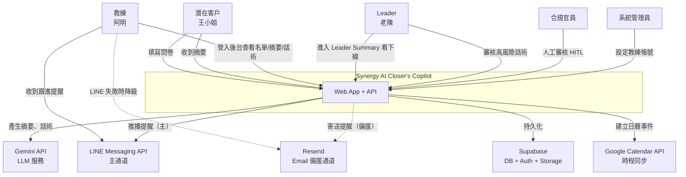
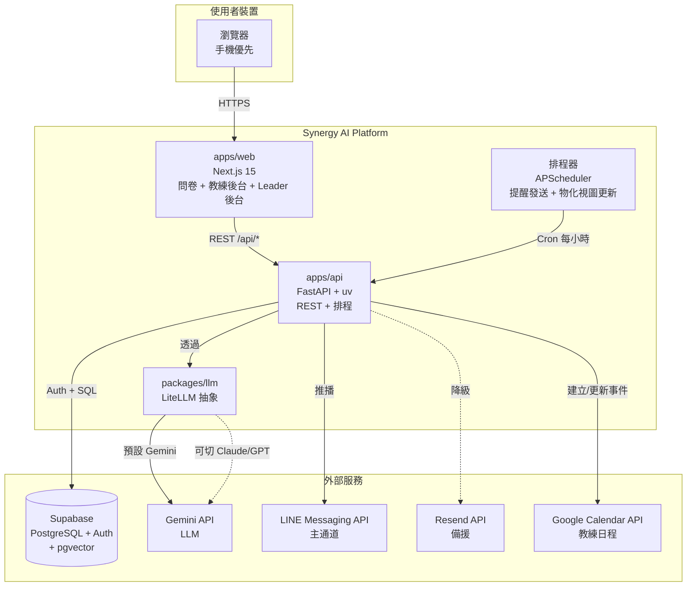
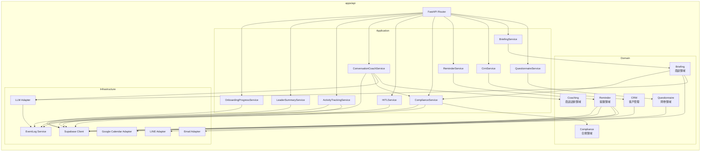
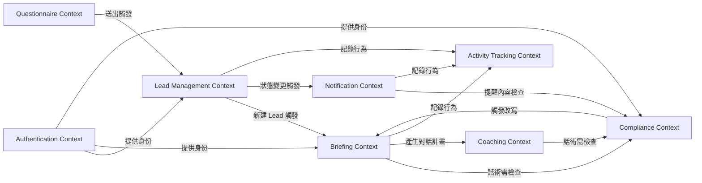
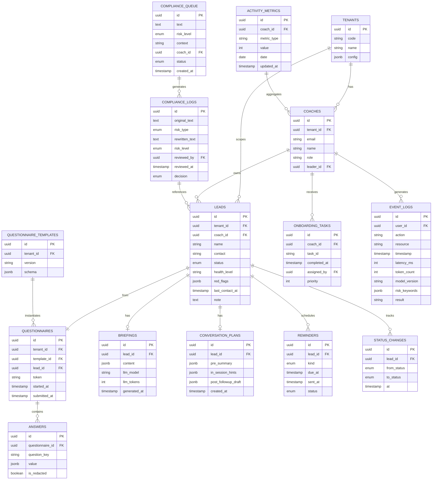

# 架構與設計文件 — Synergy AI Closer's Copilot

> **版本:** v3.0 | **更新:** 2026-05-08 | **狀態:** 實作基準 | **對應 Phase I MVP:** `docs/12_phase1_mvp.md`

---

## v3.0 範圍擴充註記

本版本升級為 Phase I v3.0，新增合規 AI、HITL、商談話術、Leader Summary 等新模組，影響架構如下：

**Application 層新增模組**：ComplianceService、HITLService、ConversationCoachService、ActivityTrackingService、LeaderSummaryService、OnboardingProgressService

**Infrastructure 層新增**：GoogleCalendarAdapter、EventLog Service

**資料層新增**：物化視圖（`mv_coach_weekly_stats`、`mv_leader_summary`）、新表（`compliance_logs`、`compliance_queue`、`onboarding_tasks`）

**DDD 新增 Context**：**Compliance Bounded Context**、**Coaching Bounded Context**

詳見後續章節「v3.0 補丁」及 [06_modules.md](./06_modules.md)。

---

## 第 1 部分：架構總覽

### 1.1 C4 模型

#### L1 系統情境圖



#### L2 容器圖



#### L3 元件圖（apps/api 內部新增合規與 Leader 層）



---

### 1.2 DDD 戰略設計

#### 通用語言（Ubiquitous Language）——v3.0 擴充

| 領域術語 | 定義 | 對應程式碼命名 |
| :--- | :--- | :--- |
| **問卷** | 一份填完的健康問卷實例 | `Questionnaire` entity |
| **商談摘要** | AI 生成給教練看的單頁摘要（客戶版 + 教練版） | `Briefing` aggregate |
| **名單** | 填完問卷後的客戶資料 | `Lead` entity |
| **客戶狀態** | 新名單/已填問卷/已預約/已商談/已推薦/試用中/已成交/未成交/需回訪/沉默（10 種） | `LeadStatus` enum |
| **提醒** | 排程給教練的跟進通知 | `Reminder` entity |
| **商談話術** | 前/中/後三段教練用話術（新） | `ConversationPlan` aggregate |
| **合規檢查** | 文字通過規則庫、LLM、人工審核的流程（新） | `ComplianceLog`、`ComplianceQueue` entity |
| **人工審核** | HITL 環節，高風險訊息等待審核員決策（新） | `ComplianceQueueItem` entity |
| **活動指標** | 教練問卷數、商談數、成交數等聚合（新） | `ActivityMetrics` entity |
| **新手進度** | 新教練的 onboarding checklist（新） | `OnboardingTask` entity |
| **教練** | 系統使用者（經營者） | `Coach` entity = User |
| **Leader** | 管理者（資深經營者，監控下線） | `Leader` = User（角色） |
| **租戶** | 未來多品牌隔離單位 | `Tenant` entity，MVP 固定 'synergy' |

#### 限界上下文（Bounded Context）——v3.0 新增



**新增 Context 說明**：

| Context | 核心職責 | 對應模組 |
| :--- | :--- | :--- |
| **Compliance** | 文字風險檢查（規則庫 + LLM + HITL） | ComplianceService、HITLService |
| **Coaching** | 商談前/中/後話術生成 | ConversationCoachService |
| **Activity Tracking** | 教練活動聚合、Leader 報表 | ActivityTrackingService、LeaderSummaryService、OnboardingProgressService |

---

### 1.3 分層架構

MVP 採用 **Clean Architecture 精簡版**（3 層）：

| 層 | 內容 | 目錄 |
| :--- | :--- | :--- |
| **Domain** | Entity、Value Object、業務規則 | `apps/api/src/domain/` |
| **Application** | Use Case、Service、編排邏輯 | `apps/api/src/application/` |
| **Infrastructure** | DB、LLM、Email、HTTP Adapter | `apps/api/src/infrastructure/` |

**依賴方向**：Infrastructure → Application → Domain（向內依賴）。

**v3.0 新增**：
- Domain 層新增 `Compliance` 與 `Coaching` aggregate
- Application 層新增 6 個 service（ComplianceService、HITLService、ConversationCoachService、ActivityTrackingService、LeaderSummaryService、OnboardingProgressService）
- Infrastructure 層新增 GoogleCalendarAdapter、EventLog Service

---

### 1.4 技術選型

| 分類 | 選用技術 | 選擇理由 | 備選方案 | ADR |
| :--- | :--- | :--- | :--- | :--- |
| 後端框架 | FastAPI + Python 3.12 + uv | 延用 module2；async 原生、Pydantic 整合 | Django、Flask | ADR-001 |
| 前端框架 | Next.js 15 + React 19 + Tailwind v4 | 延用 module2 UI；Apple tokens 已建 | Vite+React、Remix | ADR-001 |
| 資料庫 | Supabase Cloud（PostgreSQL + pgvector） | RLS、Auth、pgvector 免費層 | 自架 PG、PlanetScale | ADR-003 |
| 認證 | Supabase Auth（Magic Link） | 內建、省時 | Clerk、Auth0 | ADR-003 |
| LLM | Gemini-2.5-flash via LiteLLM | 成本最低、抽象層可切 | Claude Opus 4.6 | ADR-004 |
| 訊息通道（主） | LINE Messaging API | 台灣教練日常慣用、開信率最高 | WhatsApp（非台灣） | ADR-008 |
| 訊息通道（備援） | Resend（Email） | LINE 失敗時降級、3k 免費 | SendGrid、SES | ADR-008 |
| 合規檢查 | 規則庫（YAML）+ LLM 二次覆核 + HITL | 成本與準確度平衡、可稽核 | 純 LLM、純黑名單 | ADR-010 |
| 人工審核 | 同步阻塞 + 30min SLA | 風險管理優先於體驗 | 非同步預設通過 | ADR-011 |
| 排程 | APScheduler（Python in-process） | 單機夠用、Pilot 量小 | Celery、Temporal | — |
| CI/CD | GitHub Actions | 標準 | GitLab CI | — |
| 部署 | Railway / Fly.io | Python + Postgres 相容 | Vercel（僅前端）+ Railway | — |
| 可觀測性 | Sentry + Supabase Logs | 入門足夠 | Datadog、PostHog | — |

---

## 第 2 部分：需求摘要

### 功能性需求（由 PRD 收斂）——v3.0 擴充

| ID | 需求 | 對應 US | v3.0 新增 |
| :--- | :--- | :--- | :--- |
| FR-1 | 潛在客戶可填寫並送出三階段問卷 | US-A01, A02 | 三階段 |
| FR-2 | 問卷送出後 30 秒內產生雙版摘要 | US-A01 | 雙版（客戶+教練） |
| FR-3 | 教練在 Lead 建立後 30 秒內收到通知 | US-A03 | 無變 |
| FR-4 | 教練可打開商談前 AI 摘要頁 | US-B01, B02, B03 | 新增中/後話術 |
| FR-5 | 教練可列表、搜尋、篩選客戶 | US-C01 | 無變 |
| FR-6 | 問卷送出自動在 CRM 建檔 | US-C02 | 無變 |
| FR-7 | 教練可更新客戶狀態（10 種狀態機） | US-C03 | 10 種（原 4 種） |
| FR-8 | 系統於商談後 48h/7d/30d 自動發送提醒 | US-D01 | Google Calendar 連動 |
| **FR-9** | **所有對外訊息必過合規檢查** | **US-E01, E03** | **✨ 新增** |
| **FR-10** | **高風險訊息進入 HITL 人工審核** | **US-E02** | **✨ 新增** |
| **FR-11** | **Leader 可看下線教練本週漏斗** | **US-F01, F02** | **✨ 新增** |
| **FR-12** | **新手教練進度 checklist** | **US-F03** | **✨ 新增** |

### 非功能性需求——v3.0 補充

| 分類 | 需求描述 | 目標值 |
| :--- | :--- | :--- |
| 性能 | 問卷頁載入 | < 2s（3G 網路） |
| 性能 | 商談摘要生成（含合規檢查） | ≤ 30s（含 LLM） |
| 性能 | API p95 延遲（非 LLM） | < 500ms |
| 性能 | 跟進草稿生成 | ≤ 3s（規則庫快路徑） |
| 合規 | 合規檢查誤判率 | < 5% |
| 合規 | HITL 審核 SLA | ≤ 30 min |
| 可擴展性 | 同時線上教練數 | ≥ 10（Pilot 期） |
| 可擴展性 | 月問卷量 | ≥ 500（容量上限） |
| 可用性 (SLA) | MVP Pilot 階段 | ≥ 99.0% |
| 可觀測性 | 所有 AI 任務記 EventLog | 100% |
| 安全性 | 傳輸 | TLS 1.3 |
| 安全性 | 認證 | Supabase Magic Link + JWT |
| 安全性 | PII 隔離 | Leader 不可見 Coach 客戶 PII |

---

## 第 3 部分：系統設計

### 3.1 架構模式

- **模式**：模組化單體（Modular Monolith）+ 扁平 Monorepo
- **選擇理由**：
  - MVP 量小，微服務是過度工程
  - 單體內按 Bounded Context 分模組，Phase 2 要拆時邊界清楚
  - Monorepo 方便共用型別與 UI

### 3.2 元件職責——v3.0 擴充

| 元件 | 核心職責 | 技術 | 依賴 |
| :--- | :--- | :--- | :--- |
| `apps/web` | 問卷填答 UI + 教練後台 + Leader 後台 | Next.js 15 / React 19 | `packages/ui`、`packages/domain` |
| `apps/api` | REST API + 排程器 | FastAPI / uv | Supabase、`packages/llm` |
| `packages/domain` | 共用型別（TS + Pydantic dual） | TypeScript + Python | — |
| `packages/llm` | LLM 抽象 + prompt 模板 + 合規改寫 | Python / LiteLLM | Gemini/Claude API |
| `packages/ui` | 共用 React 元件 | React + Tailwind | Apple UI tokens |
| Supabase | DB + Auth + Storage + RLS | Managed SaaS | — |
| APScheduler | 每小時掃提醒、30min 更新物化視圖 | In-process Python | Supabase |

---

## 第 4 部分：資料架構——v3.0 補丁

### ER 模型（核心表 + 新增）



### 物化視圖（v3.0 新增）

```sql
-- mv_coach_weekly_stats: 教練週度統計
CREATE MATERIALIZED VIEW mv_coach_weekly_stats AS
SELECT
  c.id coach_id,
  c.name coach_name,
  date_trunc('week', CURRENT_DATE) week_start,
  COUNT(DISTINCT CASE WHEN l.created_at >= date_trunc('week', CURRENT_DATE) THEN l.id END) questionnaires_count,
  COUNT(DISTINCT CASE WHEN l.status IN ('已商談', '已推薦', '試用中', '已成交', '未成交') AND l.last_contact_at >= date_trunc('week', CURRENT_DATE) THEN l.id END) conversations_count,
  COUNT(DISTINCT CASE WHEN l.status IN ('已成交') AND l.updated_at >= date_trunc('week', CURRENT_DATE) THEN l.id END) conversions_count
FROM coaches c
LEFT JOIN leads l ON c.id = l.coach_id AND l.tenant_id = c.tenant_id
GROUP BY c.id, c.name;

-- mv_leader_summary: Leader 視角下線統計（含新手進度）
CREATE MATERIALIZED VIEW mv_leader_summary AS
SELECT
  l.id leader_id,
  l.name leader_name,
  c.id coach_id,
  c.name coach_name,
  COUNT(DISTINCT CASE WHEN ld.created_at >= date_trunc('week', CURRENT_DATE) THEN ld.id END) week_questionnaires,
  COUNT(DISTINCT CASE WHEN ld.status IN ('已商談', '已推薦', '試用中', '已成交', '未成交') THEN ld.id END) week_conversations,
  COUNT(DISTINCT CASE WHEN ld.status = '已成交' THEN ld.id END) week_conversions,
  COUNT(ot.id) onboarding_total,
  COUNT(CASE WHEN ot.completed_at IS NOT NULL THEN 1 END) onboarding_completed
FROM coaches l
LEFT JOIN coaches c ON c.leader_id = l.id
LEFT JOIN leads ld ON c.id = ld.coach_id AND ld.tenant_id = l.tenant_id
LEFT JOIN onboarding_tasks ot ON c.id = ot.coach_id
GROUP BY l.id, l.name, c.id, c.name;
```

### 新增表欄位補丁

| 表 | 新增欄位 | 型別 | 說明 |
| :--- | :--- | :--- | :--- |
| `leads` | `status` 改為 10 種 enum | enum | 新名單/已填問卷/已預約/已商談/已推薦/試用中/已成交/未成交/需回訪/沉默 |
| `coaches` | `line_user_id` | string | LINE OA 綁定用戶 ID |
| `coaches` | `timezone` | string | 時區（用於 Google Calendar 事件） |
| `questionnaire_responses` 新增 | `customer_summary` | text | 客戶版摘要（友善版本） |
| `conversation_plans` 新增 | `pre_summary`, `in_session_hints`, `post_followup_draft` | jsonb | 商談前/中/後話術 |
| `event_logs` 新增 | `risk_keywords` | jsonb array | 觸發的合規風險詞 |
| `event_logs` 新增 | `model_version` | string | LLM 模型版本（如 gemini-2.5-flash） |

---

## 第 5 部分：部署與基礎設施

（維持既有，無新增）

### 環境策略

| 環境 | DB | API URL | Web URL | 用途 |
| :--- | :--- | :--- | :--- | :--- |
| local | Supabase local | localhost:8000 | localhost:3000 | 開發 |
| staging | Supabase free project | api-staging.synergy-ai.tw | staging.synergy-ai.tw | 內部驗證 |
| production | Supabase Pro | api.synergy-ai.tw | app.synergy-ai.tw | Pilot 使用 |

### 成本估算（Pilot 階段，月度）——v3.0 補充

| 項目 | 成本 (NTD) | 備註 |
| :--- | :--- | :--- |
| Supabase Free/Pro | 0-1000 | 視資料量 |
| Gemini API | 100-300 | 三層檢查（規則庫快路徑減少 LLM 呼叫） |
| LINE Messaging API | 800 | Light plan 15k 訊息 |
| Resend（備援） | 0 | < 3,000 封/月 |
| Google Calendar API | 0 | 免費層足夠 Pilot |
| Railway（API） | 150-500 | Hobby plan |
| Vercel（Web） | 0 | Hobby plan |
| 網域 + SSL | 60 | .tw 網域 |
| **合計** | **1,110-2,660** | |

---

## 第 6 部分：可觀測性與風險

### EventLog 設計（v3.0 新增強制要求）

所有 AI 任務、狀態變更、合規檢查均寫入 `event_logs`：

| 任務 | 記錄欄位 |
| :--- | :--- |
| 問卷送出 | user_id、lead_id、latency_ms、token_count、model_version |
| 摘要生成 | lead_id、latency_ms、token_count、model_version、risk_keywords（觸發的合規詞） |
| 話術生成 | lead_id、latency_ms、token_count、model_version、risk_keywords |
| 合規檢查 | lead_id、original_text_length、risk_type、latency_ms、model_version |
| HITL 決策 | compliance_queue_id、reviewed_by、decision、latency_ms |
| 提醒發送 | lead_id、channel (line/email)、latency_ms、result (success/failed) |

**可觀測性指標**（Phase 1 核心監控）：

- 問卷完成率
- 摘要生成成功率 & p95 延遲
- 合規檢查誤判率（定義：規則庫初篩 vs LLM 不同步）
- HITL 審核超時率（> 30 min）
- 教練話術使用率
- 提醒送達率（按通道）
- LLM 月成本與 token 計數

---

**版本履歷**

| 版本 | 日期 | 變更 |
| :--- | :--- | :--- |
| v1.0 | 2026-04-24 | 初版（C4、DDD、分層架構、資料模型） |
| v2.0 | — | （未發布） |
| **v3.0** | **2026-05-08** | **新增 Compliance / HITL / Coaching / Activity Tracking context + 6 個 service + 物化視圖 + EventLog 強制記錄** |
