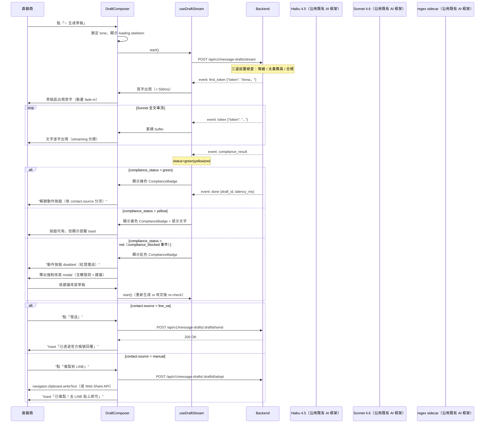
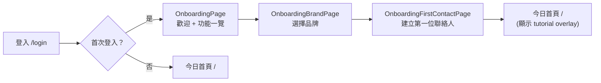

# 04 前端架構規範（React 19 + Vite + Tailwind v4 + PWA）

版本 v0.3 | 日期 2026-06-07 | 狀態 draft | 對應 PRD v0.2（docs/PRD.md）/ 00_tech-spec v0.4 | 模組 care-copilot（repo 根 frontend/）

> v0.3 變更：第 7 節新增入口 5（LINE 自動建議 SuggestionCard）與時間軸來源標示；9.3 發送流程加入太業務員預警 dialog（409 SALESY_WARNING）；9.6 VoiceButton 增 OA 客戶試聽後發送分流。

---

## 目錄

1. [技術棧與設計原則](#1-技術棧與設計原則)
2. [資訊架構與路由表](#2-資訊架構與路由表)
3. [元件樹](#3-元件樹)
4. [狀態管理](#4-狀態管理)
5. [API Client 層](#5-api-client-層)
6. [SSE 草稿串流 UX 流程](#6-sse-草稿串流-ux-流程)
7. [四種補資料 UI](#7-四種補資料-ui)
8. [合規 / 情緒 / 太業務員 UI 呈現規格](#8-合規--情緒--太業務員-ui-呈現規格)
9. [草稿模式 UX 設計（含 LINE OA 發送分流）](#9-草稿模式-ux-設計含-line-oa-發送分流)
10. [PWA 規格](#10-pwa-規格)
11. [設計 Tokens 與深色模式](#11-設計-tokens-與深色模式)
12. [載入 / 空 / 錯誤狀態與無障礙](#12-載入--空--錯誤狀態與無障礙)
13. [前端目錄結構](#13-前端目錄結構)

---

## 1. 技術棧與設計原則

### 1.1 技術棧總表

| 分類 | 選用技術 | 版本 | 用途 |
|---|---|---|---|
| 框架 | React | 19.x | Concurrent features、`use()` hook、Server Actions 就緒 |
| 建置工具 | Vite | 6.x | 快速 HMR、Tree-shaking、PWA plugin |
| 樣式 | Tailwind CSS | v4.x | CSS-first token 管理、零執行期開銷 |
| PWA | vite-plugin-pwa | latest | Service Worker 自動注入、manifest 管理 |
| UI Token 基礎 | Apple 設計系統 | `.claude/ui/apple/DESIGN.md` | iPhone 使用者 80%；Apple 風格熟悉感降低學習成本 |
| 狀態管理（Server） | TanStack Query | 5.x | 自動快取、失效、樂觀更新、SSE 支援 |
| 狀態管理（Client） | Zustand | 5.x | 輕量全域 UI state，React 19 並行安全 |
| HTTP 客戶端 | 原生 fetch + 封裝 | — | 注入 JWT、統一錯誤、型別對齊 DTO |
| 路由 | React Router | 7.x | File-based routing、Lazy loading |
| 表單 | React Hook Form + Zod | latest | schema 驗證，前端邊界防護 |
| 圖示 | Lucide React | latest | 輕量、Tree-shakable、Apple SF 風格近似 |
| 測試 | Vitest + Testing Library | latest | 單元 + 元件整合測試 |
| 錯誤監控 | Sentry JS SDK | latest | 前端錯誤聚合 |
| i18n | react-i18next | latest | v1 繁中為主；語音介面支援英語標記 |

### 1.2 設計原則

**Mobile PWA 優先**：直銷商 80% 用 iPhone。所有頁面以 375px（iPhone SE）為設計基準，桌機為漸進強化。觸控目標最小 44px × 44px（Apple HIG 標準）。

**Apple 設計語言**：語意化 CSS 變數（見第 11 節）、SF Pro Display 字體回退、大量留白、清晰層級、毛玻璃 (backdrop-filter)、克制動畫（150–300ms）。禁止硬編碼 hex 色票，一律走 token。

**草稿模式硬限制**：AI 永不自動送出任何訊息。草稿 UI 最終動作依客戶來源分流（見第 9 節）：LINE OA 客戶（`contact.source = line_oa`）顯示「發送」按鈕（由後端 push 給客戶）；手動管理客戶（`source = manual`）維持「複製到 LINE / WhatsApp」。無論哪種模式，教練都必須主動按按鈕才會送出。

**合規 Gate 前置**：草稿呈現前必過合規掃描，紅燈時送出按鈕 disabled，強制改寫（見第 8 節）。

**AI 層整合介面**（沿用既有框架，本次不重新設計）：前端透過 SSE 與 REST 消費後端 AI 結果；前端不直接呼叫 Anthropic / OpenAI API。

---

## 2. 資訊架構與路由表

### 2.1 整體 IA 結構

```
Care Copilot PWA
├── 認證流程
│   ├── /login               登入（Email + Password → 取得 JWT）
│   ├── /onboarding          新手引導（3 步）
│   └── /onboarding/brand    選擇品牌
├── 主 App（需登入）
│   ├── / 或 /today          今日 5 件事（首頁，含「待回覆」卡）
│   ├── /inbox               收件匣（LINE OA 待回覆訊息清單）
│   ├── /contacts            客戶列表
│   ├── /contacts/:id        客戶詳情頁（多分頁）
│   │   ├── [tab=profile]    活檔案
│   │   ├── [tab=timeline]   互動時間軸
│   │   ├── [tab=inbox]      對話/收件（LINE 來訊 + 回覆草稿）
│   │   ├── [tab=samples]    樣品追蹤
│   │   ├── [tab=drafts]     訊息草稿（主動外發）
│   │   ├── [tab=questionnaire] 健康問卷
│   │   ├── [tab=objection]  異議處理
│   │   └── [tab=recruitment] 招募階段
│   ├── /settings            設定
│   └── /subscription        訂閱管理
└── 公開頁面（無需登入）
    └── /q/:token            健康問卷公開填答頁
```

### 2.2 路由表

| 路徑 | 元件 | 需要登入 | 說明 |
|---|---|---|---|
| `/login` | `LoginPage` | 否 | POST /api/v1/auth/login（email + password → JWT） |
| `/onboarding` | `OnboardingPage` | 是（新帳號） | 步驟 1：歡迎 + 功能一覽 |
| `/onboarding/brand` | `OnboardingBrandPage` | 是（新帳號） | 步驟 2：選擇品牌（Synergy / 其他） |
| `/onboarding/first-contact` | `OnboardingFirstContactPage` | 是（新帳號） | 步驟 3：建立第一位聯絡人 |
| `/` | `TodayPage` | 是 | 今日 5 件事首頁（retention 錨點，含「待回覆」卡） |
| `/today` | redirect → `/` | 是 | 別名 |
| `/inbox` | `InboxPage` | 是 | 收件匣：所有租戶待回覆 LINE 訊息清單（GET /inbox）|
| `/contacts` | `ContactListPage` | 是 | 客戶列表（搜尋 + 標籤篩選） |
| `/contacts/new` | `ContactNewPage` | 是 | 新增聯絡人 |
| `/contacts/:contactId` | `ContactDetailPage` | 是 | 客戶詳情頁（預設 tab=profile） |
| `/contacts/:contactId?tab=profile` | （同上） | 是 | 活檔案分頁 |
| `/contacts/:contactId?tab=timeline` | （同上） | 是 | 互動時間軸 |
| `/contacts/:contactId?tab=inbox` | （同上） | 是 | 對話/收件分頁（LINE 來訊 + ReplyComposer）|
| `/contacts/:contactId?tab=samples` | （同上） | 是 | 樣品追蹤分頁 |
| `/contacts/:contactId?tab=drafts` | （同上） | 是 | 訊息草稿分頁（主動外發） |
| `/contacts/:contactId?tab=questionnaire` | （同上） | 是 | 健康問卷分頁 |
| `/contacts/:contactId?tab=objection` | （同上） | 是 | 異議處理分頁 |
| `/contacts/:contactId?tab=recruitment` | （同上） | 是 | 招募階段分頁 |
| `/settings` | `SettingsPage` | 是 | 個人設定（語言、通知、隱私） |
| `/subscription` | `SubscriptionPage` | 是 | 訂閱方案 / 升級 |
| `/q/:token` | `QuestionnairePublicPage` | **否** | 客戶填答問卷（無需登入，一次性 token） |

### 2.3 底部導航列（Mobile）

主 App 底部固定導航（iOS tab bar 樣式）：

| 圖示 | 標籤 | 路徑 | 徽章 |
|---|---|---|---|
| House | 今日 | `/` | 未完成任務數（含待回覆） |
| Inbox | 收件匣 | `/inbox` | 未讀待回覆訊息數（紅點）|
| Users | 客戶 | `/contacts` | — |
| Settings | 設定 | `/settings` | — |

---

## 3. 元件樹

### 3.1 頁面元件樹（Mermaid）

```mermaid
graph TD
    App["App (Router + QueryClient + ZustandProvider)"]

    App --> AuthGuard["AuthGuard"]
    App --> QuestPublic["QuestionnairePublicPage /q/:token"]

    AuthGuard --> AppLayout["AppLayout (底部導航 + 頂部 Header)"]
    AuthGuard --> OnboardingLayout["OnboardingLayout"]

    AppLayout --> TodayPage["TodayPage /"]
    AppLayout --> InboxPage["InboxPage /inbox"]
    AppLayout --> ContactListPage["ContactListPage /contacts"]
    AppLayout --> ContactDetailPage["ContactDetailPage /contacts/:id"]
    AppLayout --> SettingsPage["SettingsPage"]
    AppLayout --> SubscriptionPage["SubscriptionPage"]

    OnboardingLayout --> OnboardingPage["OnboardingPage"]
    OnboardingLayout --> OnboardingBrandPage["OnboardingBrandPage"]
    OnboardingLayout --> OnboardingFirstContactPage["OnboardingFirstContactPage"]

    TodayPage --> CareStreakBanner["CareStreakBanner"]
    TodayPage --> TaskCardList["TaskCardList"]
    TaskCardList --> TaskCard["TaskCard"]
    TaskCard --> EmotionBadge["EmotionBadge"]
    TaskCard --> ComplianceBadge["ComplianceBadge"]
    TaskCard --> InboundReplyCard["InboundReplyCard (source=inbound_reply)"]

    InboxPage --> InboxList["InboxList"]
    InboxList --> IncomingMessageCard["IncomingMessageCard"]
    IncomingMessageCard --> ReplyComposer["ReplyComposer"]
    ReplyComposer --> ComplianceBadge
    ReplyComposer --> SendOrCopyButton["SendOrCopyButton (依 source 分流)"]

    ContactListPage --> ContactSearchBar["ContactSearchBar"]
    ContactListPage --> TagFilterChips["TagFilterChips"]
    ContactListPage --> ContactCardList["ContactCardList"]
    ContactCardList --> ContactCard["ContactCard"]
    ContactCard --> EmotionBadge
    ContactCard --> SalesyBanner["SalesyBanner (條件顯示)"]
    ContactCard --> AssignedCoachBadge["AssignedCoachBadge"]

    ContactDetailPage --> ContactHeader["ContactHeader (頭像 + 姓名 + 情緒 + 太業務員 + 指派教練)"]
    ContactDetailPage --> ContactTabBar["ContactTabBar (8 tabs)"]
    ContactDetailPage --> ProfileTab["ProfileTab"]
    ContactDetailPage --> TimelineTab["TimelineTab"]
    ContactDetailPage --> InboxTab["InboxTab (tab=inbox)"]
    ContactDetailPage --> SamplesTab["SamplesTab"]
    ContactDetailPage --> DraftsTab["DraftsTab"]
    ContactDetailPage --> QuestionnaireTab["QuestionnaireTab"]
    ContactDetailPage --> ObjectionTab["ObjectionTab"]
    ContactDetailPage --> RecruitmentTab["RecruitmentTab"]

    ProfileTab --> AddInfoSheet["AddInfoSheet (四入口)"]
    ProfileTab --> FieldEditCard["FieldEditCard"]
    ProfileTab --> AssignmentPanel["AssignmentPanel (Leader 可改派)"]

    InboxTab --> IncomingMessageCard
    InboxTab --> ReplyComposer

    DraftsTab --> DraftComposer["DraftComposer"]
    DraftComposer --> ToneTabs["ToneTabs [care/casual/business]"]
    DraftComposer --> ComplianceBadge
    DraftComposer --> VoiceButton["VoiceButton"]
    DraftComposer --> SendOrCopyButton

    SamplesTab --> SampleForm["SampleForm"]
    SamplesTab --> SampleTimeline["SampleTimeline"]

    ObjectionTab --> ObjectionSheet["ObjectionSheet"]
    ObjectionSheet --> ObjectionTemplateList["ObjectionTemplateList (10 項)"]
    ObjectionSheet --> ObjectionResponseCard["ObjectionResponseCard (共情/提問/邀請)"]

    RecruitmentTab --> RecruitmentStageStepper["RecruitmentStageStepper"]
    RecruitmentTab --> FunnelStatsCard["FunnelStatsCard (Leader 視角)"]
```



### 3.2 共用元件規格

| 元件名 | 說明 | 主要 Props | 互動行為 |
|---|---|---|---|
| `TaskCard` | 今日任務卡 | `task: TodayTask`, `onComplete`, `onSnooze`, `onDismiss` | 點卡體 → 開客戶詳情；左滑 → 完成；右滑 → 延後；`source_type=inbound_reply` 時顯示橘色「待回覆」標籤 |
| `InboundReplyCard` | 今日5件事中的「待回覆」卡 | `task: TodayTask`（source_type=inbound_reply）, `isNewCoach?: boolean` | 顯示客戶名 + 來訊摘要；新手教練加醒目橘底提醒橫幅；點擊 → `/contacts/:id?tab=inbox` |
| `ContactCard` | 客戶列表單卡 | `contact: Contact`, `onClick` | 顯示姓名、最後互動時間、EmotionBadge、SalesyBanner（條件）、指派教練名（AssignedCoachBadge）|
| `AssignedCoachBadge` | 顯示目前指派教練 | `coachName: string`, `coachId: string` | 純顯示；Leader 在詳情頁可透過 AssignmentPanel 改派 |
| `AssignmentPanel` | Leader 改派教練面板 | `contactId: string`, `currentCoachId: string`, `onAssign` | 下拉選擇教練 → PUT /contacts/:id/assignment；僅 leader role 可見 |
| `InboxList` | 收件匣清單 | `items: InboxItem[]`, `onSelectItem` | 顯示客戶名 + 來訊摘要 + 時間；未回覆狀態標橘點 |
| `IncomingMessageCard` | 客戶 LINE 來訊原文顯示 | `message: InboundMessage` | 顯示來訊時間、原文內文、客戶頭像；唯讀 |
| `ReplyComposer` | 回覆草稿區（含來訊脈絡） | `inboundId: string`, `contactId: string`, `draftId?: string` | 上半部顯示來訊原文（IncomingMessageCard）；下半部顯示 AI 建議草稿 + 可編輯 + ComplianceBadge；底部 SendOrCopyButton |
| `SendOrCopyButton` | 依 contact.source 分流的動作按鈕 | `source: 'line_oa'\|'manual'`, `draftId: string`, `complianceStatus: string`, `onSent`, `onCopied` | `line_oa` → 藍色「發送」主按鈕（disabled 時合規紅燈）；`manual` → 「複製到 LINE」；發送後顯示 toast |
| `DraftComposer` | 主動草稿生成區 | `contactId: string`, `draftId?: string` | 含 ToneTabs、streaming 顯示、合規燈號、SendOrCopyButton |
| `ToneTabs` | 語氣分頁（care/casual/business） | `value: Tone`, `onChange`, `disabledTones?: Tone[]` | 情緒紅燈時 business tab disabled + tooltip 說明 |
| `ComplianceBadge` | 合規燈號 | `status: 'green'\|'yellow'\|'red'`, `triggeredTerms?: string[]`, `suggestion?: string` | 綠色 checkmark；黃色警示 icon + hover tooltip；紅色 X + 強制改寫 modal |
| `EmotionBadge` | 情緒狀態徽章 | `emotion: 'stressed'\|'neutral'\|'happy'`, `updatedAt?: string` | 顯示對應顏色圓點 + 文字；點擊展開情緒說明 |
| `SalesyBanner` | 太業務員警示橫幅 | `alertId: string`, `salesyCount: number`, `onAcknowledge`, `onDismiss` | 黃底橫幅；確認 → 關閉橫幅；關掉 → 需填原因 |
| `VoiceButton` | 語音草稿觸發按鈕 | `draftId: string`, `disabled?: boolean` | 點擊 → 開 VoiceConfigSheet；Freemium 配額耗盡時顯示 UsageQuotaHint |
| `ObjectionSheet` | 異議處理底抽屜 | `contactId: string`, `onAdopt: (text: string) => void` | Bottom Sheet；選 10 種預設或手打；顯示三種回應 |
| `AddInfoSheet` | 四種補資料入口底抽屜 | `contactId: string` | 四個大按鈕：貼上對話 / 上傳截圖 / 語音備忘 / 分享 |
| `CareStreak` | 連續關懷天數 | `streak: number`, `goal?: number` | 顯示火焰 icon + 天數；點擊展開說明 |
| `UsageQuotaHint` | 配額剩餘提示 | `quotaType: 'drafts'\|'voice'\|'contacts'`, `used: number`, `limit: number` | Freemium 用戶顯示；剩 1 時變紅；0 時顯示升級 CTA |

---

## 4. 狀態管理

### 4.1 狀態分層策略

```
┌────────────────────────────────────────────────────┐
│  Server State（TanStack Query）                    │
│  - contacts / today-tasks / drafts / samples 等    │
│  - 自動快取 + stale-while-revalidate + 失效策略    │
└────────────────────────────────────────────────────┘
┌────────────────────────────────────────────────────┐
│  Client / UI State（Zustand）                      │
│  - 當前選中的 tone（care/casual/business）          │
│  - 正在串流的 draftId                              │
│  - Sheet 開關狀態（objectionsSheetOpen 等）        │
│  - 配額提示 dismissed 狀態                         │
└────────────────────────────────────────────────────┘
┌────────────────────────────────────────────────────┐
│  Form State（React Hook Form + Zod）               │
│  - 聯絡人編輯表單                                  │
│  - 樣品記錄表單                                    │
│  - 異議改寫輸入                                    │
└────────────────────────────────────────────────────┘
```

### 4.2 TanStack Query 查詢鍵設計

```typescript
// 查詢鍵命名規範：['資源複數', 'scope', ...params]
export const queryKeys = {
  todayTasks:          () => ['today-tasks'],
  contacts:            (filters?: ContactFilters) => ['contacts', filters],
  contact:             (id: string) => ['contacts', id],
  contactInteractions: (id: string) => ['contacts', id, 'interactions'],
  contactLifeEvents:   (id: string) => ['contacts', id, 'life-events'],
  contactSamples:      (id: string) => ['contacts', id, 'samples'],
  contactDrafts:       (id: string) => ['contacts', id, 'message-drafts'],
  contactInbound:      (id: string) => ['contacts', id, 'inbound-messages'],
  inbox:               () => ['inbox'],
  sampleFollowups:     (id: string) => ['samples', id, 'followups'],
  objectionTemplates:  () => ['objection-templates'],
  usageQuota:          () => ['auth', 'me', 'usage-quota'],
  subscription:        () => ['subscription'],
  complianceCheck:     (id: string) => ['compliance', 'checks', id],
} as const
```

### 4.3 主要 Query / Mutation 規格

| Hook | 端點 | staleTime | gcTime | 失效策略 |
|---|---|---|---|---|
| `useTodayTasks()` | GET /today-tasks | 60s | 5min | 完成/延後/略過任何一個 → 失效 |
| `useContacts(filters)` | GET /contacts | 30s | 10min | 建立/更新/封存聯絡人 → 失效 |
| `useContact(id)` | GET /contacts/:id | 30s | 10min | 任何該 contact 更新 → 失效 |
| `useContactInteractions(id)` | GET /contacts/:id/interactions | 30s | 10min | 新增互動 → 失效 |
| `useContactSamples(id)` | GET /contacts/:id/samples | 60s | 10min | 新增/更新樣品 → 失效 |
| `useContactDrafts(id)` | GET /contacts/:id/message-drafts | 30s | 5min | adopt/生成/send → 失效 |
| `useInbox()` | GET /inbox | 30s | 5min | sendDraft 成功後 → 失效；可 polling 或 SSE 通知 |
| `useContactInbound(id)` | GET /contacts/:id/inbound-messages | 30s | 5min | 新訊息到達 → 失效 |
| `useUsageQuota()` | GET /auth/me/usage-quota | 0（always fresh） | 1min | 每次 AI 操作後 → 失效 |
| `useObjectionTemplates()` | GET /objection-templates | 1h | 1day | 無自動失效（靜態資料）|

**Mutation 範例（建立樣品）**：
```typescript
const mutation = useMutation({
  mutationFn: (data: CreateSampleRequest) =>
    apiClient.post(`/contacts/${contactId}/samples`, data),
  onSuccess: () => {
    queryClient.invalidateQueries({ queryKey: queryKeys.contactSamples(contactId) })
    queryClient.invalidateQueries({ queryKey: queryKeys.todayTasks() })
    queryClient.invalidateQueries({ queryKey: queryKeys.usageQuota() })
  },
})
```

### 4.4 Zustand Store 設計

**authStore**（`src/stores/authStore.ts`）負責管理登入狀態：

```typescript
// src/stores/authStore.ts
interface AuthState {
  accessToken: string | null         // 登入後由 POST /api/v1/auth/login 回傳
  user: {
    sub: string                      // distributor_id
    tenant_id: string
    role: string
  } | null

  // Actions
  setAuth: (token: string, user: AuthState['user']) => void
  clearAuth: () => void              // 登出：清除 token，導回 /login
}

export const useAuthStore = create<AuthState>((set) => ({
  accessToken: null,
  user: null,
  setAuth: (token, user) => set({ accessToken: token, user }),
  clearAuth: () => set({ accessToken: null, user: null }),
}))
```

登入流程：`LoginPage` 呼叫 `POST /api/v1/auth/login`，回傳 `{ access_token }` 後呼叫 `setAuth()` 寫入 store；`AuthGuard` 讀取 `accessToken`，為 null 時導回 `/login`。token 過期（401 回應）時 apiClient 自動呼叫 `clearAuth()` 並導向 `/login`。

---

```typescript
// src/stores/uiStore.ts
interface UIState {
  // 草稿相關
  activeTone: 'care' | 'casual' | 'business'
  streamingDraftId: string | null
  streamBuffer: string
  streamStatus: 'idle' | 'streaming' | 'done' | 'error' | 'compliance_blocked'

  // Sheet 開關
  addInfoSheetOpen: boolean
  addInfoSheetContactId: string | null
  objectionSheetOpen: boolean
  objectionSheetContactId: string | null
  voiceConfigSheetOpen: boolean

  // 收件匣 / 回覆
  sendingDraftId: string | null        // 正在呼叫 /send 的 draftId
  sendStatus: 'idle' | 'sending' | 'sent' | 'error'

  // 提示 dismissed
  quotaHintDismissed: Record<string, boolean>

  // Actions
  setActiveTone: (tone: UIState['activeTone']) => void
  setStreamStatus: (status: UIState['streamStatus']) => void
  appendStreamBuffer: (token: string) => void
  resetStream: () => void
  openAddInfoSheet: (contactId: string) => void
  closeAddInfoSheet: () => void
  openObjectionSheet: (contactId: string) => void
  closeObjectionSheet: () => void
  setSendStatus: (draftId: string | null, status: UIState['sendStatus']) => void
}
```

### 4.5 SSE 串流自訂 Hook：useDraftStream

```typescript
// src/hooks/useDraftStream.ts
interface UseDraftStreamOptions {
  contactId: string
  tone: 'care' | 'casual' | 'business'
  channel: 'line' | 'whatsapp' | 'ig_dm' | 'email'
  onFirstToken?: () => void
  onComplianceResult?: (result: ComplianceResult) => void
  onDone?: (draftId: string, meta: DraftMeta) => void
  onComplianceBlocked?: (blocked: ComplianceBlocked) => void
  onError?: (error: Error) => void
}

interface UseDraftStreamReturn {
  start: () => void
  abort: () => void
  content: string          // 累積的草稿文字
  status: StreamStatus     // 'idle'|'connecting'|'streaming'|'done'|'error'|'compliance_blocked'
  complianceStatus: 'green' | 'yellow' | 'red' | null
  triggeredTerms: string[]
  suggestion: string | null
  draftId: string | null
  latencyMs: number | null
}

// 實作摘要：
// 1. 呼叫 POST /api/v1/message-drafts/stream
// 2. 以 EventSource-like 方式讀取 ReadableStream（原生 fetch + getReader()）
// 3. 解析 SSE 事件：first_token / token / compliance_result / done / compliance_blocked
// 4. 同步更新 Zustand streamBuffer
// 5. 元件 unmount 時呼叫 abort()
```

**Hook 消費範例**：
```typescript
const {
  start, abort, content, status,
  complianceStatus, triggeredTerms, suggestion, draftId
} = useDraftStream({
  contactId,
  tone: activeTone,
  channel: 'line',
  onDone: (id) => {
    queryClient.invalidateQueries({ queryKey: queryKeys.contactDrafts(contactId) })
    queryClient.invalidateQueries({ queryKey: queryKeys.usageQuota() })
  },
  onComplianceBlocked: (blocked) => {
    // 開啟強制改寫 modal
  },
})
```

---

## 5. API Client 層

### 5.1 封裝設計

```typescript
// src/lib/apiClient.ts
class ApiClient {
  private baseUrl = import.meta.env.VITE_API_BASE_URL  // 例：https://api.carecopilot.app/api/v1
  private getToken: () => string | null                 // 注入 authStore token getter

  async request<T>(
    method: 'GET' | 'POST' | 'PUT' | 'DELETE' | 'PATCH',
    path: string,
    options?: { body?: unknown; params?: Record<string, string> }
  ): Promise<T>

  // SSE 串流（回傳 ReadableStream）
  async stream(
    path: string,
    body: unknown
  ): Promise<ReadableStream<Uint8Array>>
}

// JWT 注入：每次 request 前從 authStore 讀取 accessToken，注入 Authorization: Bearer <token>
// 401 處理：收到 401 時呼叫 authStore.clearAuth() 並導向 /login（不重試，token 不可 refresh）
// 統一錯誤轉型：HTTP 4xx/5xx → ApiError（含 code + message + details）
```

### 5.2 統一錯誤型別

```typescript
// src/lib/errors.ts
export class ApiError extends Error {
  constructor(
    public readonly code: string,     // 對應契約 F.3 錯誤碼
    public readonly message: string,
    public readonly status: number,
    public readonly details?: unknown
  ) {}
}

// 前端錯誤碼處理對照
const ERROR_MESSAGES: Record<string, string> = {
  QUOTA_EXCEEDED:            '今日配額已用完，請升級方案繼續使用',
  COST_LIMIT_REACHED:        '今日 AI 費用已達上限，請明天再試',
  COMPLIANCE_RED_BLOCKED:    '訊息含高風險詞，請依建議改寫後重試',
  QUESTIONNAIRE_LINK_EXPIRED:'問卷連結已過期（有效期 7 天）',
  QUESTIONNAIRE_LINK_USED:   '此問卷連結已填寫過',
  VOICE_DURATION_EXCEEDED:   '語音內容超過 60 秒上限，請縮短草稿',
  AI_PROVIDER_ERROR:         'AI 服務暫時無法使用，請稍後再試',
}
```

### 5.3 主要 API 呼叫清單

| Hook / 函式 | Method | 路徑 | 說明 |
|---|---|---|---|
| `useContacts` | GET | `/contacts` | 支援 `?q=` 搜尋、標籤篩選、游標分頁 |
| `useContact` | GET | `/contacts/:contactId` | 含最近 5 次互動、source 欄位 |
| `createContact` | POST | `/contacts` | 建立新聯絡人 |
| `updateContact` | PUT | `/contacts/:contactId` | 更新活檔案欄位 |
| `updateAssignment` | PUT | `/contacts/:contactId/assignment` | Leader 改派教練（`{ coach_id }`）|
| `addInteraction` | POST | `/contacts/:contactId/interactions` | 記錄互動 |
| `getInbound` | GET | `/contacts/:contactId/inbound-messages` | 取得該客戶的 LINE 來訊列表 |
| `parseText` | POST | `/contacts/:contactId/parse-text` | 貼文字補資料 |
| `parseImage` | POST | `/contacts/:contactId/parse-image` | 截圖補資料（form-data）|
| `parseAudio` | POST | `/contacts/:contactId/parse-audio` | 語音備忘補資料（form-data）|
| `detectEmotion` | POST | `/contacts/:contactId/emotion/detect` | 觸發情緒感測 |
| `overrideEmotion` | PUT | `/contacts/:contactId/emotion/override` | 手動覆蓋情緒 |
| `getSalesyAlerts` | GET | `/salesy-alerts` | 列出未確認警報 |
| `acknowledgeSalesyAlert` | POST | `/salesy-alerts/:alertId/acknowledge` | 確認警報 |
| `dismissSalesyAlert` | POST | `/salesy-alerts/:alertId/dismiss` | 關掉警報（附原因）|
| `useTodayTasks` | GET | `/today-tasks` | 今日 5 件事（含 source_type=inbound_reply 卡）|
| `completeTask` | POST | `/today-tasks/:taskId/complete` | 完成任務 |
| `snoozeTask` | POST | `/today-tasks/:taskId/snooze` | 延後任務 |
| `getInbox` | GET | `/inbox` | 待回覆 LINE 訊息清單（全租戶，分頁）|
| `generateDraft` | POST | `/message-drafts` | 非串流草稿（備用）|
| `streamDraft` | POST (SSE) | `/message-drafts/stream` | 串流草稿（主要）|
| `adoptDraft` | POST | `/message-drafts/:draftId/adopt` | 標記採用（manual 複製前）|
| `sendDraft` | POST | `/message-drafts/:draftId/send` | LINE OA 發送（後端 push 給客戶）|
| `createSample` | POST | `/contacts/:contactId/samples` | 記錄發樣品 |
| `updateSample` | PUT | `/contacts/:contactId/samples/:sampleId` | 更新樣品狀態 |
| `generateVoiceClip` | POST | `/voice-clips` | TTS 生成語音 |
| `downloadVoiceClip` | POST | `/voice-clips/:clipId/download` | 記錄下載事件 |
| `getObjectionTemplates` | GET | `/objection-templates` | 10 種預設異議 |
| `generateObjectionResponse` | POST | `/objection-responses` | 生成三種風格回應 |
| `adoptObjectionResponse` | POST | `/objection-responses/:responseId/adopt` | 標記採用 |
| `createQuestionnaireLink` | POST | `/contacts/:contactId/questionnaire-links` | 生成問卷連結 |
| `getQuestionnaire` | GET | `/questionnaire-links/:token` | 公開取得題目（無 JWT）|
| `submitQuestionnaire` | POST | `/questionnaire-links/:token/submit` | 公開提交填答（無 JWT）|
| `updateRecruitmentStage` | PUT | `/contacts/:contactId/recruitment-stage` | 更新招募階段 |
| `checkCompliance` | POST | `/compliance/check` | 主動送文字掃描 |
| `getUsageQuota` | GET | `/auth/me/usage-quota` | 今日配額 |
| `upgradeSubscription` | POST | `/subscription/upgrade` | 升級（觸發 Stripe）|

### 5.4 型別對齊策略

所有請求/回應 DTO 型別直接對應契約 E 章（資料實體）的欄位名（snake_case），不做前端 camelCase 自動轉換，以避免與後端欄位名脫節。

```typescript
// 直接沿用契約欄位名
interface Contact {
  id: string                          // ctc_ 前綴
  distributor_id: string
  tenant_id: string
  display_name: string
  source: 'line_oa' | 'manual'        // LINE OA 輪派進來 or 教練手動新增
  distributor_id: string | null    // 輪派/改派後的教練 id
  assigned_coach_name: string | null  // 顯示用
  health_concerns: string[]
  communication_pref: 'line' | 'whatsapp' | 'ig_dm' | 'email'
  relationship_type: 'friend' | 'acquaintance' | 'prospect' | 'customer' | 'recruit_prospect'
  current_emotion: 'stressed' | 'neutral' | 'happy' | null
  salesy_streak_count: number
  last_interaction_at: string | null
  dormant_since: string | null
  recruitment_stage: 'warm_list' | 'exposure' | 'invitation' | 'signed' | null
  is_archived: boolean
  created_at: string
  updated_at: string
}

interface TodayTask {
  id: string                          // tsk_ 前綴
  contact_id: string
  task_date: string
  priority: number
  source_type: 'life_event' | 'sample_followup' | 'dormant' | 'recruitment' | 'salesy_alert' | 'inbound_reply'
  reason: string
  cta_label: string
  status: 'pending' | 'done' | 'snoozed' | 'dismissed'
  completed_at: string | null
  inbound_message_id: string | null   // source_type=inbound_reply 時有值
  is_new_coach_assignment: boolean    // true → 新手教練醒目提醒
}

interface InboundMessage {
  id: string                          // inb_ 前綴
  contact_id: string
  tenant_id: string
  received_at: string
  content: string                     // 客戶原文
  line_message_id: string
  reply_draft_id: string | null       // 關聯的草稿 id（若已生成）
  replied_at: string | null
}

interface InboxItem {
  inbound_message: InboundMessage
  contact: Pick<Contact, 'id' | 'display_name' | 'source' | 'distributor_id'>
  draft: MessageDraft | null
}

interface MessageDraft {
  id: string                          // dft_ 前綴
  contact_id: string
  tone: 'care' | 'casual' | 'business'
  channel: 'line' | 'whatsapp' | 'ig_dm' | 'email'
  content: string
  compliance_status: 'green' | 'yellow' | 'red'
  adopted: boolean
  sent_at: string | null              // LINE OA 發送時間（null = 未發送）
  delivery_method: 'line_push' | 'manual_copy' | null
  in_reply_to_inbound_id: string | null  // 回覆型草稿關聯的來訊 id
  model_used: 'haiku-4-5' | 'sonnet-4-6'
  latency_ms: number
}
```

---

## 6. SSE 草稿串流 UX 流程

### 6.1 完整流程圖（Mermaid Sequence Diagram）



### 6.2 各狀態 UI 對照

| 狀態 | DraftComposer 顯示 | 按鈕狀態 |
|---|---|---|
| idle | 空白草稿區 + 「✨ 生成草稿」按鈕 | 生成按鈕可用 |
| connecting | skeleton 動畫（3 行虛框） | 生成按鈕 loading spinner |
| first_token 收到 | 首字 fade-in，清除 skeleton | 中止按鈕出現 |
| streaming | 逐字出現，光標閃爍 | 中止按鈕可用 |
| done + green（line_oa）| 完整草稿 + 綠色 ComplianceBadge | 藍色「發送」主按鈕；「換語氣」次要；「🔊 生語音」三次 |
| done + green（manual）| 完整草稿 + 綠色 ComplianceBadge | 藍色「複製到 LINE」主按鈕；其餘同上 |
| done + yellow | 完整草稿 + 黃色 ComplianceBadge + 提醒文字 | 按鈕可用，加「我了解仍要繼續」確認步驟 |
| compliance_blocked | 草稿文字顯示（但加遮罩）+ 紅色 ComplianceBadge | 動作按鈕 disabled（紅燈擋送）；「依建議改寫」按鈕可用 |
| error | 錯誤訊息文字 | 「重試」按鈕 |

### 6.3 語氣切換後重新生成

直銷商點擊 ToneTabs 切換語氣後：
1. 若已有草稿（status=done），顯示「切換語氣 → 重新生成？」確認對話框
2. 確認後呼叫 `useDraftStream.start()`，帶新 tone
3. 舊草稿保留在 `/contacts/:id?tab=drafts` 歷史中

---

## 7. 四種補資料 UI

### 7.1 入口觸發點

**AddInfoSheet** 可從兩處開啟：
- ProfileTab 頁頂部「+ 補資料」浮動按鈕
- 客戶詳情頁 Header 右側選單（...更多）

### 7.2 四種入口詳細規格

#### 入口 1：貼上對話（ParseText）

```
UI 流程：
1. AddInfoSheet 選「💬 貼上對話」
2. 展開全屏文字輸入框（placeholder：「把 LINE 對話直接貼在這裡…」）
3. 輸入長度計數（最多 3000 字）
4. 點「分析」→ POST /api/v1/contacts/:contactId/parse-text
5. 後端 AI 抽取後回傳 ParseTextResult：
   {
     "suggested_updates": {
       "health_concerns": ["睡眠改善"],
       "interests": ["瑜珈"]
     },
     "life_events_detected": [
       {"event_type": "health_topic", "description": "提到睡眠問題"}
     ],
     "emotion_hint": "stressed"
   }
6. 前端顯示「確認套用」卡片，逐欄讓使用者勾選
7. 點「套用選取項目」→ PUT /api/v1/contacts/:contactId + 各別建立 life_events
```

假設：後端 AI 解析可能需要 2–5 秒，前端顯示 skeleton + 取消按鈕。

#### 入口 2：上傳截圖（ParseImage）

```
UI 流程：
1. AddInfoSheet 選「📷 上傳截圖」
2. 呼叫 <input type="file" accept="image/*"> 或 PWA Camera API
3. 預覽截圖縮圖 + 壓縮至 < 2MB（canvas 壓縮）
4. POST /api/v1/contacts/:contactId/parse-image（multipart/form-data）
5. 顯示確認套用卡片（同入口 1 步驟 6–7）
```

假設：截圖壓縮在前端進行（canvas.toBlob quality=0.8），超過 2MB 顯示「截圖太大，請裁切後重試」。

#### 入口 3：語音備忘（ParseAudio）

```
UI 流程：
1. AddInfoSheet 選「🎙 語音備忘」
2. 顯示錄音介面：大圓形麥克風按鈕
3. 按住錄音（最長 120 秒，進度環顯示）
4. 放開 → 播放預覽 + 確認送出
5. POST /api/v1/contacts/:contactId/parse-audio（multipart/form-data, audio/webm）
6. 後端 STT + AI 抽取後回傳 ParseAudioResult（格式同 ParseTextResult）
7. 顯示確認套用卡片
```

假設：使用 MediaRecorder API（audio/webm;codecs=opus），iOS PWA 需測試 audio/mp4 fallback。

#### 入口 4：分享入口（Web Share Target）

```
UI 流程：
1. 直銷商在 LINE / Safari 選取文字 → 系統分享 → 選「Care Copilot」
2. PWA Share Target 接收 text 參數，導向 /contacts（若無指定 contact）
3. 顯示「分享給哪位客戶？」搜尋彈窗
4. 選擇聯絡人後，自動進入貼上對話流程（步驟同入口 1 第 2 步起）
```

manifest.json share_target 設定（見第 10 節）。

#### 入口 5：LINE 自動建議（SuggestionCard，OA 客戶限定）

OA 客戶來訊經後端 enrichment 管線自動抽取重點，前端只負責呈現「待確認建議」並收教練決定（G.7：AI 不直接寫活檔案）：

```
UI 流程：
1. ProfileTab 頂部顯示 PendingSuggestions 區塊（有 pending 建議時）
   GET /api/v1/contacts/:contactId/suggestions?status=pending
2. 每筆 SuggestionCard 顯示：
   ┌──────────────────────────────────────────────┐
   │  💡 建議補入活檔案：健康關注「睡眠品質差」      │
   │  依據：6/7 來訊「最近都睡不好」                │
   │  [✓ 確認入檔]  [✎ 修改後入檔]  [✕ 忽略]      │
   └──────────────────────────────────────────────┘
3. 確認 → POST /contact-suggestions/:id/confirm
   修改 → 展開編輯框，confirm 時帶 edited_value
   忽略 → POST /contact-suggestions/:id/dismiss
4. confirm 成功 → invalidateQueries(['contacts', contactId])，活檔案即時更新
```

**互動時間軸來源標示**：互動記錄列表每筆依 `source` 顯示 badge——`line_oa` 顯示「LINE」標籤（原文唯讀，僅可加註 note）；`manual` 顯示「補登」標籤（可編輯）。兩者合併按 `occurred_at` 排序。

---

## 8. 合規 / 情緒 / 太業務員 UI 呈現規格

### 8.1 EmotionBadge 規格

| emotion 值 | 顏色（token） | 圖示 | 文字 | 出現位置 |
|---|---|---|---|---|
| `happy` | `--color-success` (綠) | 😊 或綠點 | 適合深聊 | ContactCard、ContactHeader |
| `neutral` | `--color-warning` (黃) | 😐 或黃點 | 一般可聊 | 同上 |
| `stressed` | `--color-danger` (紅) | 😟 或紅點 | 先別推銷 | 同上 |
| null / 未感測 | `--color-neutral-300` (灰) | — | — | 不顯示 |

點擊 EmotionBadge → 展開 tooltip：
```
[情緒感測器]
最後感測：5 分鐘前

她目前看起來壓力有點大。
建議今天的訊息以關懷為主，
先別提產品或商機。

[一鍵覆蓋 → 選擇正確情緒]  [確定]
```

一鍵覆蓋 → `PUT /api/v1/contacts/:contactId/emotion/override`，更新 `overridden_emotion`。

### 8.2 SalesyBanner 規格

**觸發條件**：`contact.salesy_streak_count >= 3`

**顯示位置**：ContactHeader 頂部黃底橫幅，ContactCard 右側小標籤

**互動規格**：
```
┌────────────────────────────────────────────────────┐
│  ⚠️ 你最近 3 則訊息都在推銷。先關懷一下吧！         │
│  [看關懷草稿]    [這次沒事，關掉]                   │
└────────────────────────────────────────────────────┘
```

- 點「看關懷草稿」→ 跳至 DraftsTab，tone 強制切換為 `care`，觸發 `start()` 生成純關懷草稿（無產品、無 CTA）→ `POST /api/v1/salesy-alerts/:alertId/acknowledge`
- 點「這次沒事，關掉」→ 彈出原因輸入框（選填，最多 100 字）→ `POST /api/v1/salesy-alerts/:alertId/dismiss`

### 8.3 ComplianceBadge 規格

**顯示位置**：DraftComposer 草稿文字下方一行

| status | 外觀 | 互動 |
|---|---|---|
| `green` | 綠色 checkmark + 「合規通過」文字 | 無（僅顯示）|
| `yellow` | 黃色三角形警示 + 「請留意以下用詞」 | 點擊展開 tooltip 列出 triggered_terms 與 suggestion |
| `red` | 紅色 X + 「高風險詞，需改寫」 | 點擊 → 強制改寫 Modal（見下方）|

**強制改寫 Modal（紅燈 gate）**：

```
┌──────────────────────────────────────────────────────────┐
│  ⛔ 訊息含高風險詞，需要調整才能複製                      │
│                                                          │
│  偵測到的詞：「保證」「治癒」                              │
│                                                          │
│  建議改寫：                                              │
│  「保證」→ 改為「我自己用了感覺不錯，分享給你參考」        │
│  「治癒」→ 改為「幫助我維持正常生活節奏」                  │
│                                                          │
│  ┌─────────────────────────────────────────────────┐   │
│  │ （直銷商在此編輯草稿文字）                        │   │
│  └─────────────────────────────────────────────────┘   │
│                                                          │
│  [取消]                        [重新掃描合規]            │
└──────────────────────────────────────────────────────────┘
```

重新掃描 → `POST /api/v1/compliance/check`，若回傳 green → 關閉 modal，解鎖複製按鈕。

### 8.4 生成草稿前的三道前置檢查（前端呈現）

後端在草稿生成前執行三道前置檢查（情緒感測 / 太業務員 / 合規），結果以 SSE metadata 或初始 HTTP 回應頭帶回前端：

| 前置檢查 | 後端動作 | 前端呈現 |
|---|---|---|
| 情緒 = stressed | Sonnet 強制使用 care tone，忽略 business tab | DraftComposer 鎖定 care tab，business tab disabled + tooltip「她目前壓力大，先用關懷語氣」|
| salesy_streak_count >= 3 | 草稿強制 care tone，無產品 | 同上 + SalesyBanner 出現 |
| 合規紅燈 | 阻擋草稿交付 | compliance_blocked 事件 → 強制改寫 Modal |

---

## 9. 草稿模式 UX 設計（含 LINE OA 發送分流）

### 9.1 核心設計原則

**AI 永不自動送出任何訊息**（硬限制）。無論哪種模式，教練都必須主動按按鈕才會送出。

草稿動作依 `contact.source` 分流：

| contact.source | 主要 CTA | 後端動作 | 成功提示 |
|---|---|---|---|
| `line_oa` | 藍色「發送」按鈕 | POST /message-drafts/:id/send（後端 LINE push 給客戶）| toast「已透過官方帳號回覆」|
| `manual` | 藍色「複製到 LINE」按鈕 | POST /message-drafts/:id/adopt + clipboard | toast「已複製！去 LINE 貼上即可」|

**紅燈擋送**：無論哪種模式，`compliance_status = red` 時動作按鈕一律 disabled，必須改寫後通過合規才能繼續。

### 9.2 DraftComposer 完整佈局

**LINE OA 客戶（source=line_oa）**：

```
┌─────────────────────────────────────────────────────┐
│  ToneTabs：[關懷] [隨意] [商業]  （紅燈時商業禁用）  │
├─────────────────────────────────────────────────────┤
│  草稿文字區（可直接編輯）                            │
│                                                     │
│  Anna，最近睡得好一點了嗎？上週你說睡眠不太好，     │
│  不知道後來有沒有改善～                              │
│                                                     │
│  ComplianceBadge：✅ 合規通過                       │
│  EmotionBadge：😊 她今天心情不錯                    │
├─────────────────────────────────────────────────────┤
│  UsageQuotaHint（Freemium）：今日草稿剩 3/5         │
├─────────────────────────────────────────────────────┤
│  [🔊 生語音]  [換語氣重生]  [發送  ✦ 主按鈕（藍）]  │
└─────────────────────────────────────────────────────┘
小字提示：「按發送後將透過官方 LINE 帳號送出，無法撤回」
```

**手動管理客戶（source=manual）**：

```
┌─────────────────────────────────────────────────────┐
│  ToneTabs：[關懷] [隨意] [商業]  （紅燈時商業禁用）  │
├─────────────────────────────────────────────────────┤
│  草稿文字區（可直接編輯）                            │
│  ...（同上）                                        │
│  ComplianceBadge：✅ 合規通過                       │
├─────────────────────────────────────────────────────┤
│  UsageQuotaHint（Freemium）：今日草稿剩 3/5         │
├─────────────────────────────────────────────────────┤
│  [🔊 生語音]  [換語氣重生]  [複製到 LINE  ✦ 主按鈕] │
│                              ↓ 展開更多複製選項      │
│                            [LINE] [WhatsApp] [IG DM] │
└─────────────────────────────────────────────────────┘
小字提示：AI 草稿僅供參考，需由您手動複製後傳送。系統不會代為傳送任何訊息。
```

### 9.3 發送流程（LINE OA 客戶）

```
教練點「發送」
    ↓
合規 gate：compliance_status = red → 按鈕 disabled，流程終止
    ↓（green / yellow 通過）
POST /message-drafts/:draftId/send
    ↓
409 SALESY_WARNING？（即將連續第 3 則推銷型訊息）
    ↓ 是 → SalesyPreSendDialog：
    │   ┌──────────────────────────────────────────────┐
    │   │ ⚠️ 這會是你連續第 3 則產品訊息               │
    │   │ 先換個話題關心一下？                          │
    │   │ [改用關懷草稿]（載入 care_draft_id）          │
    │   │ [仍要發送]（帶 acknowledge_salesy:true 重送） │
    │   └──────────────────────────────────────────────┘
    ↓ 否（或教練確認後重送）
後端 LINE push 給客戶，更新 sent_at + delivery_method=line_push
    ↓
toast「已透過官方帳號回覆」+ 3 秒後消失
    ↓
queryClient.invalidateQueries(['inbox'])
queryClient.invalidateQueries(['contacts', contactId, 'inbound-messages'])
queryClient.invalidateQueries(['today-tasks'])
```

### 9.4 複製流程（manual 客戶）

```
教練點「複製到 LINE」
    ↓
POST /message-drafts/:draftId/adopt （標記採用）
    ↓
navigator.clipboard.writeText(draftContent)
    ↓
toast 提示「已複製！打開 LINE 貼上即可」+ 3 秒後消失
    ↓（可選）
navigator.share({ text: draftContent })  (若平台支援 Web Share)
```

**重要 UX 說明文字**（顯示在 DraftComposer 頂部，灰色小字，manual 模式限定）：
> AI 草稿僅供參考，需由您手動複製後傳送。系統不會代為傳送任何訊息。

### 9.5 ReplyComposer（收件匣回覆專用）

ReplyComposer 用於 InboxPage 和 ContactDetailPage 的 `tab=inbox` 分頁，用來回覆 LINE 來訊：

```
┌─────────────────────────────────────────────────────┐
│  [來訊原文區 — IncomingMessageCard]                  │
│  Anna：「想了解一下你們的產品，適合我嗎？」           │
│  收到時間：今天 10:32                               │
├─────────────────────────────────────────────────────┤
│  AI 建議回覆（可編輯）                               │
│  Anna，謝謝你的詢問！我很樂意為你介紹...             │
│                                                     │
│  ComplianceBadge：✅ 合規通過                       │
├─────────────────────────────────────────────────────┤
│  [發送  ✦ 藍色主按鈕]                               │
└─────────────────────────────────────────────────────┘
注意：ReplyComposer 僅服務 source=line_oa 客戶，無「複製」按鈕。
```

ReplyComposer 呼叫端點與 DraftComposer 相同：
- 生成草稿：POST /message-drafts/stream（帶 `in_reply_to_inbound_id`）
- 發送：POST /message-drafts/:draftId/send

### 9.6 VoiceButton 流程

```
點「🔊 生語音」
    ↓
VoiceConfigSheet（底抽屜）：
  - 聲音：[🎙 溫暖女聲] [🎙 中性男聲]
  - 語言：[繁中 zh-TW] [英語 en-US]
  - 預覽文字（草稿前 50 字）
  - UsageQuotaHint（Freemium：今日語音剩 2/3）
    ↓
點「生成語音」
    ↓
POST /api/v1/voice-clips {draft_id, voice_style, language}
    ↓ （後端 TTS 生成，10 秒內）
顯示語音預覽播放器（duration_seconds 顯示）
    ↓
依客戶類型分流：

【manual 客戶】
點「下載」→ 觸發下載 storage_url
         → POST /api/v1/voice-clips/:clipId/download（記錄採用）
         → toast「已下載！打開 LINE 上傳語音即可」

【LINE OA 客戶】
「發送」按鈕初始 disabled（灰色，提示「請先試聽」）
    ↓
教練按播放器播放 → onEnded（或播放 ≥ 3 秒）
    → POST /api/v1/voice-clips/:clipId/listen
    → 「發送」按鈕 enabled
    ↓
點「發送」→ POST /api/v1/voice-clips/:clipId/send
    ↓ 422 VOICE_NOT_LISTENED → 重新要求試聽
    ↓ 409 VOICE_STALE（草稿已改）→ 提示「草稿已修改，請重新生成語音」
    ↓ 422 COMPLIANCE_RED_BLOCKED → 顯示合規警示
    ↓ 成功
toast「語音已透過官方帳號送出」
queryClient.invalidateQueries(['inbox'])
```

---

## 10. PWA 規格

### 10.1 manifest.json

```json
{
  "name": "Care Copilot",
  "short_name": "Care",
  "description": "直銷商的關懷 Copilot",
  "start_url": "/",
  "scope": "/",
  "display": "standalone",
  "orientation": "portrait",
  "theme_color": "#007AFF",
  "background_color": "#FFFFFF",
  "lang": "zh-TW",
  "icons": [
    { "src": "/icons/icon-72.png",   "sizes": "72x72",   "type": "image/png" },
    { "src": "/icons/icon-96.png",   "sizes": "96x96",   "type": "image/png" },
    { "src": "/icons/icon-128.png",  "sizes": "128x128", "type": "image/png" },
    { "src": "/icons/icon-192.png",  "sizes": "192x192", "type": "image/png", "purpose": "any maskable" },
    { "src": "/icons/icon-512.png",  "sizes": "512x512", "type": "image/png", "purpose": "any maskable" }
  ],
  "screenshots": [
    { "src": "/screenshots/today-tasks.png", "sizes": "390x844", "type": "image/png", "form_factor": "narrow", "label": "今日 5 件事" }
  ],
  "share_target": {
    "action": "/share-target",
    "method": "GET",
    "params": {
      "title": "title",
      "text": "text",
      "url": "url"
    }
  },
  "shortcuts": [
    {
      "name": "今日任務",
      "url": "/",
      "icons": [{ "src": "/icons/shortcut-today.png", "sizes": "96x96" }]
    },
    {
      "name": "新增聯絡人",
      "url": "/contacts/new",
      "icons": [{ "src": "/icons/shortcut-new-contact.png", "sizes": "96x96" }]
    }
  ]
}
```

### 10.2 Service Worker 離線策略

使用 vite-plugin-pwa + Workbox，設定如下：

| 資源類型 | 策略 | 說明 |
|---|---|---|
| HTML 骨架（`/`） | Network First | 優先網路，失敗回 cache |
| CSS / JS bundle | Cache First（stale-while-revalidate）| 優先 cache，背景更新 |
| `/icons/`, `/screenshots/` | Cache First（永久）| 靜態資源永久快取 |
| 字體（Apple 系統字體）| 系統字體，不需快取 | — |
| `/api/v1/*` | Network Only | API 請求不快取（即時資料）|
| 語音檔（storage URL） | Cache Then Network | 預覽播放用；download 後清除 |

**離線訊息顯示**：偵測到 `navigator.onLine = false` 時，顯示全域 toast：
> 目前離線，部分功能暫停使用。今日任務可繼續瀏覽。

### 10.3 iOS 安裝體驗

iOS Safari 不支援自動安裝提示，需在 App 中自行引導：

1. **首次啟動（Web）**：偵測 `!window.navigator.standalone` + iOS 平台 → 顯示「安裝 App」提示橫幅
2. 提示文字：「點選 Safari 底部分享按鈕 [□↑]，然後選『加入主畫面』，即可像 App 一樣使用」
3. 橫幅可「不再顯示」（localStorage 記錄）
4. HTML head 加入 iOS 相關 meta：
   ```html
   <meta name="apple-mobile-web-app-capable" content="yes">
   <meta name="apple-mobile-web-app-status-bar-style" content="default">
   <meta name="apple-mobile-web-app-title" content="Care">
   <link rel="apple-touch-icon" href="/icons/icon-192.png">
   ```

### 10.4 Web Share Target

`/share-target` 路由接收系統分享內容：

```typescript
// src/pages/ShareTargetPage.tsx
// 1. 從 URL params 取得 text（分享的文字內容）
// 2. 導向 /contacts，開啟 ContactSearchSheet
// 3. 直銷商選擇聯絡人後，自動進入 ParseText 流程
// 4. URL 格式：/share-target?text=...&title=...
```

---

## 11. 設計 Tokens 與深色模式

### 11.1 CSS 變數定義（Apple 設計系統對齊）

```css
/* src/styles/tokens.css */
:root {
  /* === 色彩 === */
  --color-primary:            #007AFF;   /* Apple Blue */
  --color-primary-hover:      #0062CC;
  --color-on-primary:         #FFFFFF;

  --color-success:            #34C759;   /* Apple Green */
  --color-warning:            #FF9F0A;   /* Apple Orange */
  --color-danger:             #FF3B30;   /* Apple Red */
  --color-info:               #5AC8FA;   /* Apple Light Blue */

  /* 中性色 */
  --color-neutral-50:         #FAFAFA;
  --color-neutral-100:        #F2F2F7;   /* iOS groupedBackground */
  --color-neutral-200:        #E5E5EA;
  --color-neutral-300:        #C7C7CC;
  --color-neutral-400:        #AEAEB2;
  --color-neutral-500:        #8E8E93;
  --color-neutral-600:        #636366;
  --color-neutral-700:        #48484A;
  --color-neutral-800:        #3A3A3C;
  --color-neutral-900:        #2C2C2E;

  /* 語意色 */
  --color-bg:                 #FFFFFF;
  --color-bg-secondary:       #F2F2F7;
  --color-bg-card:            #FFFFFF;
  --color-bg-overlay:         rgba(255, 255, 255, 0.72);
  --color-text-primary:       #1C1C1E;
  --color-text-secondary:     #8E8E93;
  --color-text-tertiary:      #AEAEB2;
  --color-text-on-primary:    #FFFFFF;
  --color-border:             #C6C6C8;
  --color-border-light:       #E5E5EA;
  --color-separator:          rgba(60, 60, 67, 0.12);

  /* 合規燈號專屬（語意化）*/
  --color-compliance-green:   #34C759;
  --color-compliance-yellow:  #FF9F0A;
  --color-compliance-red:     #FF3B30;

  /* === 字體 === */
  --font-family:              -apple-system, "SF Pro Display", "Helvetica Neue", sans-serif;
  --font-zh:                  "PingFang TC", "Noto Sans TC", sans-serif;

  --font-size-xs:             11px;
  --font-size-sm:             13px;
  --font-size-body:           17px;   /* iOS body */
  --font-size-callout:        16px;
  --font-size-subheading:     15px;
  --font-size-heading-sm:     20px;
  --font-size-heading-md:     24px;
  --font-size-heading-lg:     28px;
  --font-size-title:          34px;

  --font-weight-regular:      400;
  --font-weight-medium:       500;
  --font-weight-semibold:     600;
  --font-weight-bold:         700;

  --line-height-tight:        1.2;
  --line-height-body:         1.5;

  /* === 間距（4px 基準）=== */
  --spacing-1:    4px;
  --spacing-2:    8px;
  --spacing-3:    12px;
  --spacing-4:    16px;
  --spacing-5:    20px;
  --spacing-6:    24px;
  --spacing-8:    32px;
  --spacing-10:   40px;
  --spacing-12:   48px;
  --spacing-16:   64px;

  /* === 圓角 === */
  --radius-sm:    6px;
  --radius-md:    10px;   /* iOS 按鈕 */
  --radius-lg:    14px;   /* iOS 卡片 */
  --radius-xl:    20px;   /* iOS Sheet */
  --radius-full:  9999px; /* 膠囊型按鈕 */

  /* === 陰影 === */
  --shadow-sm:    0 1px 3px rgba(0, 0, 0, 0.08);
  --shadow-md:    0 4px 12px rgba(0, 0, 0, 0.10);
  --shadow-lg:    0 8px 24px rgba(0, 0, 0, 0.12);
  --shadow-card:  0 2px 8px rgba(0, 0, 0, 0.08);

  /* === 毛玻璃 === */
  --glass-bg:         rgba(255, 255, 255, 0.72);
  --glass-blur:       blur(20px) saturate(180%);

  /* === 動畫 === */
  --duration-fast:    150ms;
  --duration-base:    200ms;
  --duration-slow:    300ms;
  --ease-default:     cubic-bezier(0.25, 0.46, 0.45, 0.94);
}

/* 深色模式 */
@media (prefers-color-scheme: dark) {
  :root {
    --color-bg:               #000000;
    --color-bg-secondary:     #1C1C1E;
    --color-bg-card:          #2C2C2E;
    --color-bg-overlay:       rgba(28, 28, 30, 0.72);
    --color-text-primary:     #FFFFFF;
    --color-text-secondary:   #8E8E93;
    --color-text-tertiary:    #636366;
    --color-border:           #3A3A3C;
    --color-border-light:     #2C2C2E;
    --color-separator:        rgba(84, 84, 88, 0.6);
    --color-neutral-100:      #1C1C1E;
    --color-neutral-200:      #2C2C2E;
    --color-neutral-300:      #3A3A3C;
    --glass-bg:               rgba(28, 28, 30, 0.72);
  }
}
```

### 11.2 Tailwind v4 設定

```typescript
// tailwind.config.ts
import type { Config } from 'tailwindcss'

export default {
  content: ['./index.html', './src/**/*.{ts,tsx}'],
  theme: {
    extend: {
      colors: {
        primary:     'var(--color-primary)',
        success:     'var(--color-success)',
        warning:     'var(--color-warning)',
        danger:      'var(--color-danger)',
        'bg-card':   'var(--color-bg-card)',
        'text-primary':   'var(--color-text-primary)',
        'text-secondary': 'var(--color-text-secondary)',
        border:      'var(--color-border)',
      },
      borderRadius: {
        sm:   'var(--radius-sm)',
        md:   'var(--radius-md)',
        lg:   'var(--radius-lg)',
        xl:   'var(--radius-xl)',
      },
      spacing: {
        '1': 'var(--spacing-1)',
        '2': 'var(--spacing-2)',
        '3': 'var(--spacing-3)',
        '4': 'var(--spacing-4)',
        '6': 'var(--spacing-6)',
        '8': 'var(--spacing-8)',
      },
      fontFamily: {
        sans: 'var(--font-family)',
      },
      animation: {
        'fade-in':      'fadeIn var(--duration-base) var(--ease-default)',
        'slide-up':     'slideUp var(--duration-slow) var(--ease-default)',
        'pulse-cursor': 'pulseCursor 1s infinite',
      },
    },
  },
} satisfies Config
```

**禁止硬編碼色票**：所有 Tailwind class 使用 token 別名（`bg-primary`、`text-text-primary`），不允許 `bg-[#007AFF]` 這類寫法（CI lint 規則：`no-hardcoded-colors`）。

---

## 12. 載入 / 空 / 錯誤狀態與無障礙

### 12.1 三態規格

| 狀態 | 元件 | 呈現方式 |
|---|---|---|
| **載入中** | TodayPage | 5 個 TaskCard skeleton（動畫 shimmer）|
| **載入中** | ContactListPage | 10 個 ContactCard skeleton |
| **載入中** | InboxPage | InboxList skeleton（3 個 IncomingMessageCard 虛框）|
| **載入中** | DraftComposer | 3 行文字 skeleton + 光標 |
| **載入中** | ReplyComposer | 來訊區 + 草稿區各一組 skeleton |
| **空狀態** | TodayPage（無任務） | 插圖 + 「今天沒有待辦！繼續保持 ✦」+ CareStreak 展示 |
| **空狀態** | InboxPage（無待回覆）| 插圖 + 「目前沒有待回覆的訊息，做得好！」|
| **空狀態** | ContactListPage（無聯絡人） | 插圖 + 「還沒有任何聯絡人，點 + 建立第一位」|
| **空狀態** | DraftsTab（無草稿） | 插圖 + 「點下方按鈕生成第一份草稿」|
| **空狀態** | InboxTab（無來訊）| 「這位客戶尚未透過 LINE 傳訊」|
| **錯誤** | 全局 | Error Boundary → 錯誤頁（含「重新整理」按鈕）|
| **錯誤** | 單一查詢失敗 | inline 錯誤訊息 + 「重試」按鈕 |
| **發送失敗** | ReplyComposer / SendOrCopyButton | inline 錯誤「傳送失敗，請重試」+ 「重試」按鈕 |
| **網路離線** | 全局 | 頂部 banner「目前離線，部分功能暫停」|

### 12.2 無障礙規格

| 規則 | 實作 |
|---|---|
| 觸控目標 ≥ 44×44px | 所有按鈕、tab、卡片的可點擊區域 min-h-[44px] min-w-[44px] |
| 對比度 WCAG AA | 文字色 vs 背景色對比 ≥ 4.5:1（使用 token 已保證）|
| aria-label | icon-only 按鈕必加（VoiceButton、AddInfoSheet 按鈕等）|
| 鍵盤導航 | Tab 鍵可導航主要操作；focus ring 使用 `--color-primary` |
| 動態字體 | 使用 rem 單位，系統字體大小偏好生效 |
| Screen Reader | 合規燈號狀態以 `aria-live="polite"` 公告；重要警示以 `role="alert"` |

### 12.3 i18n 規格（v1）

```typescript
// src/lib/i18n.ts
// v1 繁中為主（zh-TW），語音介面支援標記英語（en-US）
// 使用 react-i18next，翻譯檔放 src/locales/zh-TW.json
```

語音介面中英語支援：VoiceConfigSheet 的語言選項（zh-TW / en-US）僅影響 TTS 輸出語言（`voice_clips.language` 欄位），不影響 App UI 語言。

---

## 13. 前端目錄結構

```
frontend/                               # repo 根（獨立專案）
├── index.html
├── vite.config.ts          # PWA plugin、路徑別名（@/）
├── tailwind.config.ts      # token 設定
├── tsconfig.json
├── package.json
├── public/
│   ├── manifest.json
│   ├── icons/              # 各尺寸 PWA icon
│   └── screenshots/        # App Store style 截圖
└── src/
    ├── main.tsx            # ReactDOM.createRoot + Provider 掛載
    ├── App.tsx             # Router + QueryClient + Zustand
    ├── router.tsx          # 路由定義（見第 2 節）
    │
    ├── pages/              # 路由頁面元件（薄層，組合 components）
    │   ├── TodayPage.tsx
    │   ├── InboxPage.tsx                # /inbox 收件匣
    │   ├── ContactListPage.tsx
    │   ├── ContactDetailPage.tsx
    │   ├── ContactNewPage.tsx
    │   ├── LoginPage.tsx
    │   ├── OnboardingPage.tsx
    │   ├── OnboardingBrandPage.tsx
    │   ├── OnboardingFirstContactPage.tsx
    │   ├── SettingsPage.tsx
    │   ├── SubscriptionPage.tsx
    │   ├── QuestionnairePublicPage.tsx   # /q/:token 無需登入
    │   └── ShareTargetPage.tsx          # PWA Web Share Target
    │
    ├── components/
    │   ├── layout/
    │   │   ├── AppLayout.tsx            # 底部 tab bar + Header
    │   │   ├── BottomNav.tsx
    │   │   ├── PageHeader.tsx
    │   │   └── AuthGuard.tsx
    │   │
    │   ├── today/                       # T05 今日 5 件事
    │   │   ├── TaskCard.tsx
    │   │   ├── TaskCardList.tsx
    │   │   ├── InboundReplyCard.tsx     # source_type=inbound_reply 專用卡
    │   │   └── CareStreakBanner.tsx
    │   │
    │   ├── inbox/                       # LINE OA 收件匣
    │   │   ├── InboxList.tsx            # 待回覆清單
    │   │   ├── IncomingMessageCard.tsx  # 來訊原文顯示
    │   │   └── ReplyComposer.tsx        # 來訊 + AI 草稿 + 發送
    │   │
    │   ├── contacts/                    # T01 活檔案
    │   │   ├── ContactCard.tsx
    │   │   ├── ContactCardList.tsx
    │   │   ├── ContactHeader.tsx
    │   │   ├── ContactSearchBar.tsx
    │   │   ├── ContactTabBar.tsx
    │   │   ├── AssignedCoachBadge.tsx   # 顯示指派教練
    │   │   ├── AssignmentPanel.tsx      # Leader 改派面板
    │   │   └── tabs/
    │   │       ├── ProfileTab.tsx
    │   │       ├── TimelineTab.tsx
    │   │       ├── InboxTab.tsx         # tab=inbox 對話/收件
    │   │       ├── SamplesTab.tsx
    │   │       ├── DraftsTab.tsx
    │   │       ├── QuestionnaireTab.tsx
    │   │       ├── ObjectionTab.tsx
    │   │       └── RecruitmentTab.tsx
    │   │
    │   ├── drafts/                      # T06 訊息草稿
    │   │   ├── DraftComposer.tsx
    │   │   ├── ToneTabs.tsx
    │   │   ├── DraftStreamDisplay.tsx   # 串流文字顯示
    │   │   └── SendOrCopyButton.tsx     # 依 contact.source 分流動作按鈕
    │   │
    │   ├── voice/                       # T08 語音草稿
    │   │   ├── VoiceButton.tsx
    │   │   └── VoiceConfigSheet.tsx
    │   │
    │   ├── objection/                   # T09 異議處理
    │   │   ├── ObjectionSheet.tsx
    │   │   ├── ObjectionTemplateList.tsx
    │   │   └── ObjectionResponseCard.tsx
    │   │
    │   ├── samples/                     # T07 樣品追蹤
    │   │   ├── SampleForm.tsx
    │   │   └── SampleTimeline.tsx
    │   │
    │   ├── recruitment/                 # T11 招募漏斗
    │   │   ├── RecruitmentStageStepper.tsx
    │   │   └── FunnelStatsCard.tsx
    │   │
    │   ├── add-info/                    # 四種補資料入口
    │   │   ├── AddInfoSheet.tsx
    │   │   ├── ParseTextInput.tsx
    │   │   ├── ParseImageUpload.tsx
    │   │   ├── ParseAudioRecorder.tsx
    │   │   └── ParseConfirmCard.tsx     # 確認套用 UI
    │   │
    │   └── shared/                      # 共用 UI 元件
    │       ├── EmotionBadge.tsx
    │       ├── SalesyBanner.tsx
    │       ├── ComplianceBadge.tsx
    │       ├── ComplianceBlockedModal.tsx
    │       ├── CareStreak.tsx
    │       ├── UsageQuotaHint.tsx
    │       ├── Skeleton.tsx
    │       ├── Toast.tsx
    │       ├── BottomSheet.tsx          # 共用底抽屜容器
    │       └── ErrorBoundary.tsx
    │
    ├── hooks/
    │   ├── useDraftStream.ts            # SSE 串流 hook（見第 4.5 節）
    │   ├── useAuth.ts                   # authStore 封裝（登入/登出/JWT 狀態）
    │   ├── useContactQueries.ts         # 聯絡人相關 TanStack Query
    │   ├── useTodayTasks.ts
    │   ├── useInbox.ts                  # 收件匣 + 來訊查詢
    │   ├── useSendDraft.ts              # sendDraft mutation（含失效邏輯）
    │   ├── useSalesyAlerts.ts
    │   ├── useUsageQuota.ts
    │   ├── useObjectionResponse.ts
    │   ├── useVoiceClip.ts
    │   └── usePWA.ts                    # 安裝提示、offline 偵測
    │
    ├── stores/
    │   ├── uiStore.ts                   # Zustand UI state（見第 4.4 節）
    │   └── authStore.ts                 # 登入用戶資訊快取
    │
    ├── lib/
    │   ├── apiClient.ts                 # fetch 封裝（見第 5.1 節）
    │   ├── errors.ts                    # ApiError 定義
    │   ├── queryKeys.ts                 # TanStack Query 鍵（見第 4.2 節）
    │   └── i18n.ts                      # react-i18next 設定
    │
    ├── types/
    │   ├── api.ts                       # 全部 DTO 型別（對應契約 E 章）
    │   └── enums.ts                     # 所有 enum 型別（對應契約 H 章）
    │
    ├── styles/
    │   ├── tokens.css                   # CSS 變數（見第 11.1 節）
    │   └── globals.css                  # Tailwind base import + 全局樣式
    │
    └── locales/
        └── zh-TW.json                   # v1 繁中翻譯
```

詳細專案結構說明請參閱 `./06_project-structure.md`（待補充）。

---

## 附錄 A：元件與 API 端點快速對照

| 元件 | 呼叫端點 | 契約參照 |
|---|---|---|
| TodayPage | GET /api/v1/today-tasks | F.7 T05 |
| InboundReplyCard（今日卡）| — （資料來自 today-tasks）| F.7 T05 |
| TaskCard（完成）| POST /api/v1/today-tasks/:taskId/complete | F.7 T05 |
| InboxPage | GET /api/v1/inbox | F.7 LINE |
| IncomingMessageCard | GET /api/v1/contacts/:contactId/inbound-messages | F.7 LINE |
| ReplyComposer（生成）| POST /api/v1/message-drafts/stream | F.6、F.7 T06 |
| ReplyComposer（發送）| POST /api/v1/message-drafts/:draftId/send | F.7 LINE |
| SendOrCopyButton（發送）| POST /api/v1/message-drafts/:draftId/send | F.7 LINE |
| SendOrCopyButton（複製）| POST /api/v1/message-drafts/:draftId/adopt | F.7 T06 |
| ContactListPage | GET /api/v1/contacts | F.7 T01 |
| AssignmentPanel（Leader）| PUT /api/v1/contacts/:contactId/assignment | F.7 T01 |
| ProfileTab | GET /api/v1/contacts/:contactId | F.7 T01 |
| EmotionBadge | POST /api/v1/contacts/:contactId/emotion/detect | F.7 T03 |
| EmotionBadge（覆蓋）| PUT /api/v1/contacts/:contactId/emotion/override | F.7 T03 |
| SalesyBanner（確認）| POST /api/v1/salesy-alerts/:alertId/acknowledge | F.7 T04 |
| SalesyBanner（關掉）| POST /api/v1/salesy-alerts/:alertId/dismiss | F.7 T04 |
| DraftComposer（串流）| POST /api/v1/message-drafts/stream | F.6、F.7 T06 |
| VoiceButton | POST /api/v1/voice-clips | F.7 T08 |
| ObjectionSheet | GET /api/v1/objection-templates | F.7 T09 |
| ObjectionResponseCard | POST /api/v1/objection-responses | F.7 T09 |
| SamplesTab | POST /api/v1/contacts/:contactId/samples | F.7 T07 |
| QuestionnaireTab | POST /api/v1/contacts/:contactId/questionnaire-links | F.7 T10 |
| QuestionnairePublicPage | GET /api/v1/questionnaire-links/:token | F.7 T10 |
| RecruitmentStageStepper | PUT /api/v1/contacts/:contactId/recruitment-stage | F.7 T11 |
| ComplianceBadge | POST /api/v1/compliance/check | F.7 合規 |
| UsageQuotaHint | GET /api/v1/auth/me/usage-quota | F.7 PLT |
| SubscriptionPage | POST /api/v1/subscription/upgrade | F.7 PLT |

---

## 附錄 B：Onboarding 流程（3 步）



Onboarding 完成狀態以 `distributors.is_active = true` + localStorage flag 雙重判斷，避免刷新後重複顯示。

---

*相關文件：*
- *[01_architecture.md](./01_architecture.md) — 系統架構*
- *[02_api.md](./02_api.md) — API 契約*
- *[03_data-model.md](./03_data-model.md) — 資料模型*
- *[05_backend.md](./05_backend.md) — 後端架構規範*
- *[06_project-structure.md](./06_project-structure.md) — 專案目錄結構*
