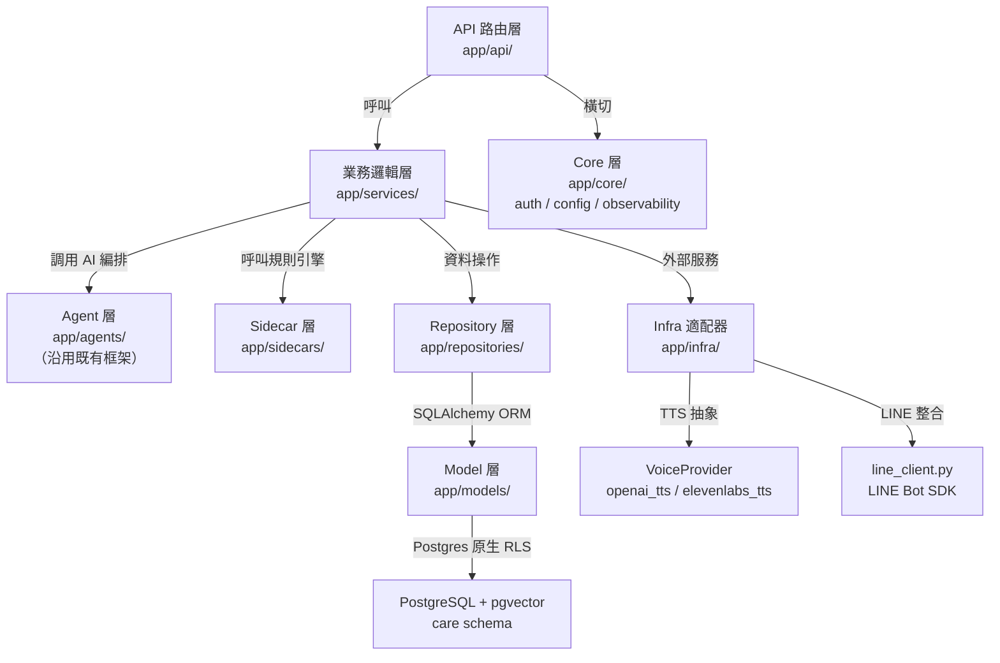
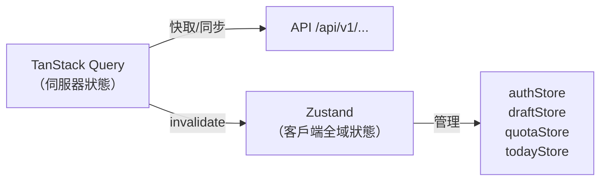
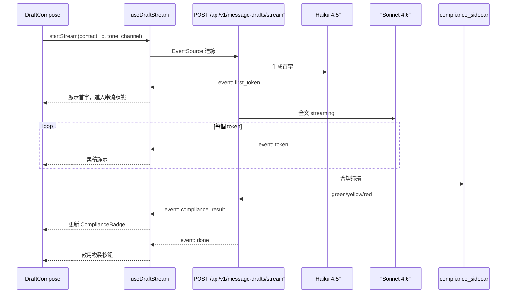
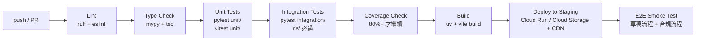
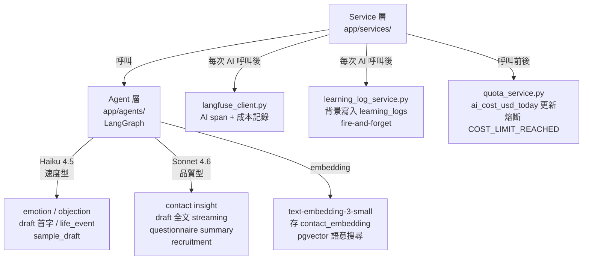

版本 v0.3 | 日期 2026-06-07 | 狀態 draft | 對應 PRD v0.2（docs/PRD.md）/ 00_tech-spec v0.4 | 獨立 repo 根結構

> v0.3 變更：新增 enrichment_service.py（來訊三合一分析）；learning_log event_type 增 voice_sent / inbound_enriched / suggestion_confirmed / suggestion_dismissed；語音保存改雙軌（未發送 7 天 / 已發送 30 天）。

# 06 Care Copilot 專案結構指南

## 目錄

1. [專案落點與結構說明](#1-專案落點與結構說明)
2. [完整目錄樹](#2-完整目錄樹)
3. [後端目錄說明](#3-後端目錄說明)
4. [前端目錄說明](#4-前端目錄說明)
5. [命名規範](#5-命名規範)
6. [環境變數清單](#6-環境變數清單)
7. [套件管理](#7-套件管理)
8. [測試目錄與品質門檻](#8-測試目錄與品質門檻)
9. [Lint 與格式化工具](#9-lint-與格式化工具)
10. [Dev Server 起法](#10-dev-server-起法)
11. [CI/CD 概念](#11-cicd-概念)
12. [文件落點說明](#12-文件落點說明)
13. [AI 層整合介面](#13-ai-層整合介面)

---

## 1. 專案落點與結構說明

Care Copilot 為**獨立 repo 根結構**，不放在 `modules/` 子目錄下。`backend/` 與 `frontend/` 直接位於 repo 根（`d:/project/synergy/`）最上層。

> `modules/` 目錄下的既有 POC（module1-distributor、module2-questionnaire）為舊有驗證性模組，與本專案獨立、互不干擾，開發時忽略。

```
synergy/                                 ← repo 根目錄（本專案根）
├── backend/                             ← FastAPI，uv 管理，Python 3.12（本專案）
├── frontend/                            ← React 19 + Vite + Tailwind v4 + PWA（本專案）
├── modules/                             ← 舊有 POC，忽略
│   ├── module1-distributor/
│   └── module2-questionnaire/
├── .claude/
│   ├── rules/                           ← 全 repo 共用規則
│   └── ui/                              ← UI 設計系統（apple 等）
├── MVP_docs/                            ← Care Copilot 技術文件集
│   ├── 01_architecture.md
│   ├── 02_api.md
│   ├── 03_data-model.md
│   ├── 04_frontend.md
│   ├── 05_backend.md
│   └── 06_project-structure.md         ← 本文件
├── VibeCoding_Workflow_Templates/
├── CLAUDE.md                            ← 跨模組共用規範
└── docs/                                ← PRD 及原始需求文件
    └── 0516_vibecoding_template/mvp/prd.md
```

### 埠號總覽

| 服務 | 埠 | 備註 |
|---|---|---|
| **backend** | **8002** | FastAPI，uvicorn |
| **frontend dev server** | **3002** | Vite dev |
| **PostgreSQL container（本地）** | **5432** | docker-compose pgvector/pgvector:pg16 |

---

## 2. 完整目錄樹

```
synergy/                                 ← repo 根（本專案根）
│
├── backend/                             ← FastAPI，uv 管理，Python 3.12
│   ├── app/
│   │   ├── __init__.py
│   │   ├── main.py                      ← 入口：uvicorn :8002，掛路由、中介層、OTel
│   │   │
│   │   ├── api/                         ← 路由層（依工具分模組）
│   │   │   ├── __init__.py
│   │   │   ├── deps.py                  ← 共用依賴（get_db, get_current_distributor）
│   │   │   ├── auth.py                  ← GET /api/v1/auth/me, PUT, GET usage-quota
│   │   │   ├── contacts.py              ← T01 活檔案 CRUD + parse-text/image/audio
│   │   │   ├── life_events.py           ← T02 生活事件雷達
│   │   │   ├── emotion.py               ← T03 情緒感測器
│   │   │   ├── salesy_alerts.py         ← T04 太業務員警報
│   │   │   ├── today_tasks.py           ← T05 今日 5 件事
│   │   │   ├── message_drafts.py        ← T06 訊息草稿（含 SSE /stream）
│   │   │   ├── samples.py               ← T07 樣品追蹤
│   │   │   ├── voice_clips.py           ← T08 語音草稿
│   │   │   ├── objection_responses.py   ← T09 異議處理器
│   │   │   ├── questionnaire.py         ← T10 健康問卷（含無需 JWT 端點）
│   │   │   ├── recruitment.py           ← T11 招募漏斗
│   │   │   ├── webhooks.py              ← LINE Webhook（/api/v1/webhooks/line）
│   │   │   ├── compliance.py            ← SYS 合規低語
│   │   │   └── platform.py              ← PLT 訂閱/用量/同意/資料請求/學習紀錄
│   │   │
│   │   ├── services/                    ← 業務邏輯層（對齊契約 D 章）
│   │   │   ├── __init__.py
│   │   │   ├── contact_service.py       ← T01，Sonnet 4.6 insight 生成
│   │   │   ├── life_event_service.py    ← T02，Haiku 4.5 文字事件抽取
│   │   │   ├── emotion_service.py       ← T03，Haiku 4.5 三檔分類
│   │   │   ├── salesy_alert_service.py  ← T04，純規則引擎（無 AI）
│   │   │   ├── today_task_service.py    ← T05，規則排序（v1 無 AI）
│   │   │   ├── message_draft_service.py ← T06，Haiku 首字 + Sonnet 全文 SSE
│   │   │   ├── sample_service.py        ← T07，APScheduler 排 48h/72h/7d
│   │   │   ├── voice_service.py         ← T08，VoiceProvider 抽象介面
│   │   │   ├── objection_service.py     ← T09，Haiku 4.5 三種風格
│   │   │   ├── questionnaire_service.py ← T10，Sonnet 4.6 摘要
│   │   │   ├── recruitment_service.py   ← T11，Sonnet 4.6 + FTC 嚴格合規
│   │   │   ├── compliance_service.py    ← SYS，呼叫 sidecar + 寫 compliance_checks
│   │   │   ├── assignment_service.py    ← LINE 輪詢指派（round-robin）
│   │   │   ├── inbox_service.py         ← LINE 收件匣 / 待回覆訊息管理
│   │   │   ├── enrichment_service.py    ← LINE 來訊三合一分析（情緒/事件/活檔案建議，單次 Haiku）
│   │   │   ├── learning_log_service.py  ← PLT，fire-and-forget 背景寫入
│   │   │   └── quota_service.py         ← PLT，配額計量與熔斷
│   │   │
│   │   ├── agents/                      ← LangGraph agent 定義（沿用既有框架）
│   │   │   ├── __init__.py
│   │   │   ├── README.md                ← 說明：AI 編排層沿用既有框架，本次不重新設計
│   │   │   ├── contact_insight_agent.py ← T01，Sonnet 4.6
│   │   │   ├── life_event_agent.py      ← T02，Haiku 4.5
│   │   │   ├── emotion_agent.py         ← T03，Haiku 4.5
│   │   │   ├── draft_agent.py           ← T06，Haiku 首字 + Sonnet 全文
│   │   │   ├── sample_draft_agent.py    ← T07，Haiku 4.5
│   │   │   ├── objection_agent.py       ← T09，Haiku 4.5
│   │   │   ├── questionnaire_agent.py   ← T10，Sonnet 4.6
│   │   │   └── recruitment_agent.py     ← T11，Sonnet 4.6
│   │   │
│   │   ├── sidecars/                    ← 非 AI 規則引擎（< 50ms）
│   │   │   ├── __init__.py
│   │   │   ├── compliance_sidecar.py    ← regex 掃描，綠/黃/紅，< 50ms
│   │   │   └── salesy_rules.py          ← 太業務員：產品關鍵字 + URL pattern
│   │   │
│   │   ├── repositories/                ← 資料存取層（Repository Pattern）
│   │   │   ├── __init__.py
│   │   │   ├── base_repository.py       ← 基底：findAll, findById, create, update, delete
│   │   │   ├── contact_repository.py    ← contacts + contact_interactions
│   │   │   ├── life_event_repository.py ← life_events
│   │   │   ├── sample_repository.py     ← samples + sample_followups
│   │   │   ├── draft_repository.py      ← message_drafts
│   │   │   ├── voice_repository.py      ← voice_clips
│   │   │   ├── compliance_repository.py ← compliance_checks + compliance_lexicon
│   │   │   ├── today_task_repository.py ← today_tasks
│   │   │   ├── official_account_repository.py ← LINE 官方帳號
│   │   │   ├── inbound_message_repository.py  ← LINE 收件訊息
│   │   │   ├── learning_log_repository.py ← learning_logs
│   │   │   └── quota_repository.py      ← usage_quotas
│   │   │
│   │   ├── domain/                      ← 純業務規則（無框架依賴）
│   │   │   ├── __init__.py
│   │   │   ├── quota_rules.py           ← Freemium/Pro/ProPlus 配額常數
│   │   │   ├── today_task_priority.py   ← 優先序：生活事件→樣品→沉睡→招募→太業務員
│   │   │   └── sample_schedule.py       ← 48h/72h/7d 排程計算
│   │   │
│   │   ├── models/                      ← SQLAlchemy ORM 模型（對齊契約 E 章）
│   │   │   ├── __init__.py
│   │   │   ├── tenant.py                ← tenants（tnt_）
│   │   │   ├── distributor.py           ← distributors（usr_）
│   │   │   ├── brand.py                 ← brands（brd_）+ brand_products（prd_）
│   │   │   ├── contact.py               ← contacts（ctc_）+ contact_interactions（itr_）
│   │   │   ├── life_event.py            ← life_events（evt_）
│   │   │   ├── sample.py                ← samples（smp_）+ sample_followups（sfu_）
│   │   │   ├── message_draft.py         ← message_drafts（dft_）
│   │   │   ├── voice_clip.py            ← voice_clips（voc_）
│   │   │   ├── objection.py             ← objection_templates（obt_）+ objection_responses（obr_）
│   │   │   ├── questionnaire.py         ← questionnaire_templates（qtpl_）+ links（qlnk_）+ responses（qrsp_）
│   │   │   ├── recruitment.py           ← recruitment_stages（rcs_）
│   │   │   ├── compliance.py            ← compliance_lexicon（lex_）+ compliance_checks（cck_）
│   │   │   ├── emotion.py               ← emotion_readings（emo_）
│   │   │   ├── salesy_alert.py          ← salesy_alerts（sal_）
│   │   │   ├── today_task.py            ← today_tasks（tsk_）
│   │   │   ├── official_account.py      ← LINE 官方帳號（oa_）
│   │   │   ├── inbound_message.py       ← LINE 收件訊息（inb_）
│   │   │   ├── learning_log.py          ← learning_logs（lgl_）
│   │   │   ├── consent.py               ← consents（cns_）+ data_requests（drq_）
│   │   │   └── subscription.py          ← subscriptions（sub_）+ usage_quotas（uqt_）
│   │   │
│   │   ├── schemas/                     ← Pydantic 請求/回應 schema（snake_case）
│   │   │   ├── __init__.py
│   │   │   ├── common.py                ← 分頁 cursor schema、錯誤信封
│   │   │   ├── auth.py
│   │   │   ├── contact.py
│   │   │   ├── life_event.py
│   │   │   ├── emotion.py
│   │   │   ├── salesy_alert.py
│   │   │   ├── today_task.py
│   │   │   ├── message_draft.py         ← 含 SSE event schema
│   │   │   ├── sample.py
│   │   │   ├── voice_clip.py
│   │   │   ├── objection.py
│   │   │   ├── questionnaire.py
│   │   │   ├── recruitment.py
│   │   │   ├── compliance.py
│   │   │   └── platform.py              ← subscription, usage, consent, data_request
│   │   │
│   │   ├── infra/                       ← 基礎設施適配器（外部服務）
│   │   │   ├── __init__.py
│   │   │   ├── voice_provider.py        ← VoiceProvider 抽象介面（供應商未定）
│   │   │   ├── openai_tts.py            ← OpenAI TTS 實作
│   │   │   ├── elevenlabs_tts.py        ← ElevenLabs 實作（假設：供應商 W4 確認）
│   │   │   ├── storage.py               ← GCS 語音檔上傳/Signed URL
│   │   │   ├── line_client.py           ← LINE Bot SDK 包裝（send/reply/webhook 驗簽）
│   │   │   ├── scheduler.py             ← APScheduler 設定（樣品提醒、今日任務每日排定）
│   │   │   └── langfuse_client.py       ← Langfuse 初始化（AI trace）
│   │   │
│   │   └── core/                        ← 橫切關注點
│   │       ├── __init__.py
│   │       ├── config.py                ← pydantic-settings，載入 .env
│   │       ├── auth.py                  ← FastAPI 自建 JWT 驗證 + 登入、角色 distributor/leader
│   │       ├── db.py                    ← SQLAlchemy async engine + session factory
│   │       ├── observability.py         ← OpenTelemetry instrumentation + Sentry init
│   │       ├── errors.py                ← 統一錯誤碼（對齊契約 F.3）與例外處理器
│   │       └── cost_guard.py            ← 每日 AI 成本熔斷（≤ USD 0.30/人/日）
│   │
│   ├── migrations/                      ← Alembic 資料庫遷移
│   │   ├── env.py
│   │   ├── script.py.mako
│   │   └── versions/                    ← 版本遷移腳本（care schema）
│   │
│   ├── tests/                           ← 後端測試（覆蓋率門檻 80%+）
│   │   ├── __init__.py
│   │   ├── conftest.py                  ← pytest fixtures，含 test DB、mock JWT / 測試用 token
│   │   ├── unit/                        ← 單元測試
│   │   │   ├── services/
│   │   │   ├── sidecars/
│   │   │   └── domain/
│   │   ├── integration/                 ← 整合測試
│   │   │   ├── api/                     ← 各路由端點測試（TestClient）
│   │   │   ├── rls/                     ← RLS 租戶隔離測試（R001 不得查 R002 資料）
│   │   │   └── scheduler/               ← APScheduler 排程測試
│   │   └── e2e/                         ← 關鍵流程端對端測試
│   │       ├── test_draft_flow.py       ← 草稿 SSE 串流全流程
│   │       └── test_compliance_gate.py  ← 紅燈強制阻擋流程
│   │
│   ├── pyproject.toml                   ← uv 管理，Python 3.12
│   ├── uv.lock
│   ├── requirements.txt                 ← uv pip compile 產出（CI/CD 用）
│   └── .env.example                     ← 環境變數範本（見第 6 章）
│
├── frontend/                            ← React 19 + Vite + Tailwind v4 + PWA
│   ├── src/
│   │   ├── routes/                      ← 路由定義（React Router v7）
│   │   │   └── index.tsx
│   │   │
│   │   ├── pages/                       ← 頁面元件（對齊架構文件 01_architecture.md）
│   │   │   ├── Today.tsx                ← T05 今日 5 件事（App 首頁）
│   │   │   ├── Contacts/
│   │   │   │   ├── ContactList.tsx      ← 聯絡人列表
│   │   │   │   └── ContactDetail.tsx    ← T01 活檔案詳情頁
│   │   │   ├── Drafts/
│   │   │   │   └── DraftCompose.tsx     ← T06 訊息草稿（含 SSE 串流）
│   │   │   ├── Samples/
│   │   │   │   └── SampleList.tsx       ← T07 樣品追蹤
│   │   │   ├── Objection/
│   │   │   │   └── ObjectionPage.tsx    ← T09 快速異議處理器
│   │   │   ├── Questionnaire/
│   │   │   │   ├── SendQuestionnaire.tsx ← T10 發問卷（直銷商端）
│   │   │   │   └── FillQuestionnaire.tsx ← T10 填答頁（客戶端，無需登入）
│   │   │   ├── Recruitment/
│   │   │   │   └── RecruitmentFunnel.tsx ← T11 招募漏斗
│   │   │   ├── Inbox/
│   │   │   │   └── InboxPage.tsx        ← LINE 收件匣（待回覆訊息列表）
│   │   │   ├── Subscription.tsx         ← PLT 訂閱管理
│   │   │   └── Auth/
│   │   │       └── Login.tsx            ← 自建 JWT 登入
│   │   │
│   │   ├── components/                  ← 可重用 UI 元件
│   │   │   ├── ui/                      ← 基礎元件（Button, Card, Badge, Input...）
│   │   │   ├── compliance/
│   │   │   │   └── ComplianceBadge.tsx  ← 綠/黃/紅燈顯示
│   │   │   ├── emotion/
│   │   │   │   └── EmotionBadge.tsx     ← stressed/neutral/happy 徽章
│   │   │   ├── drafts/
│   │   │   │   ├── DraftCard.tsx        ← 草稿卡（含採用按鈕）
│   │   │   │   └── StreamingDraft.tsx   ← SSE 串流顯示元件
│   │   │   ├── inbox/
│   │   │   │   ├── InboxMessageCard.tsx ← 待回覆訊息卡（LINE 來源）
│   │   │   │   └── ReplyReviewPanel.tsx ← 回覆審核面板（含發送按鈕）
│   │   │   ├── today/
│   │   │   │   └── TodayTaskCard.tsx    ← 今日 5 件事卡片（含 CTA）
│   │   │   ├── contact/
│   │   │   │   ├── ContactCard.tsx
│   │   │   │   └── ParseInputModal.tsx  ← 四種補資料入口（文字/截圖/語音）
│   │   │   ├── voice/
│   │   │   │   └── VoicePlayer.tsx      ← 語音預覽 + 下載
│   │   │   └── quota/
│   │   │       └── QuotaBanner.tsx      ← Freemium 剩餘額度提示
│   │   │
│   │   ├── hooks/                       ← 自訂 React Hooks
│   │   │   ├── useContacts.ts           ← TanStack Query contacts
│   │   │   ├── useTodayTasks.ts
│   │   │   ├── useDraftStream.ts        ← SSE 串流 hook
│   │   │   ├── useInbox.ts              ← LINE 收件匣狀態
│   │   │   ├── useEmotionDetect.ts
│   │   │   ├── useCompliance.ts
│   │   │   ├── useVoiceClip.ts
│   │   │   ├── useQuota.ts              ← 配額狀態（含熔斷提示）
│   │   │   └── useAuth.ts               ← 自建 JWT 管理
│   │   │
│   │   ├── lib/
│   │   │   ├── api/                     ← HTTP client（對齊契約 F 章）
│   │   │   │   ├── client.ts            ← axios/fetch 基底，注入 JWT Bearer
│   │   │   │   ├── contacts.ts          ← /api/v1/contacts 系列
│   │   │   │   ├── drafts.ts            ← /api/v1/message-drafts 系列
│   │   │   │   ├── samples.ts           ← /api/v1/samples 系列
│   │   │   │   ├── voice.ts             ← /api/v1/voice-clips 系列
│   │   │   │   ├── objection.ts         ← /api/v1/objection-responses 系列
│   │   │   │   ├── questionnaire.ts     ← /api/v1/questionnaire-links 系列
│   │   │   │   ├── recruitment.ts       ← /api/v1/recruitment 系列
│   │   │   │   ├── compliance.ts        ← /api/v1/compliance 系列
│   │   │   │   ├── inbox.ts             ← /api/v1/inbox 系列（LINE 收件匣）
│   │   │   │   └── platform.ts          ← /api/v1/subscription, usage 系列
│   │   │   ├── sse.ts                   ← SSE 連線管理（EventSource 包裝）
│   │   │   └── errors.ts                ← 對齊錯誤碼 F.3（QUOTA_EXCEEDED 等）
│   │   │
│   │   ├── store/                       ← Zustand 全域狀態
│   │   │   ├── authStore.ts             ← 當前使用者、自建 JWT、role
│   │   │   ├── todayStore.ts            ← 今日任務快取
│   │   │   ├── draftStore.ts            ← 草稿暫存（含 SSE 進行中狀態）
│   │   │   └── quotaStore.ts            ← Freemium 配額即時狀態
│   │   │
│   │   ├── styles/
│   │   │   ├── tokens/
│   │   │   │   └── apple.css            ← Apple 設計系統 tokens（對齊 .claude/ui/apple/DESIGN.md）
│   │   │   └── global.css               ← Tailwind v4 directives + 全域覆蓋
│   │   │
│   │   └── pwa/
│   │       ├── sw.ts                    ← Service Worker（Workbox via vite-plugin-pwa）
│   │       └── notifications.ts         ← Push notification 包裝（未來樣品提醒用）
│   │
│   ├── public/
│   │   ├── manifest.json                ← PWA manifest（name, icons, display: standalone）
│   │   └── icons/                       ← 192x192, 512x512 PWA icon
│   │
│   ├── index.html
│   ├── vite.config.ts                   ← Vite 6，含 vite-plugin-pwa 設定
│   ├── tailwind.config.ts               ← Tailwind v4，CSS-first token 映射
│   ├── tsconfig.json
│   ├── package.json
│   └── .env.example                     ← 前端環境變數範本（見第 6 章）
│
└── docs/                                ← 原始需求文件（PRD 等）
    └── README.md                        ← 指向 /MVP_docs/ 的說明
```

---

## 3. 後端目錄說明

### 3.1 分層架構對應



### 3.2 各目錄職責速查

| 目錄 | 職責 | 不該做的事 |
|---|---|---|
| `app/api/` | 接收 HTTP 請求、驗證、呼叫 service、回傳 schema | 不含業務邏輯、不直接查 DB |
| `app/services/` | 業務邏輯、編排多個 repository/agent/sidecar | 不直接操作 DB session、不處理 HTTP context |
| `app/agents/` | LangGraph agent 定義（AI 編排，沿用既有框架） | 不含業務判斷、不直接回傳 HTTP response |
| `app/sidecars/` | regex 合規掃描、太業務員規則（< 50ms，無 AI） | 不呼叫外部 API、不持久化（由 service 負責寫 DB） |
| `app/repositories/` | 封裝 DB 查詢，暴露標準介面 | 不含業務邏輯、不呼叫 AI |
| `app/domain/` | 純 Python 業務規則常數與計算（無框架依賴） | 不 import FastAPI/SQLAlchemy |
| `app/models/` | SQLAlchemy ORM 對應 DB 表格 | 不含業務邏輯 |
| `app/schemas/` | Pydantic 請求/回應 schema（API contract） | 不直接對應 ORM model |
| `app/infra/` | 外部服務適配器（TTS、LINE、Storage、Scheduler、Langfuse） | 不含業務邏輯 |
| `app/core/` | 橫切：設定、認證、DB 連線、觀測、錯誤 | 不含工具相關邏輯 |

### 3.3 關鍵檔案說明

**`app/main.py`** — FastAPI 應用程式入口

```python
# 假設：使用 lifespan 管理 DB pool 與 APScheduler
from contextlib import asynccontextmanager
from fastapi import FastAPI

@asynccontextmanager
async def lifespan(app: FastAPI):
    # startup: init DB pool, start APScheduler
    yield
    # shutdown: stop scheduler, close DB pool

app = FastAPI(lifespan=lifespan)
app.include_router(contacts.router, prefix="/api/v1")
# ... 其餘路由
```

**`app/core/config.py`** — pydantic-settings 設定載入

```python
from pydantic_settings import BaseSettings

class Settings(BaseSettings):
    # 所有環境變數在此定義（見第 6 章）
    database_url: str
    jwt_secret: str
    jwt_alg: str = "HS256"
    access_token_ttl_hours: int = 24
    gcs_bucket: str
    google_application_credentials: str
    anthropic_api_key: str
    line_channel_secret: str
    line_channel_access_token: str
    ...
    class Config:
        env_file = ".env"
```

**`app/api/webhooks.py`** — LINE Webhook 接收端點

- 掛載 `POST /api/v1/webhooks/line`
- 透過 `line_client.py` 驗證 `X-Line-Signature`
- 解析事件後呼叫 `inbox_service.py` 寫入 `inbound_messages`
- 呼叫 `assignment_service.py` 執行 round-robin 指派

**`app/infra/line_client.py`** — LINE Bot SDK 包裝

- 封裝 `line-bot-sdk` 的 `LineBotApi` 與 `WebhookParser`
- 提供 `verify_signature()`、`reply_message()`、`push_message()` 等方法
- 從 `Settings` 讀取 `LINE_CHANNEL_SECRET` 與 `LINE_CHANNEL_ACCESS_TOKEN`

**`app/services/assignment_service.py`** — round-robin 指派

- 從 `official_accounts` 取可用帳號列表
- 依序輪詢指派給下一位直銷商（round-robin）
- 寫入 `inbound_messages.assigned_distributor_id`

**`app/services/inbox_service.py`** — 收件匣管理

- 存入 LINE 收到的訊息（`inbound_messages`）
- 提供「待回覆」篩選（未回覆 + 指派給當前直銷商）
- 回覆審核通過後呼叫 `line_client.py` 發送

**`app/sidecars/compliance_sidecar.py`** — 合規掃描

- 載入 `compliance_lexicon`（DB 或快取）中的 regex pattern
- 回傳 `ComplianceResult(status: "green"|"yellow"|"red", triggered_terms, suggestion)`
- 必須 < 50ms；失敗時 fallback 為 `green` 但記 Sentry 告警
- 100% 呼叫結果寫入 `compliance_checks`（由 `compliance_service.py` 負責）

**`app/infra/voice_provider.py`** — TTS 供應商抽象

```python
from abc import ABC, abstractmethod

class VoiceProvider(ABC):
    @abstractmethod
    async def synthesize(self, text: str, voice_style: str, language: str) -> bytes:
        """回傳 mp3 bytes，長度 ≤ 60 秒"""
        ...
```

---

## 4. 前端目錄說明

### 4.1 頁面與工具對應

| 頁面路徑 | 對應工具 | 關鍵元件 |
|---|---|---|
| `/` → `Today.tsx` | T05 今日 5 件事 | `TodayTaskCard` × 5 |
| `/contacts` → `ContactList.tsx` | T01 活檔案（列表） | `ContactCard`、搜尋 |
| `/contacts/:id` → `ContactDetail.tsx` | T01–T04、T06–T11 整合入口 | `EmotionBadge`、`ParseInputModal`、浮按鈕 |
| `/contacts/:id/draft` → `DraftCompose.tsx` | T06 訊息草稿 | `StreamingDraft`、`ComplianceBadge`、三語氣 tab |
| `/samples` → `SampleList.tsx` | T07 樣品追蹤 | 樣品狀態 enum 顯示 |
| `/objection` → `ObjectionPage.tsx` | T09 異議處理 | 10 種預設模板 + 三風格結果 |
| `/questionnaire/fill/:token` → `FillQuestionnaire.tsx` | T10（客戶端） | 無需登入、7 天有效 |
| `/recruitment` → `RecruitmentFunnel.tsx` | T11 招募漏斗 | 四階段漏斗圖 |
| `/inbox` → `InboxPage.tsx` | LINE 收件匣 | `InboxMessageCard`、`ReplyReviewPanel`（含發送按鈕） |
| `/subscription` → `Subscription.tsx` | PLT 訂閱 | 方案比較表、升級 CTA |

### 4.2 狀態管理原則



- **伺服器狀態**（聯絡人列表、草稿歷史、配額、收件匣）：TanStack Query
- **客戶端全域狀態**（當前登入者、SSE 進行中草稿、Freemium 即時額度）：Zustand
- **元件局部狀態**（form 輸入、modal open/close）：`useState`

### 4.3 SSE 串流元件設計

`DraftCompose.tsx` + `useDraftStream.ts` 處理 T06 訊息草稿串流：



### 4.4 Apple 設計系統整合

前端遵循 `.claude/ui/apple/DESIGN.md`（mode: single, primary: apple）。

Token 檔位置：`src/styles/tokens/apple.css`

```css
/* 從 DESIGN.md 抄出並在此統一定義，後續元件只引用 token 名稱 */
:root {
  --color-primary: #007AFF;        /* Apple Blue */
  --color-text-primary: #1D1D1F;
  --color-background: #F5F5F7;
  --color-surface: #FFFFFF;
  --color-danger: #FF3B30;         /* 合規紅燈 */
  --color-warning: #FF9500;        /* 合規黃燈 */
  --color-success: #34C759;        /* 合規綠燈 */
  --radius-sm: 8px;
  --radius-md: 12px;
  --radius-lg: 16px;
  --shadow-card: 0 1px 3px rgba(0, 0, 0, 0.10);
  --spacing-base: 4px;
}
```

**禁止**在元件中硬編碼色票（如 `#007AFF`），一律引用 `var(--color-primary)`。

---

## 5. 命名規範

### 5.1 總覽

| 範疇 | 規範 | 範例 |
|---|---|---|
| 資料庫表格名 | snake_case 複數 | `contacts`, `message_drafts`, `compliance_checks` |
| 資料庫欄位名 | snake_case | `distributor_id`, `created_at`, `compliance_status` |
| 資料庫 schema | `care` | `care.contacts` |
| ID 前綴 | 見契約 F.5 | `ctc_`, `dft_`, `usr_` |
| API 路徑 | 小寫複數連字號 | `/api/v1/message-drafts`, `/api/v1/today-tasks` |
| API Base | `/api/v1` | — |
| Python 模組/函式 | snake_case | `contact_service.py`, `get_current_distributor()` |
| Python 類別 | PascalCase | `ContactService`, `VoiceProvider` |
| TypeScript 元件 | PascalCase | `TodayTaskCard.tsx`, `StreamingDraft.tsx` |
| TypeScript hook | camelCase + use 前綴 | `useDraftStream.ts`, `useQuota.ts` |
| TypeScript store | camelCase + Store 後綴 | `authStore.ts`, `draftStore.ts` |
| TypeScript API client | camelCase | `contacts.ts`, `drafts.ts` |
| CSS token | `--color-*`, `--spacing-*`, `--radius-*` | `--color-primary` |
| Enum 值 | snake_case 小寫 | `care`, `stressed`, `warm_list`, `green` |
| 模組前綴（內部識別） | `cc_` | `cc_contact_id`（僅文件討論用，DB 不含此前綴） |

### 5.2 Enum 值快查（對齊契約 H 章）

| Enum | 允許值 |
|---|---|
| `tone`（訊息語氣） | `care` / `casual` / `business` |
| `emotion`（情緒感測） | `stressed` / `neutral` / `happy` |
| `compliance_status`（合規燈號） | `green` / `yellow` / `red` |
| `recruitment_stage`（招募階段） | `warm_list` / `exposure` / `invitation` / `signed` |
| `sample status`（樣品狀態） | `sent` / `followed_up_48h` / `followed_up_72h` / `followed_up_7d` / `converted` / `not_converted` / `cancelled` |
| `plan`（訂閱方案） | `freemium` / `pro` / `pro_plus` / `leader_team` / `top_leader` / `design_partner` |
| `interaction_type`（互動類型） | `message_sent` / `voice_sent` / `sample_given` / `in_person_meet` / `call` / `questionnaire_sent` / `note_added` / `text_parsed` / `image_parsed` / `audio_parsed` |
| `communication_pref`（溝通偏好） | `line` / `whatsapp` / `ig_dm` / `email` |
| `relationship_type`（關係分類） | `friend` / `acquaintance` / `prospect` / `customer` / `recruit_prospect` |
| `today_task source_type`（任務來源） | `life_event` / `sample_followup` / `dormant` / `recruitment` / `salesy_alert` |
| `learning_log event_type`（學習事件） | `emotion_read` / `draft_generated` / `draft_adopted` / `draft_rejected` / `salesy_alert_dismissed` / `salesy_alert_acknowledged` / `objection_used` / `compliance_triggered` / `compliance_overridden` / `voice_downloaded` / `voice_sent` / `inbound_enriched` / `suggestion_confirmed` / `suggestion_dismissed` |
| `objection_responses adopted_style`（異議採用） | `empathy` / `question` / `invite` / `none` |
| `voice_style`（語音風格） | `warm_female` / `neutral_male` |
| `followup_type`（樣品跟進類型） | `h48` / `h72` / `d7` |
| `consent_type`（同意類型） | `data_storage` / `marketing` / `questionnaire` |
| `request_type`（資料請求） | `export` / `delete` |

### 5.3 檔案大小上限（對齊 coding-style.md）

| 範疇 | 典型行數 | 上限 |
|---|---|---|
| Python service/repository | 200–400 行 | 800 行 |
| Python API route | 100–200 行 | 400 行 |
| TypeScript 頁面元件 | 150–300 行 | 600 行 |
| TypeScript 可重用元件 | 50–150 行 | 300 行 |
| TypeScript hook | 50–150 行 | 300 行 |

---

## 6. 環境變數清單

### 6.1 後端 `.env.example`

```dotenv
# ==================================================
# Care Copilot Backend — .env.example
# 複製此檔為 .env 並填入真實值（勿 commit .env）
# prod 環境機密由 GCP Secret Manager 管理
# ==================================================

# --- FastAPI 基本設定 ---
PORT=8002
APP_ENV=development                        # development | staging | production
ALLOWED_ORIGINS=http://localhost:3002      # CORS，多個以逗號分隔

# --- 自建 JWT 認證 ---
JWT_SECRET=change-me-to-32-or-more-random-bytes  # HS256 簽名金鑰（32+ bytes 隨機字串）
JWT_ALG=HS256
ACCESS_TOKEN_TTL_HOURS=24

# --- PostgreSQL（自建 container / Cloud SQL）---
DATABASE_URL=postgresql+asyncpg://care:<password>@localhost:5432/care

# --- GCS 語音檔儲存 ---
GCS_BUCKET=care-copilot-voice-clips        # 語音檔 bucket（未發送 7 天 / 已 OA 發送 30 天，APScheduler 依 expires_at / retention_until 清理）
GOOGLE_APPLICATION_CREDENTIALS=/path/to/service-account.json  # GCP SA 金鑰路徑（prod: Secret Manager）

# --- AI 供應商 ---
ANTHROPIC_API_KEY=                         # Claude Haiku 4.5 + Sonnet 4.6
ANTHROPIC_HAIKU_MODEL=claude-haiku-4-5     # 速度型：情緒感測、異議、草稿首字、生活事件
ANTHROPIC_SONNET_MODEL=claude-sonnet-4-6   # 品質型：活檔案 insight、全文 streaming、問卷摘要

# --- 語音 TTS（供應商 W4 前選型，兩者皆備）---
TTS_PROVIDER=openai                        # openai | elevenlabs
OPENAI_API_KEY=                            # OpenAI TTS
ELEVENLABS_API_KEY=                        # ElevenLabs TTS
VOICE_MAX_DURATION_SECONDS=60              # 單段語音上限（硬限制）

# --- LINE 整合（prod 走 GCP Secret Manager）---
LINE_CHANNEL_SECRET=                       # Webhook 驗簽金鑰
LINE_CHANNEL_ACCESS_TOKEN=                 # Bot API 發訊 token

# --- 觀測 ---
LANGFUSE_PUBLIC_KEY=                       # Langfuse AI trace
LANGFUSE_SECRET_KEY=
LANGFUSE_HOST=https://cloud.langfuse.com
SENTRY_DSN=                                # 後端錯誤監控
OTEL_EXPORTER_OTLP_ENDPOINT=              # OpenTelemetry 收集器（本地開發可不設）

# --- 成本護欄 ---
AI_COST_LIMIT_USD_PER_USER_PER_DAY=0.30   # 每位活躍直銷商每日 AI 成本上限

# --- Freemium 配額 ---
FREEMIUM_CONTACTS_LIMIT=30
FREEMIUM_DRAFTS_PER_DAY=5
FREEMIUM_VOICE_PER_DAY=3
PRO_VOICE_PER_DAY=10
# Pro 草稿和聯絡人上限：9999（視同無限制）

# --- APScheduler ---
SCHEDULER_TIMEZONE=Asia/Taipei             # 今日 5 件事每日凌晨產生時區
TODAY_TASKS_GENERATE_HOUR=1                # 每日 01:00 AM 產生
TODAY_TASKS_GENERATE_MINUTE=0
```

### 6.2 前端 `.env.example`

```dotenv
# ==================================================
# Care Copilot Frontend — .env.example
# Vite 前端環境變數（VITE_ 前綴才能在瀏覽器讀到）
# ==================================================

VITE_API_BASE_URL=http://localhost:8002    # 後端 API base URL（JWT 由 api/client.ts 注入）
VITE_SENTRY_DSN=                           # 前端錯誤監控
VITE_APP_ENV=development                   # development | staging | production
```

> 安全提醒：`.env` 含真實金鑰，已列入 `.gitignore`。`JWT_SECRET`、`ANTHROPIC_API_KEY`、`LINE_CHANNEL_SECRET`、`LINE_CHANNEL_ACCESS_TOKEN`、`GOOGLE_APPLICATION_CREDENTIALS` 絕對不得出現在前端程式碼或 git 歷史中。

---

## 7. 套件管理

### 7.1 後端：uv（強制）

依據 `.claude/rules/development-workflow.md`，Python 專案一律使用 `uv` 管理套件。

```toml
# pyproject.toml（關鍵依賴清單）
[project]
name = "care-copilot-backend"
version = "0.1.0"
requires-python = ">=3.12"
dependencies = [
    "fastapi>=0.115",
    "uvicorn[standard]>=0.30",
    "sqlalchemy[asyncio]>=2.0",
    "asyncpg>=0.29",
    "alembic>=1.13",
    "pydantic>=2.7",
    "pydantic-settings>=2.3",
    "python-jose[cryptography]>=3.3",  # JWT HS256 簽發與驗證
    "passlib[bcrypt]>=1.7",            # 密碼雜湊
    "google-cloud-storage>=2.16",      # GCS 語音檔上傳/Signed URL
    "langchain>=0.2",
    "langgraph>=0.2",          # AI 編排框架（沿用既有框架）
    "anthropic>=0.28",         # Claude Haiku 4.5 + Sonnet 4.6
    "openai>=1.35",            # OpenAI TTS
    "pgvector>=0.3",           # pgvector Python binding
    "apscheduler>=3.10",       # 樣品提醒排程
    "line-bot-sdk>=3.0",       # LINE Bot SDK（Webhook + Messaging API）
    "langfuse>=3.0",           # AI trace
    "opentelemetry-api>=1.25",
    "opentelemetry-sdk>=1.25",
    "opentelemetry-instrumentation-fastapi>=0.46",
    "sentry-sdk[fastapi]>=2.7",
    "httpx>=0.27",             # 非同步 HTTP client（測試用）
]

[tool.uv]
dev-dependencies = [
    "pytest>=8.2",
    "pytest-asyncio>=0.23",
    "pytest-cov>=5.0",
    "httpx>=0.27",
    "ruff>=0.4",
    "mypy>=1.10",
]
```

**常用指令**

```bash
# 初始化（首次）
uv init
uv venv --python 3.12
uv sync

# 新增套件
uv add <package>
uv add -d <dev-package>

# 執行
uv run uvicorn app.main:app --reload --port 8002

# 產出 requirements.txt（CI 用）
uv pip compile pyproject.toml -o requirements.txt

# 測試
uv run pytest --cov=app --cov-report=term-missing

# Lint
uv run ruff check app/
uv run ruff format app/
```

### 7.2 前端：由 /pm-choose 決定

依據 `.claude/rules/package-manager.md`，前端 package manager **由使用者決定**，不得自選。

執行任何前端 Node 指令前，必須先讀取 `.claude/taskmaster-data/package-manager.json`：

- **檔案存在** → 使用其中 `manager` 欄位指定的 PM
- **檔案不存在** → 先執行 `/pm-choose` 讓使用者選擇，再繼續

| 操作 | npm | pnpm | bun |
|---|---|---|---|
| 安裝依賴 | `npm install` | `pnpm install` | `bun install` |
| 新增套件 | `npm install <pkg>` | `pnpm add <pkg>` | `bun add <pkg>` |
| 啟動 dev | `npm run dev` | `pnpm dev` | `bun dev` |
| 測試 | `npm test` | `pnpm test` | `bun test` |
| 建置 | `npm run build` | `pnpm build` | `bun run build` |

**關鍵前端依賴**

```json
{
  "dependencies": {
    "react": "^19.0.0",
    "react-dom": "^19.0.0",
    "react-router-dom": "^7.0.0",
    "@tanstack/react-query": "^5.0.0",
    "zustand": "^5.0.0"
  },
  "devDependencies": {
    "vite": "^6.0.0",
    "vite-plugin-pwa": "latest",
    "tailwindcss": "^4.0.0",
    "@vitejs/plugin-react": "^4.0.0",
    "typescript": "^5.5.0",
    "eslint": "^9.0.0",
    "@typescript-eslint/eslint-plugin": "^7.0.0",
    "prettier": "^3.3.0",
    "vitest": "^1.6.0",
    "@testing-library/react": "^16.0.0",
    "@testing-library/user-event": "^14.5.0"
  }
}
```

---

## 8. 測試目錄與品質門檻

### 8.1 覆蓋率門檻（對齊 `.claude/rules/testing.md`）

| 範疇 | 門檻 | 備註 |
|---|---|---|
| 後端整體 | **80%+** | Pilot 期 70%，GA 前提升至 80% |
| 前端整體 | **80%+** | — |
| 合規 sidecar（`compliance_sidecar.py`） | **100%** | 紅燈邏輯不得有漏測 |
| RLS 租戶隔離（`tests/integration/rls/`） | **100%** | 每條 R001/R002 scenario 全部覆蓋 |

### 8.2 必要測試類型

```
tests/
├── unit/                     ← 純 Python，無 DB、無外部 API（mock all）
│   ├── services/
│   │   ├── test_compliance_service.py    ← 綠/黃/紅燈邏輯、100% 記錄寫入
│   │   ├── test_quota_service.py         ← Freemium/Pro 配額計算
│   │   └── test_today_task_service.py    ← 五種來源優先序
│   ├── sidecars/
│   │   └── test_compliance_sidecar.py   ← regex 掃描，50 詞庫全部覆蓋
│   └── domain/
│       └── test_sample_schedule.py      ← 48h/72h/7d 時間計算
│
├── integration/              ← 需要 test DB（SQLite 或測試 PG instance）
│   ├── api/                  ← TestClient 打各路由
│   │   ├── test_contacts_api.py
│   │   ├── test_message_drafts_api.py   ← 含 SSE 串流測試
│   │   └── test_questionnaire_api.py    ← 無需 JWT 端點
│   ├── rls/
│   │   └── test_tenant_isolation.py    ← R001 不得查 R002；404 而非 403
│   └── scheduler/
│       └── test_sample_followup_scheduler.py
│
└── e2e/                      ← 關鍵業務流程端對端
    ├── test_draft_compliance_flow.py    ← 草稿生成 + 合規掃描 + 紅燈阻擋
    └── test_sample_48h_flow.py          ← 樣品建立 → 48h 提醒 → 草稿預生
```

### 8.3 前端測試目錄

```
frontend/src/
└── __tests__/
    ├── components/
    │   ├── TodayTaskCard.test.tsx
    │   ├── ComplianceBadge.test.tsx
    │   └── StreamingDraft.test.tsx
    ├── hooks/
    │   ├── useDraftStream.test.ts
    │   └── useQuota.test.ts
    └── pages/
        └── Today.test.tsx
```

### 8.4 TDD 流程（依 `.claude/rules/development-workflow.md`）

1. 先寫測試（RED）
2. 執行測試，確認失敗
3. 寫最小實作（GREEN）
4. 執行測試，確認通過
5. 重構（IMPROVE）
6. 確認覆蓋率 ≥ 80%

---

## 9. Lint 與格式化工具

### 9.1 後端

| 工具 | 用途 | 設定 |
|---|---|---|
| `ruff` | Lint + Format（取代 flake8/black/isort） | `pyproject.toml [tool.ruff]` |
| `mypy` | 靜態型別檢查 | `pyproject.toml [tool.mypy]` |
| `pytest` | 測試框架 | `pyproject.toml [tool.pytest.ini_options]` |

```toml
# pyproject.toml 設定片段
[tool.ruff]
target-version = "py312"
line-length = 100
select = ["E", "W", "F", "I", "B", "UP"]  # PEP8 + isort + bugbear + pyupgrade

[tool.ruff.format]
quote-style = "double"

[tool.mypy]
python_version = "3.12"
strict = true

[tool.pytest.ini_options]
asyncio_mode = "auto"
testpaths = ["tests"]
addopts = "--cov=app --cov-report=term-missing --cov-fail-under=80"
```

### 9.2 前端

| 工具 | 用途 | 設定 |
|---|---|---|
| `eslint` | Lint（TypeScript + React） | `eslint.config.js` |
| `prettier` | 格式化 | `.prettierrc` |
| `vitest` | 測試框架（Vite 生態） | `vite.config.ts` |

```json
// .prettierrc
{
  "semi": false,
  "singleQuote": true,
  "tabWidth": 2,
  "trailingComma": "es5",
  "printWidth": 100
}
```

---

## 10. Dev Server 起法

### 10.1 後端

```bash
# 進入後端目錄（使用絕對路徑避免 CWD 污染）
cd D:/project/synergy/backend

# 首次設定
uv venv --python 3.12
uv sync

# 複製並填寫環境變數
cp .env.example .env
# 編輯 .env 填入 DATABASE_URL、JWT_SECRET、ANTHROPIC_API_KEY、GCS_BUCKET、
# LINE_CHANNEL_SECRET、LINE_CHANNEL_ACCESS_TOKEN 等

# 啟動本地 PostgreSQL + pgvector container
docker compose up -d postgres

# 資料庫遷移
uv run alembic upgrade head

# 啟動（:8002）
uv run uvicorn app.main:app --reload --port 8002 --host 0.0.0.0
```

後端啟動後可訪問：
- API Docs：`http://localhost:8002/docs`
- Health：`http://localhost:8002/api/v1/health`

### 10.2 前端

```bash
# 進入前端目錄
cd D:/project/synergy/frontend

# 確認 package manager 設定
cat D:/project/synergy/.claude/taskmaster-data/package-manager.json
# 若不存在，先執行 /pm-choose

# 首次安裝（以 bun 為例，以設定檔為準）
bun install

# 複製環境變數
cp .env.example .env.local
# 編輯 .env.local 填入 VITE_API_BASE_URL 等

# 啟動 dev server（:3002）
bun dev --port 3002
```

前端啟動後訪問：`http://localhost:3002`

---

## 11. CI/CD 概念

### 11.1 Pipeline 流程



### 11.2 CI 設定（GitHub Actions，假設路徑）

```yaml
# 假設：.github/workflows/care-copilot.yml
name: Care Copilot CI

on:
  push:
    paths:
      - 'backend/**'
      - 'frontend/**'

jobs:
  backend:
    runs-on: ubuntu-latest
    steps:
      - uses: actions/checkout@v4
      - uses: astral-sh/setup-uv@v3
        with:
          python-version: "3.12"
      - working-directory: backend
        run: |
          uv sync
          uv run ruff check app/
          uv run mypy app/
          uv run pytest --cov-fail-under=80

  frontend:
    runs-on: ubuntu-latest
    steps:
      - uses: actions/checkout@v4
      - uses: oven-sh/setup-bun@v2      # 假設：bun（以設定檔為準）
      - working-directory: frontend
        run: |
          bun install
          bun run lint
          bun run typecheck
          bun run test --coverage
          bun run build
```

> 部署目標：後端 Cloud Run；前端靜態 PWA → Cloud Storage + Cloud CDN（或 Firebase Hosting）；機密由 GCP Secret Manager 管理。Production 部署細節待成本評估後確認。

---

## 12. 文件落點說明

### 12.1 MVP_docs/ 文件集

本文件集集中在 repo 根目錄的 `MVP_docs/`：

| 文件 | 內容 |
|---|---|
| `01_architecture.md` | 系統架構（架構與設計、技術選型、元件關係） |
| `02_api.md` | API 端點規格（對齊契約 F 章） |
| `03_data-model.md` | 資料庫 schema 設計（對齊契約 E 章） |
| `04_frontend.md` | 前端實作規格（元件、狀態管理、PWA） |
| `05_backend.md` | 後端實作規格（服務層、Agent 整合） |
| `06_project-structure.md` | **本文件**：目錄結構、命名、環境變數、工具鏈 |

### 12.2 與既有 docs/ 的關係

```
synergy/
├── docs/                                ← 原始需求文件（PRD、架構決策）
│   └── 0516_vibecoding_template/mvp/
│       └── prd.md                       ← PRD v0.3（本專案規格基準）
└── MVP_docs/                            ← Care Copilot 技術實作文件集
    └── 06_project-structure.md          ← 本文件
```

- `docs/` 含 PRD 與原始需求，是「要做什麼」的依據
- `MVP_docs/` 是「怎麼做」的技術規格，由技術文件撰寫者維護
- 兩者透過 PRD 版本號（v0.3）與跨文件契約版本號（v1.0）維持同步

### 12.3 本專案結構說明

本專案採用**獨立 repo 根結構**，不放在 `modules/` 子目錄下。`backend/` 與 `frontend/` 直接位於 repo 根（`d:/project/synergy/`），與既有 POC 模組並存但互不依賴。技術文件統一放在 `MVP_docs/`。

---

## 13. AI 層整合介面

> AI 編排層沿用既有框架，本次不重新設計（PRD 第 5 章：LangGraph + Haiku 4.5 + Sonnet 4.6）。本章說明**其他層如何與 AI 層整合**：呼叫方式、輸入輸出契約、串流掛載點、合規與學習紀錄掛載、成本計量點。

### 13.1 AI 層呼叫架構



### 13.2 Service 層呼叫 Agent 的標準模式

```python
# app/services/message_draft_service.py（概念示意）
from app.agents.draft_agent import DraftAgent
from app.sidecars.compliance_sidecar import ComplianceSidecar
from app.services.learning_log_service import LearningLogService
from app.services.quota_service import QuotaService

class MessageDraftService:
    async def generate_stream(
        self,
        contact_id: str,
        tone: str,          # care | casual | business（對齊契約 H.2）
        channel: str,       # line | whatsapp | ig_dm | email
        distributor_id: str,
        tenant_id: str,
    ) -> AsyncGenerator[SSEEvent, None]:

        # 1. 配額/成本前置檢查
        await QuotaService.check_draft_quota(distributor_id, tenant_id)

        # 2. 呼叫 AI Agent（沿用既有框架）
        async for event in DraftAgent.stream(contact_id=contact_id, tone=tone):
            yield event  # event: first_token / token / done

        # 3. 草稿完成後：合規掃描
        compliance_result = await ComplianceSidecar.scan(draft_content, tenant_id)
        yield SSEEvent("compliance_result", compliance_result)

        # 4. 更新成本計量
        await QuotaService.record_ai_cost(distributor_id, tenant_id, cost_usd)

        # 5. 學習紀錄（fire-and-forget，失敗不中斷主流程）
        asyncio.create_task(
            LearningLogService.write(
                distributor_id=distributor_id,
                tenant_id=tenant_id,
                event_type="draft_generated",  # 對齊契約 H.11
                source_type="message_draft",
                source_id=draft_id,
                metadata={"model_used": "sonnet-4-6", "latency_ms": latency_ms},
            )
        )
```

### 13.3 合規 Gate 掛載點（SYS）

所有「外送草稿類型」在 service 層送出前**必須**經過 `ComplianceSidecar.scan()`：

| 外送草稿來源 | 掛載位置（service） | 合規失敗行為 |
|---|---|---|
| `message_draft`（T06） | `message_draft_service.py` | SSE event: `compliance_blocked`，前端禁用送出 |
| `sample_followup_draft`（T07） | `sample_service.py` | 不寫入 DB，回傳 422 |
| `voice_clip`（T08） | `voice_service.py` | 拒絕合成，回傳 422 |
| `objection_response`（T09） | `objection_service.py` | 不回傳回應，要求改寫 |
| `questionnaire_summary`（T10） | `questionnaire_service.py` | 不寫入 `qrsp_.ai_summary`，標記 `compliance_status: red` |
| `recruitment_draft`（T11） | `recruitment_service.py` | 最嚴格（FTC 收入保證），紅燈強制阻擋 |

每次掃描 100% 寫入 `compliance_checks`（表 E.19）。

### 13.4 成本計量點

每次 AI 呼叫完成後，**同步**更新 `usage_quotas.ai_cost_usd_today`（表 E.27）：

```python
# app/core/cost_guard.py 觸發時機
# 1. Anthropic Claude 呼叫完成（從 response.usage 取 token 數計算成本）
# 2. TTS 語音生成完成（從 voice_clips.cost_usd 累加）
# 3. Embedding 生成完成

# 熔斷條件
if usage.ai_cost_usd_today >= settings.AI_COST_LIMIT_USD_PER_USER_PER_DAY:
    raise CostLimitReachedException()  # → HTTP 429 COST_LIMIT_REACHED
```

### 13.5 Langfuse AI Trace 掛載

每個 LangGraph agent 呼叫透過 `langfuse_client.py` 記錄：

| Span 欄位 | 內容 |
|---|---|
| `name` | agent 名稱（如 `draft_agent`） |
| `model` | `claude-haiku-4-5` 或 `claude-sonnet-4-6` |
| `input` | 精簡化的輸入摘要（不含 PII 原文） |
| `usage.input_tokens` | 輸入 token 數 |
| `usage.output_tokens` | 輸出 token 數 |
| `usage.total_cost` | 本次成本（USD） |
| `tags` | `["care-copilot", "<tool_id>"]` |
| `metadata.tenant_id` | 租戶 ID |
| `metadata.distributor_id` | 直銷商 ID |

> 注意：Langfuse span 中的 `input` 欄位**不得含有客戶個資原文**（如 raw_input、互動內容），僅記錄摘要或結構化參數。

---

*文件維護者：技術文件撰寫者 | 最後更新：2026-06-02 | 下次 review：Phase I Pilot 結束後（W4）*
