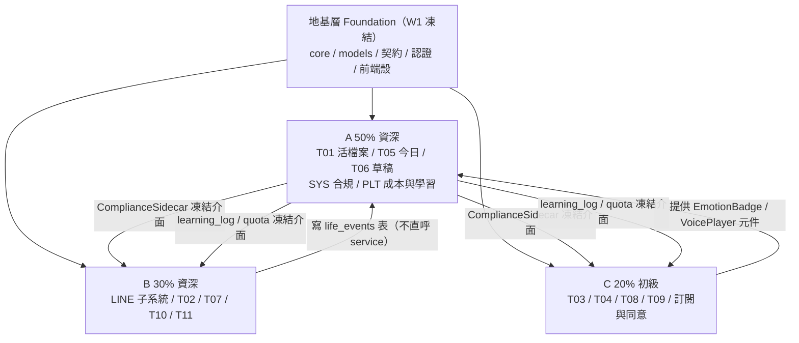
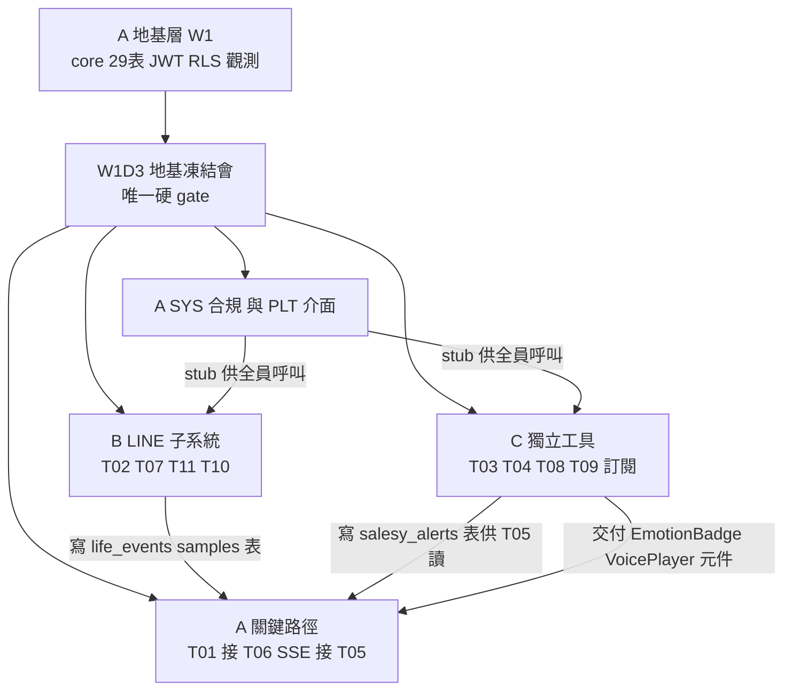
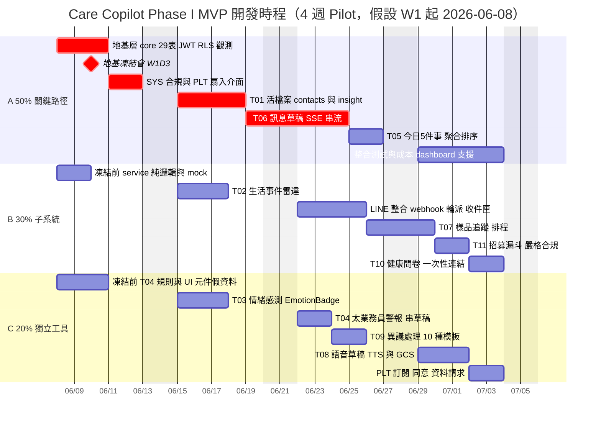

<!-- 版本 v0.2 | 日期 2026-06-07 | 狀態 draft | 對應 PRD v0.2（docs/PRD.md） / Tech Spec v0.4 | 專案 synergy(repo 根) | v0.2 變更：B 增 enrichment_service 與 contact_suggestions（來訊三合一分析）；C 的 T08 增語音 OA 發送（m4a、listen/send、30 天保存）；資料表 29 → 30 -->

# 07 團隊分工與低衝突協作策略 — Care Copilot

> 本文件把 Care Copilot Phase I MVP（11 工具 + SYS 合規 + PLT 平台 + LINE 整合）切成 **50 / 30 / 20** 三份工作，
> 切分維度 = **按工具垂直切片**，團隊組成 = **兩位資深（A、B）＋ 一位初級（C）**。
> 設計第一目標：**模組間低耦合、把跨人 merge 衝突降到最低**。
>
> 對齊文件：[00_tech-spec.md](./00_tech-spec.md)、[06_project-structure.md](./06_project-structure.md)、[02_api.md](./02_api.md)、[03_data-model.md](./03_data-model.md)。
> 本文件**不重新定義** schema / 端點 / enum；那些以 00–06 為唯一真實來源，這裡只定義「誰做哪些檔、檔與檔之間如何不打架」。

---

## 0. 怎麼讀這份文件

| 你是 | 先讀 | 重點 |
| :--- | :--- | :--- |
| A（資深，50%） | §3 地基層、§5.1、§6、§7 | 你是地基 owner，W1 凍結前你是全隊的關鍵路徑 |
| B（資深，30%） | §5.2、§6、§9 | LINE 子系統與你的垂直群，依賴 A 的凍結介面 |
| C（初級，20%） | §5.3、§6.4、§8 | 你拿的全是低耦合獨立工具，照介面契約做即可 |
| 全員 | §1、§7、§8 | 為什麼這樣切、merge 衝突熱區、Git 規範 |

---

## 1. 分工總原則

### 1.1 為什麼用「垂直切片」而不是「前端/後端/AI 分人」

水平分層（一人後端、一人前端、一人 AI）會讓**每一個功能都需要三個人協作才能完成**，介面點極多、天天互相卡、PR 互等、merge 衝突集中在共用層。

垂直切片則是：**一個人從資料表一路擁有到頁面**，一組工具的所有檔案幾乎只有他自己會動。跨人接觸面被壓到只剩「少數凍結介面」與「共用地基」。這正是降低 merge 衝突的根本手段。



### 1.2 三條鐵律（違反就會製造衝突）

1. **跨工具只透過「資料表」或「凍結介面」互動**，**絕不** `import` 對方的 service 直接呼叫其內部函式。
   - 例：T02（B）偵測到生活事件就寫進 `life_events` 表；T05（A）的排程自己去讀 `life_events` 產生今日任務卡。兩人零直接呼叫。
2. **共用地基層 W1 凍結後 append-only**：可以「新增欄位 / 新增路由 / 新增 enum 值」，**不可**修改既有簽章、改既有欄位型別、刪既有端點。要破壞性改動 → 開地基變更 PR，A review。
3. **每個檔案有唯一 owner**（見 §4 矩陣）。改不是自己 owner 的檔 → 必須該 owner review 才能合併（用 CODEOWNERS 強制）。

### 1.3 開發順序、關鍵路徑與依賴 DAG

> 一句話：**硬順序只有一個關卡（W1 地基凍結會）；凍結後三人垂直線幾乎完全平行。** 順序性分三層。

**(1) 唯一硬阻塞 — W1 地基凍結會（全隊 gate）**

A 的地基層是所有人的前置。凍結會（W1D3，見 §3.2）之前 B、C 不接真介面，但**不空轉**：做不依賴地基的部分（service 內部純邏輯、domain 規則、前端元件＋假資料、C 的 T04 純規則引擎）。凍結會通過後，三人接真介面平行開工。**A 若 delay 凍結會，全隊 delay**（風險見下表）。

**(2) 凍結後 — 三人互不阻塞**

所有跨人接點（合規 / quota / learning_log / VoiceProvider）在 W1 已凍結成**可呼叫的 stub**（合規先回 green）。消費者拿 stub 就能整合測試，不必等對方「功能做完」。這是垂直切片消除執行期互等的關鍵。

**(3) 軟順序 — 有邏輯先後但非乾等**

| 先 | 後 | 性質 |
| :--- | :--- | :--- |
| A 合規/quota/learning 介面（W1 stub） | 全員呼叫 | 介面先行 |
| A 的 T06 草稿（W2） | B 的 LINE 回覆草稿（W3 沿用 T06） | 復用 |
| A 的 VoiceProvider 抽象（W1） | C 的 T08 語音實作（W4） | 抽象先行 |
| B/C 寫自己的表（W2–W3） | A 的 T05 今日**完整 e2e** | 透過表非呼叫；T05 本體 W2 用 seed 即可開發 |

**依賴 DAG**



**關鍵路徑（critical path）= A 的「地基 → T01 → T06 SSE → T05」**

這條鏈最長且最難，決定整個專案節奏；B（30%）、C（20%）的總工時都短於它。排程上 A 永遠是瓶頸——這也是 A 拿 50% 的排程理由。甘特圖（§10）以紅色 `crit` 標出此鏈。

**順序風險與緩解**

| 風險 | 緩解 |
| :--- | :--- |
| A 的 W1 地基 delay → 全隊卡 | 凍結會設 W1D3（非週末）留 buffer；B/C 凍結前做 mock 不空轉 |
| 介面凍結後才發現要改 | 凍結會 B/C 逐一確認自己依賴的簽章才簽字；之後只准 append-only |
| A 在 W2 同時扛 T01+T06+T05 過載 | T05 本體延到 W2 末／W3 初用 seed 推進；非關鍵的 PLT 計量細節後移 |
| T05 完整 e2e 太晚整合 | 各 owner 寫自己表時順手出 seed 資料，讓 A 提早跑 T05 |

---

## 2. 工作量分配總表（50 / 30 / 20）

| 成員 | 佔比 | 角色定位 | 負責工具 | 一句話 |
| :--- | :--: | :--- | :--- | :--- |
| **A** | **50%** | 資深・地基 owner | 地基層 + T01 + T05 + T06 + SYS + PLT 成本/學習 | 撐起全隊地基與最高扇入的核心 AI 鏈 |
| **B** | **30%** | 資深・子系統 owner | LINE 整合 + T02 + T07 + T10 + T11 | 一個自成體系的 LINE + 追蹤/招募/問卷垂直群 |
| **C** | **20%** | 初級・獨立工具 | T03 + T04 + T08 + T09 + PLT 訂閱/同意/資料請求 | 全是介面清晰、彼此不交纏的獨立模組 |

> **為什麼 A 拿 50%**：地基層（core/models/migration/認證/觀測/前端殼）是全隊關鍵路徑且高扇入衝突源，必須由一位資深在 W1 先建好、先凍結，其他人才能平行開工。再加上 T06 訊息草稿（SSE 串流，全專案最難的前後端）、T05 今日聚合（讀所有來源）、SYS 合規（被所有外送草稿扇入）——這些都不適合丟給初級。
>
> **為什麼 C 拿 20% 且是這幾個**：T04 純規則引擎（無 AI、最獨立）、T09 異議（10 種靜態模板）、T03 情緒（單一分類 endpoint）、T08 語音（介面 = 文字進、mp3 出）、訂閱/同意（CRUD 展示）。全是「單一端點 / 純規則 / CRUD / 介面已被 A 定義好骨架」的低風險工作，初級可獨立交付，且這些檔案不和任何人重疊。

---

## 3. 共用地基層（Shared Foundation）— W1 由 A 建立並凍結

這是**唯一允許多人依賴的共用區**。A 在 W1 一次建好、跑通、凍結，凍結後全員 append-only。

### 3.1 地基層清單（owner = A，🔒 凍結後 append-only）

| 區塊 | 檔案 | 凍結內容 | append-only 允許 |
| :--- | :--- | :--- | :--- |
| 設定 | `backend/app/core/config.py` | `Settings` 既有欄位、`.env` 既有 key | 新增環境變數 |
| 認證 | `backend/app/core/auth.py` | JWT 簽發/驗證、`distributor`/`leader` 角色、登入流程 | — |
| DB | `backend/app/core/db.py` | async engine、session factory、RLS 三 session 變數注入（`app.current_tenant_id` / `app.current_distributor` / `app.current_role`） | — |
| 觀測 | `backend/app/core/observability.py` | OTel + Sentry 初始化 | 新增 instrument |
| 錯誤 | `backend/app/core/errors.py` | 統一錯誤碼與例外處理器（對齊 02_api.md F.3） | 新增錯誤碼 |
| 成本 | `backend/app/core/cost_guard.py` | `CostLimitReached` 熔斷邏輯（G.5） | — |
| 依賴 | `backend/app/api/deps.py` | `get_db` / `get_current_distributor` / 分頁依賴 | 新增共用依賴 |
| 入口 | `backend/app/main.py` | lifespan、中介層、router 註冊機制（見 §7.1） | 各人加 1 行 include_router |
| 共用 schema | `backend/app/schemas/common.py` | 游標分頁、統一錯誤信封 | — |
| Repo 基底 | `backend/app/repositories/base_repository.py` | findAll/findById/create/update/delete | — |
| 基礎模型 | `backend/app/models/tenant.py`、`distributor.py`、`brand.py` | tenants / distributors / brands / brand_products 四張基礎表 | — |
| Migration baseline | `backend/migrations/versions/0001_baseline.py` | Day 1 全 30 表建表（見 §9） | 後續各自獨立 revision |
| 合規介面 | `backend/app/sidecars/compliance_sidecar.py` | `ComplianceSidecar.scan(text, tenant_id) -> ComplianceResult` 簽章 | 擴詞庫 |
| 紀錄/配額介面 | `backend/app/services/learning_log_service.py`、`quota_service.py` | `LearningLogService.write(...)`、`QuotaService.check_*` / `record_ai_cost` 簽章 | — |
| 語音抽象 | `backend/app/infra/voice_provider.py` | `VoiceProvider.synthesize(text, voice_style, language) -> bytes` 抽象 | — |
| 前端殼 | `frontend/src/lib/api/client.ts` | axios/fetch 基底、JWT 注入、攔截器 | — |
| 前端殼 | `frontend/src/lib/sse.ts`、`lib/api/errors.ts` | EventSource 包裝、錯誤碼對映 | — |
| 前端殼 | `frontend/src/store/authStore.ts` | 登入態、role、token | — |
| 前端殼 | `frontend/src/routes/index.tsx` | 路由註冊機制（見 §7.4） | 各人加自己的 route 物件 |
| 前端殼 | `frontend/src/components/ui/*` | Button / Card / Badge / Input 基礎元件 | 新增基礎元件 |
| 前端殼 | `frontend/src/styles/tokens/apple.css`、`global.css` | Apple 設計 tokens、Tailwind directives | 新增 token（不改既有值） |
| PWA | `frontend/src/pwa/*`、`public/manifest.json` | Service Worker、manifest | — |

### 3.2 凍結時點與「凍結會」

- **W1 第 3 個工作日**前，A 必須交付地基層**可跑通的骨架**：能登入拿到 JWT、能打通一個 `/health`、30 表 migration 能 upgrade、`ComplianceSidecar.scan()` 有可呼叫的空實作（先回 green）、前端能登入進首頁殼。
- 交付後召開 **30 分鐘凍結會**：B、C 確認自己依賴的介面簽章 OK → 簽字凍結。凍結後這些介面進入 append-only 狀態。
- 凍結前 B、C 不碰地基檔；做自己工具的**純邏輯與 mock**（service 內部、domain 規則、前端元件 + 假資料），等凍結後再接真介面。

---

## 4. 檔案所有權矩陣（CODEOWNERS）

> 圖例：🔒 = 地基（A 建、凍結後 append-only）、A = A 專屬、B = B 專屬、C = C 專屬、🤝 = 整合檔（骨架 owner + 他人供元件，見 §7）

### 4.1 後端 `backend/app/`

| 路徑 | Owner | 對應工具 |
| :--- | :--: | :--- |
| `core/*`、`api/deps.py`、`main.py` | 🔒A | 地基 |
| `schemas/common.py`、`repositories/base_repository.py` | 🔒A | 地基 |
| `models/tenant.py`、`distributor.py`、`brand.py` | 🔒A | 地基（基礎表） |
| `sidecars/compliance_sidecar.py`、`services/compliance_service.py`、`repositories/compliance_repository.py`、`api/compliance.py`、`models/compliance.py`、`schemas/compliance.py` | A | SYS 合規低語 |
| `services/learning_log_service.py`、`quota_service.py`、`repositories/learning_log_repository.py`、`quota_repository.py`、`models/learning_log.py`、`models/subscription.py`(usage_quotas 部分)、`infra/langfuse_client.py` | A | PLT 成本/學習扇入 |
| `api/contacts.py`、`services/contact_service.py`、`repositories/contact_repository.py`、`models/contact.py`、`schemas/contact.py`、`agents/contact_insight_agent.py` | A | T01 活檔案 |
| `api/today_tasks.py`、`services/today_task_service.py`、`repositories/today_task_repository.py`、`models/today_task.py`、`schemas/today_task.py`、`domain/today_task_priority.py` | A | T05 今日 5 件事（聚合） |
| `api/message_drafts.py`、`services/message_draft_service.py`、`repositories/draft_repository.py`、`models/message_draft.py`、`schemas/message_draft.py`、`agents/draft_agent.py` | A | T06 訊息草稿（SSE） |
| `api/life_events.py`、`services/life_event_service.py`、`repositories/life_event_repository.py`、`models/life_event.py`、`schemas/life_event.py`、`agents/life_event_agent.py` | B | T02 生活事件雷達 |
| `api/samples.py`、`services/sample_service.py`、`repositories/sample_repository.py`、`models/sample.py`、`schemas/sample.py`、`agents/sample_draft_agent.py`、`domain/sample_schedule.py` | B | T07 樣品追蹤 |
| `api/recruitment.py`、`services/recruitment_service.py`、`models/recruitment.py`、`schemas/recruitment.py`、`agents/recruitment_agent.py` | B | T11 招募漏斗 |
| `api/questionnaire.py`、`services/questionnaire_service.py`、`models/questionnaire.py`、`schemas/questionnaire.py`、`agents/questionnaire_agent.py` | B | T10 健康問卷 |
| `api/webhooks.py`、`services/assignment_service.py`、`inbox_service.py`、`enrichment_service.py`、`repositories/official_account_repository.py`、`inbound_message_repository.py`、`contact_suggestion_repository.py`、`models/official_account.py`、`inbound_message.py`、`contact_suggestion.py`、`infra/line_client.py` | B | LINE 整合（含來訊三合一分析與活檔案待確認建議） |
| `api/emotion.py`、`services/emotion_service.py`、`models/emotion.py`、`schemas/emotion.py`、`agents/emotion_agent.py` | C | T03 情緒感測 |
| `api/salesy_alerts.py`、`services/salesy_alert_service.py`、`sidecars/salesy_rules.py`、`models/salesy_alert.py`、`schemas/salesy_alert.py` | C | T04 太業務員警報（純規則） |
| `api/voice_clips.py`、`services/voice_service.py`、`repositories/voice_repository.py`、`models/voice_clip.py`、`schemas/voice_clip.py`、`infra/openai_tts.py`、`elevenlabs_tts.py`、`storage.py` | C | T08 語音草稿 |
| `api/objection_responses.py`、`services/objection_service.py`、`models/objection.py`、`schemas/objection.py`、`agents/objection_agent.py` | C | T09 異議處理 |
| `api/platform.py`(訂閱/同意/資料請求部分)、`models/consent.py`、`models/subscription.py`(subscriptions 部分)、`schemas/platform.py` | C | PLT 訂閱/同意/資料請求 |
| `infra/scheduler.py` | 🤝 | APScheduler（A 建殼，T05/T07 各自註冊 job，見 §7.3） |

> **注意 `models/subscription.py`**：含 `subscriptions`（C 訂閱方案）與 `usage_quotas`（A 配額熔斷）兩張表。為避免共改一檔，**W1 由 A 在地基階段把這兩個 ORM class 拆成 `models/subscription.py`(C) 與 `models/usage_quota.py`(A) 兩個檔**（偏離 06 的單檔規劃，理由：拆檔降衝突）。

### 4.2 前端 `frontend/src/`

| 路徑 | Owner | 對應 |
| :--- | :--: | :--- |
| `lib/api/client.ts`、`sse.ts`、`errors.ts`、`store/authStore.ts`、`routes/index.tsx`、`components/ui/*`、`styles/*`、`pwa/*`、`pages/Auth/Login.tsx` | 🔒A | 地基殼 |
| `pages/Today.tsx`、`components/today/TodayTaskCard.tsx`、`store/todayStore.ts`、`hooks/useTodayTasks.ts` | 🤝A | T05 今日（整合頁，骨架 A） |
| `pages/Contacts/*`、`components/contact/*`、`hooks/useContacts.ts`、`lib/api/contacts.ts` | 🤝A | T01 活檔案（ContactDetail 為整合入口） |
| `pages/Drafts/*`、`components/drafts/*`、`hooks/useDraftStream.ts`、`store/draftStore.ts`、`lib/api/drafts.ts`、`components/compliance/ComplianceBadge.tsx` | A | T06 + 合規徽章 |
| `pages/Samples/*`、`lib/api/samples.ts` | B | T07 |
| `pages/Recruitment/*`、`lib/api/recruitment.ts` | B | T11 |
| `pages/Questionnaire/*`、`lib/api/questionnaire.ts` | B | T10（含客戶端免登入填答頁） |
| `pages/Inbox/*`、`components/inbox/*`、`hooks/useInbox.ts`、`lib/api/inbox.ts` | B | LINE 收件匣 |
| `components/emotion/EmotionBadge.tsx`、`hooks/useEmotionDetect.ts` | C | T03（嵌入 ContactDetail） |
| `components/voice/VoicePlayer.tsx`、`hooks/useVoiceClip.ts`、`lib/api/voice.ts` | C | T08（嵌入 Draft/ContactDetail） |
| `pages/Objection/*`、`lib/api/objection.ts` | C | T09 |
| `pages/Subscription.tsx`、`components/quota/QuotaBanner.tsx`、`hooks/useQuota.ts`、`store/quotaStore.ts`、`lib/api/platform.ts` | C | PLT 訂閱/配額顯示 |

---

## 5. 三人詳細工作包

### 5.1 A（50%，資深・地基 owner）

**W1（地基週，全隊關鍵路徑）**
- 建立 backend/frontend 獨立專案骨架（:8002 / :3002）、docker-compose 起 pgvector container。
- §3.1 全部地基層：core、認證（JWT 登入、distributor/leader）、DB + RLS 三 session 變數、deps、main 路由註冊機制、觀測（OTel/Langfuse/Sentry）。
- **30 表 Alembic baseline migration**（§9）+ 基礎表 model（tenants/distributors/brands/brand_products）。
- **SYS 合規 sidecar**：`ComplianceSidecar.scan()` 介面 + 50 詞 regex（法務詞庫 P0-09 未到前用 10 詞佔位），綠/黃/紅，< 50ms，100% 寫 `compliance_checks`（G.2）。
- **PLT 扇入介面**：`LearningLogService.write()`（fire-and-forget，G.4）、`QuotaService`（Freemium/Pro 配額 + 成本熔斷 G.5）、`cost_guard`。
- 前端殼：client/sse/errors、authStore、routes 機制、ui 基礎元件、Apple tokens、PWA。
- **W1D3 交付骨架 → 凍結會**。

**T01 活檔案（W1–W2）**：contacts + contact_interactions CRUD、4 種補資料入口（文字/截圖/語音 parse）、Sonnet 4.6 insight、`contact_embedding vector(1536)` 語意搜尋。前端 ContactList + ContactDetail（整合入口骨架）。

**T06 訊息草稿（W2，最難）**：`POST /api/v1/message-drafts/stream` SSE，Haiku 首字 + Sonnet 全文 streaming，3 語氣（care/casual/business），送出前過 `ComplianceSidecar`，前端 `useDraftStream` + StreamingDraft + ComplianceBadge。

**T05 今日 5 件事（W2）**：規則排序聚合，APScheduler 每日 22:00 UTC 產次日任務。**只讀** life_events / samples / salesy_alerts / recruitment / inbound_messages 等表產生 `today_tasks`（不呼叫他人 service）。前端 Today + TodayTaskCard。

**驗收**：地基凍結會通過；合規 sidecar 100% 覆蓋；RLS 隔離測試 100% 通過；T06 SSE e2e 通過。

---

### 5.2 B（30%，資深・LINE 子系統 owner）

> B 的五塊是一個**自成體系的垂直群**，與 A 的核心鏈在檔案上零重疊；唯一接點是「呼叫 A 凍結的 `ComplianceSidecar` / `LearningLogService` / `QuotaService` 介面」與「寫自己的表給 T05 讀」。

**LINE 整合（W3，最大塊）**：
- `infra/line_client.py`：封裝 line-bot-sdk，`verify_signature` / `push_message`。
- `api/webhooks.py`：`POST /api/v1/webhooks/line`（公開，X-Line-Signature HMAC 驗簽，< 3s 回 200）。
- `assignment_service.py`：新客戶 round-robin（`official_accounts.assignment_cursor`）、既有客戶 sticky、Leader 改派 `PUT /contacts/{id}/assignment`。
- `inbox_service.py` + `GET /inbox`：寫 `inbound_messages`、待回覆篩選；自動生回覆草稿（Haiku 4.5，過合規）→ 教練審核 → `POST /message-drafts/{id}/send` → LINE push（G.1/G.6：AI 不自動回、紅燈擋送；含太業務員發送前預警 409 SALESY_WARNING）。
- `enrichment_service.py`：來訊三合一分析（單次 Haiku：情緒/生活事件/活檔案建議）→ 寫 `contact_suggestions`（G.7：教練 confirm 才入檔）+ `contact-suggestions` confirm/dismiss 端點；非同步、失敗不阻收訊。
- 前端 InboxPage + InboxMessageCard + ReplyReviewPanel（含發送按鈕）。

**T02 生活事件雷達（W2）**：規則 + Haiku 4.5 抽取，**寫 `life_events` 表**（T05 自己來讀，零直接呼叫）。

**T07 樣品追蹤（W3）**：samples + sample_followups，APScheduler 排 48h/72h/7d（`domain/sample_schedule.py`），預生跟進草稿（過合規）。前端 SampleList。

**T11 招募漏斗（W3）**：四階段（warm_list/exposure/invitation/signed），Sonnet 4.6，**最嚴格 FTC 合規**（呼叫 A 的 sidecar，紅燈強制阻擋）。前端 RecruitmentFunnel。

**T10 健康問卷（W4）**：一次性連結（7 天有效、客戶端免登入填答頁）、Sonnet 4.6 摘要。前端 SendQuestionnaire（直銷商端）+ FillQuestionnaire（客戶端公開頁）。

**驗收**：LINE webhook 驗簽 + round-robin + 審核發送 e2e；問卷免登入連結安全（token 過期/一次性）；招募草稿紅燈阻擋測試通過。

---

### 5.3 C（20%，初級・獨立工具）

> C 的每一塊都是「介面已被 A 在地基定義好骨架」或「純規則 / CRUD」，可獨立交付、不卡別人。建議 C 先做 T04（最簡單、純規則、建立信心），再 T09 → T03 → T08 → 訂閱/同意。

**T04 太業務員警報（W3，純規則無 AI）**：`sidecars/salesy_rules.py`（產品關鍵字 + URL pattern）、連 3 則推銷觸發 `salesy_alerts`，預生純關懷草稿（呼叫 A 的草稿/合規介面）。最獨立，最適合起手。

**T09 異議處理（W3）**：10 種預設模板（P0-07 訪談收斂），Haiku 4.5 出共情型/提問型/邀請型 3 種，過合規。前端 ObjectionPage（獨立頁，不依賴 contacts）。

**T03 情緒感測（W2）**：單一 endpoint，Haiku 4.5 三檔（stressed/neutral/happy）。前端 EmotionBadge 元件 + useEmotionDetect hook，**交付元件給 A 嵌入 ContactDetail**（props 介面交付，不碰 A 的頁面檔）。

**T08 語音草稿（W4）**：實作 A 已定義的 `VoiceProvider` 抽象 → `openai_tts.py`（W4 選型前先做 OpenAI）、GCS 上傳 + V4 Signed URL。介面 = 文字進、**m4a（AAC）出**（LINE audio message 要求）、≤ 60s。保存雙軌：未發送 7 天 / 已 OA 發送 30 天（`retention_until`）。OA 發送流程：`/listen`（試聽前置）→ `/send`（LINE push audio message；未試聽 422、紅燈 422、草稿已改 409 VOICE_STALE）——LINE push 呼叫沿用 B 的 `line_client.py`。前端 VoicePlayer 元件（預覽 + 下載 / OA 客戶試聽後發送）。

**PLT 訂閱/同意/資料請求（W4）**：subscriptions CRUD + Subscription 頁（方案比較、升級 CTA）、consents 記錄、data_requests（export/delete，30/7 天）、QuotaBanner（讀 A 的 quota API 顯示剩餘額度）。皆為 CRUD/展示。

**驗收**：T04 規則單元測試覆蓋；T03 EmotionBadge 元件 A 確認可嵌入；T08 語音 ≤ 60s + Signed URL 過期測試；訂閱頁與 QuotaBanner 串通 A 的配額 API。

---

## 6. 模組邊界與依賴契約（這是低耦合的關鍵）

所有跨人互動只准走以下 5 個凍結接點，其餘一律「透過資料表」。

### 6.1 合規介面（A → 全員）
```python
# app/sidecars/compliance_sidecar.py（A 凍結）
class ComplianceSidecar:
    @staticmethod
    async def scan(text: str, tenant_id: str) -> ComplianceResult:
        """回傳 status: green|yellow|red, triggered_terms, suggestion；< 50ms"""
```
T06/T07/T09/T10/T11 + LINE 發送前一律呼叫此介面；紅燈處理方式見 05_backend §13.3 表。**呼叫方不碰 sidecar 內部**。

### 6.2 學習紀錄 / 配額介面（A → 全員）
```python
LearningLogService.write(distributor_id, tenant_id, event_type, source_type, source_id, metadata)  # fire-and-forget
QuotaService.check_draft_quota(distributor_id, tenant_id)      # 不足 raise → 429
QuotaService.record_ai_cost(distributor_id, tenant_id, cost_usd)  # 每次 AI 呼叫後
```
任何人做 AI 操作，**只呼叫這三個**，不自己寫 learning_logs / usage_quotas。

### 6.3 語音抽象介面（A 定義 → C 實作）
```python
# app/infra/voice_provider.py（A 凍結抽象）
class VoiceProvider(ABC):
    async def synthesize(self, text: str, voice_style: str, language: str) -> bytes: ...
```
C 只新增 `openai_tts.py` / `elevenlabs_tts.py` 實作，不改抽象。

### 6.4 「透過資料表」互動（零直接呼叫）

| 生產者 | 寫入的表 | 消費者 | 消費者怎麼拿 |
| :--- | :--- | :--- | :--- |
| T02 生活事件（B） | `life_events` | T05 今日（A） | A 的排程 SELECT，不呼叫 B |
| T07 樣品跟進（B） | `sample_followups` | T05 今日（A） | 同上 |
| T04 警報（C） | `salesy_alerts` | T05 今日（A） | 同上 |
| T11 招募（B） | `recruitment_stages` | T05 今日（A） | 同上 |
| LINE 收訊（B） | `inbound_messages` | T05 今日（A） | A 讀 `source_type=inbound_reply` |

> 這條原則讓「今日 5 件事」這個天然聚合點不會變成 5 個人共改一支 service——A 只讀表，其他人只寫自己的表。

### 6.5 前端元件交付（C → A 的整合頁）

`ContactDetail.tsx`（A 擁骨架）需要嵌入 `EmotionBadge`（C）、`VoicePlayer`（C）、`ParseInputModal`（A 自有）。
- C 把元件做成**自帶資料載入的獨立元件**（內部用自己的 hook 呼叫自己的 API），對外只暴露 `contactId` 之類最小 props。
- A 在頁面 `import` 該元件、放進版面，**不需要知道元件內部**。元件升級不影響頁面 → 不衝突。

---

## 7. Merge 衝突熱區與規避機制

垂直切片後仍有幾個「天生多人要碰」的檔，逐一拆解：

### 7.1 `app/main.py`（路由註冊）
改用**註冊表自動掃描**，避免人人改入口檔：
```python
# app/api/__init__.py（地基，A 建）
from importlib import import_module
ROUTER_MODULES = ["auth","contacts","life_events","emotion","salesy_alerts",
    "today_tasks","message_drafts","samples","voice_clips","objection_responses",
    "questionnaire","recruitment","webhooks","compliance","platform"]
routers = [import_module(f"app.api.{m}").router for m in ROUTER_MODULES]
```
`main.py` 用 `for r in routers: app.include_router(r, prefix="/api/v1")`。
新增工具 = 在 `ROUTER_MODULES` list **加一行字串**（不同行、衝突機率極低；真衝突也是一行 trivial）。

### 7.2 各 `__init__.py`（models/services/...）
- **避免在 `__init__.py` 做集中 re-export**。每個模組各自 `from app.models.contact import Contact` 直接引入具體檔，`__init__.py` 留空或最小。
- Alembic 的 model 匯入用 `models/__init__.py` 的**一人一行**（按 owner 分段註解），衝突也只是一行。

### 7.3 `infra/scheduler.py`（APScheduler）
A 建排程器殼 + 註冊機制；T05、T07 各自在自己的 service 內定義 job 函式，於模組載入時 `scheduler.add_job(...)`。**不集中在 scheduler.py 列 job**。

### 7.4 前端 `routes/index.tsx`
每個 feature 在自己資料夾匯出 route 物件，主檔只 spread：
```tsx
// 各 owner 維護：pages/Samples/routes.tsx 匯出 sampleRoutes
// routes/index.tsx（地基）只做：
export const routes = [ ...coreRoutes, ...contactRoutes, ...sampleRoutes,
  ...inboxRoutes, ...objectionRoutes, ...subscriptionRoutes, /* 各人加一行 */ ]
```

### 7.5 設計 tokens / Tailwind config
W1 由 A 從 `.claude/ui/apple/DESIGN.md` 一次抄齊 token，**凍結後 append-only**（只准新增 token，不改既有值）。元件一律引用 `var(--color-*)`，禁硬編碼 hex。

### 7.6 共用 enum / ID 前綴 / 錯誤碼
集中在凍結檔（schemas/common、core/errors、03_data-model 的 enum 表），append-only。新增 enum 值要在 PR 標題標 `[contract]` 讓 A 知道。

### 熱區總表

| 熱區 | 規避機制 | 殘餘衝突風險 |
| :--- | :--- | :--- |
| `main.py` / `api/__init__.py` | 字串註冊表，加一行 | 極低 |
| `models/__init__.py` | 一人一行、按 owner 分段 | 極低 |
| `scheduler.py` | service 內 self-register | 無（各自檔） |
| `routes/index.tsx` | feature 各自匯出 routes 陣列 | 極低 |
| Alembic versions | 各自獨立 revision + 多 head merge（§9） | 低 |
| tokens / config | W1 凍結 append-only | 無 |
| enum / 錯誤碼 | 凍結 append-only + `[contract]` 標記 | 低 |
| `ContactDetail` / `Today` 整合頁 | 骨架 owner + 自帶資料的獨立元件嵌入（§6.5） | 低 |

---

## 8. Git 協作規範

1. **分支**：`feat/<owner>-<tool>`，例 `feat/c-t04-salesy-alert`、`feat/b-line-inbox`。
2. **小步 PR**：一個 PR 只動自己 owner 的檔；碰到他人 owner 檔 → 拆出來、找 owner。PR < 400 行 diff 為佳。
3. **每日 rebase main**：每天早上先 `git pull --rebase origin main` 再開工，把整合衝突攤到每天、每次很小。
4. **CODEOWNERS 強制 review**：在 repo 根建 `.github/CODEOWNERS`（範本見附錄），改到他人 owner 檔必須該 owner approve 才能 merge。
5. **commit 慣例**（對齊 `.claude/rules/git-workflow.md`）：`feat: / fix: / refactor: ...`；動到契約檔的 PR 標題加 `[contract]`。
6. **地基凍結後**：任何破壞性改地基 → 開 `chore(foundation): ...` PR，A review + 全員知會。
7. **功能旗標**：尚未完成的工具，路由可掛但前端入口用 flag 藏，避免半成品卡 main。
8. **禁止**：直接 push main；改他人 migration revision；在 `__init__.py` 集中 re-export 製造熱區。

---

## 9. Alembic Migration 協作規範（最容易衝突，單獨立規）

1. **W1 baseline**：A 出 `0001_baseline.py`，Day 1 一次建好全 30 表（含 official_accounts/inbound_messages/contact_suggestions、含 RLS policy、pgvector 欄位）。對齊 03_data-model.md。
2. **凍結後各自獨立 revision**：之後每人對自己的表做變更，各自 `alembic revision -m "<owner>_<desc>"`；**禁止改動他人已 merge 的 revision**。
3. **多 head 處理**：兩人同時從同一 head 分出 → 出現多 head，用 `alembic merge -m "merge <a> <b>" <head1> <head2>` 合併，不互相 rebase 對方的遷移。
4. **命名**：revision message 帶 owner 與工具，例 `b_add_line_user_id_to_contacts`。
5. **跨 owner 改表**：例如 LINE 要在 `contacts`（A 的表）加 `line_user_id`——由**表 owner A 出該欄位的 migration 與 model 變更**（W1 baseline 就一次納入，避免後期跨 owner 改表）。B 只用，不自己改 A 的 contacts model。

> 因為採 Day 1 全表 baseline，絕大多數欄位 W1 就定齊，後續 migration 很少，這本身就把 migration 衝突壓到最低。

---

## 10. 4 週 Roadmap × 人員甘特

> 起始日為**假設**（W1 週一 = 2026-06-08），依實際開工日整段平移即可。紅色 `crit` = A 的關鍵路徑；◆ = 地基凍結會里程碑。`excludes weekends` 已排除週末。



| 週 | A（50%） | B（30%） | C（20%） |
| :-- | :--- | :--- | :--- |
| **W1** | 🔒地基全套 + 認證 + 29表 baseline + SYS 合規 + PLT 扇入介面 + 觀測 + T01 起頭；**W1D3 凍結會** | 凍結前：LINE/問卷/招募的 service 純邏輯 + mock；凍結後接介面 | 凍結前：T04 純規則引擎（無依賴，先做）、UI 元件 + 假資料 |
| **W2** | T06 草稿 SSE（核心）+ T05 今日聚合 + T01 完成 | T02 生活事件雷達（寫 life_events） | T03 情緒（交付 EmotionBadge 給 A） |
| **W3** | 支援整合、合規詞庫擴充（法務 50 詞到位）、效能 | LINE 整合（webhook/輪派/收件匣/審核發送）+ T07 樣品 + T11 招募 | T04 警報串草稿 + T09 異議 |
| **W4** | Pilot 啟動支援、成本 dashboard、整合測試 | T10 健康問卷（一次性連結 + 摘要） | T08 語音（VoiceProvider 實作 + GCS）+ 訂閱/同意/資料請求 |

> A 的關鍵路徑集中在 W1–W2（地基 + 核心 AI）；W3–W4 轉為支援與品質，給 B/C 的整合期留出 review 頻寬。

---

## 11. 整合節點與每週同步

| 節點 | 時機 | 內容 | 守門人 |
| :--- | :--- | :--- | :--- |
| 地基凍結會 | W1D3 | 介面簽章驗收、簽字凍結 | A |
| 每日 standup | 每日 | 昨日/今日/卡點，特別是「我要碰到誰的檔」 | 全員 |
| 契約變更知會 | 隨時 | 任何 `[contract]` PR 須群播 | 改動者 + A |
| 跨領域不變量檢查 | 每週五 | G.1–G.6（草稿不自動送、合規硬閘、租戶 404、學習紀錄、成本熔斷、LINE 人工審核）逐條過 | A |
| 整合測試 | W3、W4 | e2e：草稿+合規、樣品 48h、LINE 收發、RLS 隔離 | A 主導，owner 各補自己工具 |

### 跨領域不變量 owner（任何人實作都不得違反，A 為總守門）

| 不變量 | 主要落點 | 守門 |
| :--- | :--- | :--- |
| G.1 草稿不自動送 | 全體外送（T06/T07/T08/T09/T10/T11 + LINE） | A 定義、全員遵守 |
| G.2 合規硬閘 100% 寫入 | `ComplianceSidecar` + `compliance_checks` | A |
| G.3 租戶隔離回 404 | RLS（A）+ 每端點（各 owner） | A 出測試框架，各 owner 補 case |
| G.4 學習紀錄強制寫入 | `LearningLogService`（A）各 AI 操作呼叫 | A 介面、各 owner 呼叫 |
| G.5 成本熔斷 ≤ 0.30 | `QuotaService`/`cost_guard`（A） | A |
| G.6 LINE 人工審核 | `inbox_service` 發送流程（B） | B 實作、A review |

---

## 附錄 A：`.github/CODEOWNERS` 範本

> 把 A/B/C 換成真實 GitHub 帳號。靠左規則被靠下規則覆蓋，故先寫地基（A）再寫各工具 owner。

```
# ===== 地基層（A）=====
/backend/app/core/                  @A
/backend/app/api/deps.py            @A
/backend/app/main.py                @A
/backend/app/api/__init__.py        @A
/backend/app/schemas/common.py      @A
/backend/app/repositories/base_repository.py  @A
/backend/migrations/                @A
/frontend/src/lib/                  @A
/frontend/src/store/authStore.ts    @A
/frontend/src/routes/index.tsx      @A
/frontend/src/components/ui/         @A
/frontend/src/styles/               @A
/frontend/src/pwa/                  @A

# ===== A 的工具（T01 / T05 / T06 / SYS / PLT 扇入）=====
/backend/app/api/contacts.py        @A
/backend/app/api/today_tasks.py     @A
/backend/app/api/message_drafts.py  @A
/backend/app/api/compliance.py      @A
/backend/app/sidecars/compliance_sidecar.py  @A
/backend/app/services/contact_service.py      @A
/backend/app/services/today_task_service.py   @A
/backend/app/services/message_draft_service.py @A
/backend/app/services/learning_log_service.py @A
/backend/app/services/quota_service.py        @A
/frontend/src/pages/Today.tsx       @A
/frontend/src/pages/Contacts/       @A
/frontend/src/pages/Drafts/         @A

# ===== B 的工具（LINE / T02 / T07 / T10 / T11）=====
/backend/app/api/webhooks.py        @B
/backend/app/api/life_events.py     @B
/backend/app/api/samples.py         @B
/backend/app/api/questionnaire.py   @B
/backend/app/api/recruitment.py     @B
/backend/app/services/assignment_service.py  @B
/backend/app/services/inbox_service.py        @B
/backend/app/services/sample_service.py       @B
/backend/app/infra/line_client.py   @B
/frontend/src/pages/Inbox/          @B
/frontend/src/pages/Samples/        @B
/frontend/src/pages/Questionnaire/  @B
/frontend/src/pages/Recruitment/    @B

# ===== C 的工具（T03 / T04 / T08 / T09 / 訂閱同意）=====
/backend/app/api/emotion.py         @C
/backend/app/api/salesy_alerts.py   @C
/backend/app/api/voice_clips.py     @C
/backend/app/api/objection_responses.py  @C
/backend/app/sidecars/salesy_rules.py     @C
/backend/app/infra/openai_tts.py    @C
/backend/app/infra/elevenlabs_tts.py @C
/backend/app/infra/storage.py       @C
/frontend/src/pages/Objection/      @C
/frontend/src/pages/Subscription.tsx @C
/frontend/src/components/emotion/   @C
/frontend/src/components/voice/     @C
```

---

## 附錄 B：一頁速查

- **A 50%**：地基 + T01 + T05 + T06 + SYS + PLT 成本/學習 → 撐地基、扛核心 AI、定義所有共用介面。
- **B 30%**：LINE + T02 + T07 + T10 + T11 → 自成體系的子系統，只透過介面與表接 A。
- **C 20%**：T03 + T04 + T08 + T09 + 訂閱/同意 → 純規則/CRUD/介面清晰的獨立件。
- **降衝突三鐵律**：①跨工具只走「表 + 凍結介面」②地基 W1 凍結後 append-only ③一檔一 owner + CODEOWNERS。
- **熱區規避**：註冊表（main/routes/scheduler）、一人一行（`__init__`）、各自 revision（Alembic）、自帶資料元件（整合頁）。

---

*文件維護者：專案分工協調 | 最後更新：2026-06-02 | 下次 review：W1 地基凍結會後*
