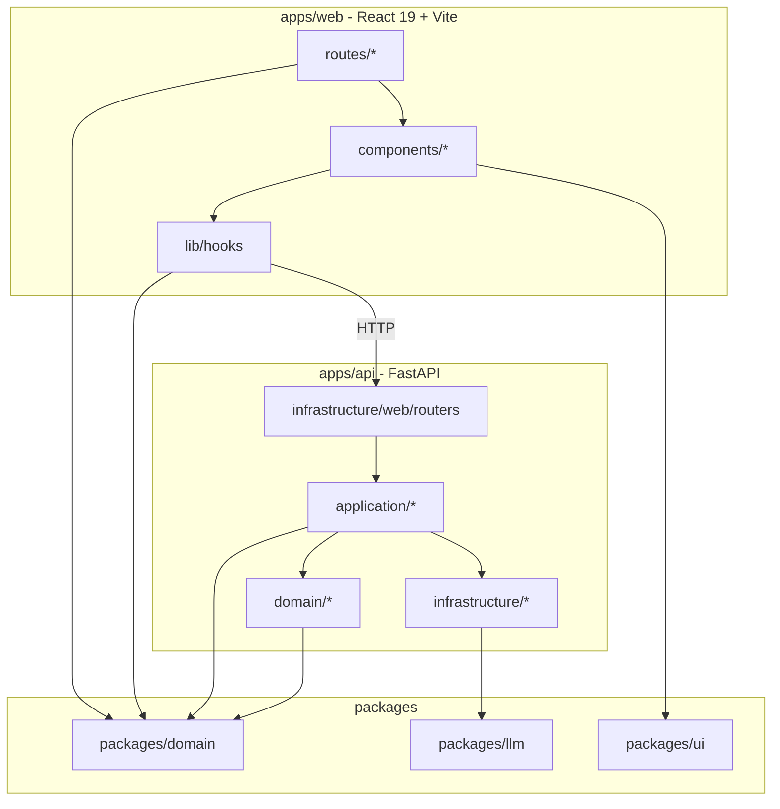
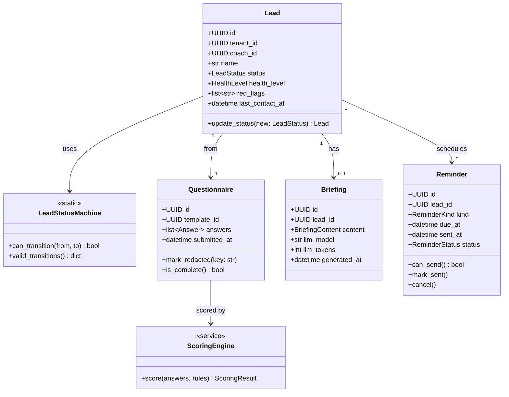

# 設計與依賴關係 — Synergy AI Closer's Copilot

> **版本:** v3.0 | **更新:** 2026-05-08
> **對應架構：** `docs/04_architecture.md` | **對應結構：** `docs/07_structure.md` | **對應決策：** ADR-013（前端改 React + Vite）

---

## 1. 分層與依賴方向



**規則**：
- Domain 不依賴任何其他層（純粹業務）
- Application 只依賴 Domain 與抽象介面（不直接 import 具體 Infra）
- Infrastructure 實作 Application 定義的介面
- `packages/*` 是橫切，所有層可用

---

## 2. 核心類別圖（Domain）



---

## 3. 技術依賴清單

### 3.1 前端（`apps/web` — v3.0 改為 React + Vite）

| 套件 | 版本 | 用途 | 理由 |
| :--- | :--- | :--- | :--- |
| react | ^19.0 | UI 框架 | 核心依賴 |
| typescript | ^5.5 | 型別 | — |
| vite | ^6.0 | 建置工具 | ADR-013：快速啟動、純靜態輸出 |
| @vitejs/plugin-react | ^4 | Vite React 支持 | — |
| react-router-dom | ^7.0 | 路由 | ADR-013：nested routes + data loaders |
| tailwindcss | ^4.0 | CSS | 既有 Apple tokens |
| @tanstack/react-query | ^5 | API 狀態管理 | 快取 + 重打 + optimistic update |
| @supabase/supabase-js | ^2 | Auth + Realtime | ADR-003 |
| react-helmet-async | ^2 | 動態 SEO meta | ADR-013：取代 Next.js next/head |
| zod | ^3 | schema 驗證 | 與 Pydantic 概念一致 |
| @hookform/resolvers | ^3 | 表單 | 問卷複雜表單 |
| react-hook-form | ^7 | 表單狀態 | — |
| lucide-react | latest | Icon | 輕量 |
| date-fns | ^3 | 時間 | 比 moment 輕 |

**ADR-013 移除**（來自 Next.js）：
- `next`
- `next-auth`（改用 Supabase Auth）

**環境變數格式變更**（ADR-013）：
- Next.js: `NEXT_PUBLIC_API_URL` → Vite: `VITE_API_BASE_URL`
- Next.js: `NEXT_PUBLIC_SUPABASE_URL` → Vite: `VITE_SUPABASE_URL`

**Build 指令變更**（ADR-013）：

| 指令 | Next.js | Vite |
| :--- | :--- | :--- |
| 開發 | `next dev` | `vite` |
| 建置 | `next build` | `vite build` |
| 預覽 | `next start` | `vite preview` |

### 3.2 後端（`apps/api`）

| 套件 | 版本 | 用途 | 理由 |
| :--- | :--- | :--- | :--- |
| fastapi | ^0.115 | REST API | — |
| uvicorn | ^0.30 | ASGI server | — |
| pydantic | ^2.9 | 資料驗證 | Pydantic v2 更快 |
| pydantic-settings | ^2 | 配置 | 環境變數管理 |
| supabase | ^2 | Client | ADR-003 |
| litellm | ^1.50 | LLM 抽象 | ADR-004 |
| line-bot-sdk | ^3 | LINE Messaging API（主通道）| ADR-008 |
| resend | ^2 | Email（備援通道）| ADR-008 |
| apscheduler | ^3.10 | 排程 | 單機夠用 |
| google-auth-oauthlib | ^1.2 | Google Calendar OAuth | ADR-012：日程整合 |
| google-auth-httplib2 | ^0.2 | Google Calendar API | ADR-012 |
| structlog | ^24 | 結構化日誌 | JSON 輸出 |
| httpx | ^0.27 | HTTP client | async |
| sentry-sdk | ^2 | 錯誤追蹤 | — |
| python-jose | ^3 | JWT 解碼 | Supabase JWT |
| pyyaml | ^6 | 計分規則 YAML | — |
| pydantic-yaml | ^1 | Pydantic YAML 支持 | 合規詞表（ADR-010） |

### 3.3 開發依賴

| 套件 | 用途 |
| :--- | :--- |
| pytest、pytest-asyncio、pytest-bdd、pytest-cov | 測試 |
| ruff | Lint + format |
| mypy | 型別檢查 |
| vcr.py | 錄製 HTTP 回應（LLM 測試） |
| playwright | E2E |
| eslint、prettier | TS lint |
| @testing-library/react | 元件測試 |
| @vitest/ui | Vite 測試 UI（可選） |
| msw | Mock Service Worker（API mock） |

### 3.4 LLM 供應商

| 供應商 | 模型 | 用途 | 月成本估（Pilot） |
| :--- | :--- | :--- | :--- |
| Google | gemini-2.5-flash（預設） | 問卷摘要 + 商談摘要 + 合規 Layer 2 | 50-200 NTD |
| Anthropic | claude-haiku-4-5（備援） | 成本超標時降級；合規高準度版本 | — |
| Anthropic | claude-opus-4-6（品質備援） | Pilot 若品質不足切換 | 500+ NTD |

---

## 4. SOLID 檢核

| 原則 | 檢核 | 實踐位置 |
| :--- | :--- | :--- |
| **S** 單一職責 | 每個 Service 一個 Bounded Context | `apps/api/src/application/*` 各一檔；前端 routes 各一頁面檔 |
| **O** 開放封閉 | LLM / Channel / Compliance 抽象可擴充 | `LLMAdapter`、`NotificationChannel`、`ComplianceLayer` Protocol |
| **L** 里氏替換 | LiteLLMAdapter、ResendEmailChannel、RuleEngine 可被測試替身取代 | 測試 fixture；VCR.py 錄製 |
| **I** 介面隔離 | Adapter 介面只暴露必要方法 | `LLMAdapter.complete()`、`ComplianceService.check()` 單一方法 |
| **D** 依賴反轉 | Application 依賴介面，不直接 import SDK | `ReminderService` 收 `NotificationChannel`；`ComplianceService` 收 `RuleEngine` + `LLMAdapter` |

---

## 5. 設計模式清單

| 模式 | 使用處 | 目的 |
| :--- | :--- | :--- |
| **Repository** | `infrastructure/persistence/repositories/*` | 封裝 Supabase 存取 |
| **Adapter** | `LLMAdapter`、`NotificationChannel` | 抽象外部服務 |
| **State Machine** | `LeadStatusMachine`、Reminder status flow | Lead/Reminder 狀態轉換規則 |
| **Strategy** | 計分規則 YAML + `ScoringEngine`；合規詞表 + RuleEngine | 規則可版本替換 |
| **Idempotency Key** | `POST /submit`、`regenerate` | 避免重複副作用 |
| **Background Task** | Briefing 生成、Reminder 發送、物化視圖更新 | 非阻塞主請求 |
| **Chain of Responsibility** | ComplianceService Layer 1 → 2 → 3 | ADR-010：多層檢查流程 |
| **Protected Routes** | React Router + ProtectedRoute HOC | ADR-013：auth guard（無 middleware） |
| **Context Provider** | React Context（AuthContext、ComplianceContext） | 跨頁面狀態共享 |
| **Custom Hooks** | `use-leads`、`use-compliance-queue` | 邏輯重用、測試友善 |

---

## 6. 前後端通信協議

### API Response Envelope（所有 endpoint）

```json
{
  "success": true,
  "data": { /* payload */ },
  "error": null,
  "timestamp": "2026-05-08T12:34:56Z"
}
```

### 成功案例（200 OK）

```json
{
  "success": true,
  "data": { "id": "lead-123", "status": "contacted" },
  "error": null
}
```

### 錯誤案例（4xx/5xx）

```json
{
  "success": false,
  "data": null,
  "error": {
    "code": "COMPLIANCE_HIGH_RISK",
    "message": "訊息包含醫療宣稱，需人工審核",
    "details": { "risk_level": "high", "flagged_text": "可治療..." }
  }
}
```

### 分頁中繼資料

```json
{
  "success": true,
  "data": [ /* items */ ],
  "pagination": {
    "total": 150,
    "page": 1,
    "limit": 20,
    "total_pages": 8
  }
}
```

---

## v3.0 Vite 切換補丁（2026-05-08）

### 主要變更

1. **前端框架**：Next.js 15 → React 19 + Vite（ADR-013）
2. **路由庫**：App Router → react-router-dom v7
3. **Build 產出**：SSR 伺服器 → 純靜態 HTML/JS/CSS
4. **部署**：Vercel → Cloudflare Pages（或 Netlify）
5. **環境變數**：`NEXT_PUBLIC_*` → `VITE_*`
6. **SEO/Meta**：next/head → react-helmet-async
7. **Auth Middleware**：Next.js middleware.ts → React ProtectedRoute HOC
8. **後端無變化**：FastAPI + uv 保持不變（ADR-001 後端部分）

### 套件遷移對照

| 用途 | 移除（Next.js） | 新增（Vite） | 用途 |
| :--- | :--- | :--- | :--- |
| 框架 | next@15 | — | Next.js 不再需要 |
| 路由 | next/router | react-router-dom@7 | 客戶端路由 |
| SEO | next/head | react-helmet-async@2 | 動態 meta tags |
| 認證 | next-auth（optional） | @supabase/supabase-js | Supabase Magic Link |
| 環境變數 | dotenv（implicit） | vite 內置 | VITE_* 前綴自動讀取 |

### 新增配置檔

- `vite.config.ts` — Vite + React 設定
- `apps/web/.env.example` — 環境變數範本

### 舊 Next.js 配置移除

- `next.config.mjs`
- `next.config.js`（如有）
- `.vercelignore`（部署改為 Cloudflare Pages）

### 開發 DX 改善（ADR-013 目標）

| 指標 | Next.js | Vite | 改善 |
| :--- | :--- | :--- | :--- |
| Dev 啟動時間 | ~3-5s | <1s | **60-80% 更快** |
| HMR 更新 | ~500ms | ~100ms | **5x 更快** |
| Build 時間 | ~45s | ~15s | **67% 更快** |
| 部署時間 | ~60s (Vercel) | ~10s (Pages) | **83% 更快** |
| Node.js runtime 依賴 | 必需 | 無（純靜態） | **部署更靈活** |

---

## 7. 多租戶預留（ADR-005）

雖 MVP 不實作完整 multi-tenant，但架構預留以下欄位與 API：

### 後端 Schema

所有核心表新增 `tenant_id`（UUID, NOT NULL, default='synergy'）：
- `leads.tenant_id`
- `questionnaires.tenant_id`
- `coaches.tenant_id`
- `compliance_logs.tenant_id`
- 等

### 前端組態

環境變數可預留 `VITE_TENANT_ID`（可選，目前固定 'synergy'）

### Phase 2 啟用時

1. 啟用 Supabase RLS policy（已寫好但未啟用）
2. 新增前端 Tenant Selector UI
3. API 自動篩選 `where tenant_id = current_tenant`

---

## 8. 合規 Vite 環境變數（ADR-010/013）

```bash
# apps/web/.env.local（開發）
VITE_API_BASE_URL=http://localhost:8000
VITE_SUPABASE_URL=https://xxxx.supabase.co
VITE_SUPABASE_ANON_KEY=eyJxxxx...
VITE_COMPLIANCE_MAX_RETRIES=3

# 部署平台（Cloudflare Pages 環境變數）
VITE_API_BASE_URL=https://api.synergy-ai.tw
VITE_SUPABASE_URL=https://xxxx.supabase.co
VITE_SUPABASE_ANON_KEY=eyJxxxx...（Secret）
```

---

## 9. 性能目標

| 指標 | 目標 | 現況（預測） | 備註 |
| :--- | :--- | :--- | :--- |
| 首次載入 (FCP) | ≤ 1.5s | ~1.2s（Vite 優化） | Cloudflare CDN 助力 |
| 互動就緒 (TTI) | ≤ 2s | ~1.8s | React 19 + code split |
| 合規檢查 p95 latency | ≤ 5s | ~3s（Layer 1 快路）| ADR-010 目標 |
| 商談摘要生成 | ≤ 30s | ~8-15s | 後台任務 |
| API 回應時間 p95 | ≤ 500ms | ~200ms | FastAPI 效率 |

