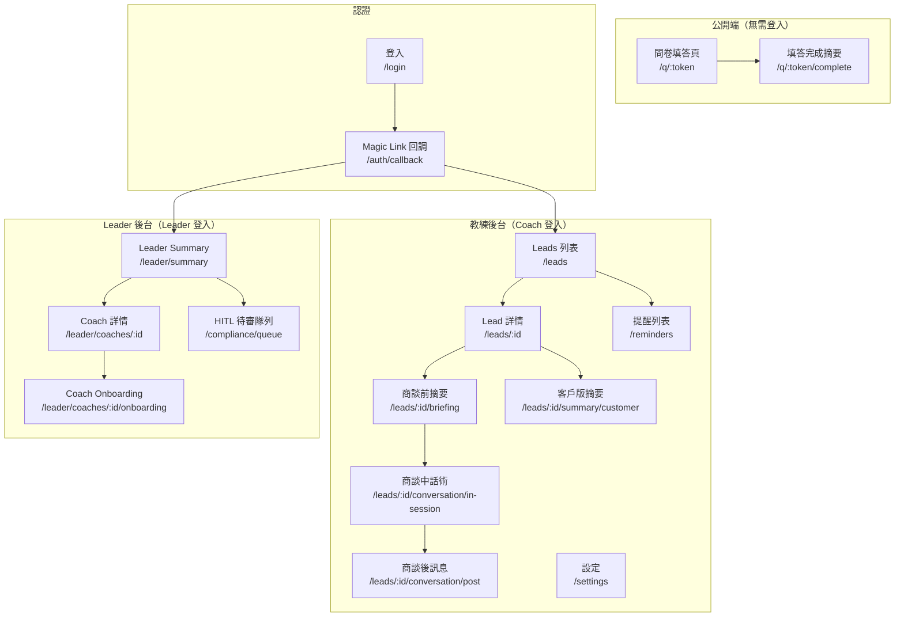
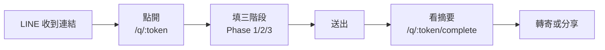
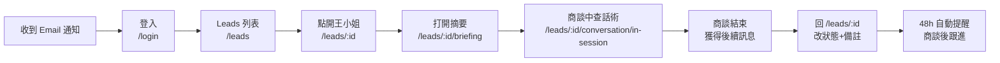
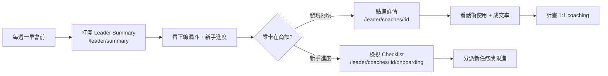

# 前端資訊架構 — Synergy AI Closer's Copilot

> **版本:** v3.0 | **更新:** 2026-05-08 | **對應 PRD:** `docs/01_prd.md` | **對應 Phase I MVP:** `docs/12_phase1_mvp.md`

---

## 1. 目的與範圍

**目的**：定義 Synergy AI Phase I MVP 前端的完整資訊架構，涵蓋教練端（Coach）與 Leader 端，作為開發與設計的 SSOT。

| 範圍 | 說明 |
| :--- | :--- |
| **包含** | 頁面 IA、使用者旅程、導航、URL 規範、資料傳遞、權限矩陣 |
| **不包含** | 視覺設計細節（走 Apple UI tokens）、元件實現、後端 API（見 `05_api.md`） |

---

## 2. 設計原則

**核心價值主張**：「**教練 5 分鐘就能準備好一場商談；Leader 一頁紙掌握全隊進度**」

### 資訊架構原則

| 原則 | 說明 |
| :--- | :--- |
| **簡化** | 教練端：填問卷、看摘要、更新狀態、收提醒 / Leader 端：看漏斗、新手進度、合規監控 / 移除：社群功能、月目標、完整儀表板 |
| **認知負荷** | 每頁 1 個主要目標；商談摘要頁是「單頁可讀完」的最高原則；Leader 報表一頁決策 |
| **架構模式** | **公開端**：扁平（問卷）/ **教練端**：層級化（CRM → Lead → 摘要 + 話術）/ **Leader 端**：聚合視角（Summary → 詳情） |
| **行動優先** | 教練 80% 在手機上看摘要；Leader 40% 用平板+桌機看報表 |

---

## 3. 資訊架構總覽

### 系統層次結構

### 頁面總覽（22 頁）

#### 公開端（3 頁）

| # | 路由 | 頁面名稱 | 主要職責 | 層級 |
| :---: | :--- | :--- | :--- | :--- |
| 1 | `/q/:token` | 問卷填答 | 無登入完成三階段問卷 | L0 |
| 2 | `/q/:token/complete` | 填答完成摘要 | 呈現客戶版摘要、可轉寄 | L0 |
| 3 | `/login` | 登入 | Email → Magic Link | L0 |

#### 認證（1 頁）

| # | 路由 | 頁面名稱 |
| :---: | :--- | :--- |
| 4 | `/auth/callback` | Magic Link 回調 |

#### 教練端（9 頁）

| # | 路由 | 頁面名稱 | 主要職責 | 使用者目標 | 層級 |
| :---: | :--- | :--- | :--- | :--- | :--- |
| 5 | `/leads` | Leads 列表（CRM） | 教練看全部客戶、搜尋、篩選 | 30 秒找到要跟進的人 | L1 |
| 6 | `/leads/:id` | Lead 詳情 | 客戶完整資料 + 問卷答案 + 狀態操作 | 掌握客戶脈絡 | L2 |
| 7 | `/leads/:id/briefing` | 商談前摘要（★ 核心） | 單頁 AI 摘要（痛點/推薦/異議/切入） | 商談前 5 分鐘準備 | L3 |
| **8** | **`/leads/:id/conversation/in-session`** | **商談中話術** | **實時話術提示、異議回覆、成交邀約** | **臨場不卡住** | **L3** |
| **9** | **`/leads/:id/conversation/post`** | **商談後訊息** | **下一步建議、跟進排程、草稿** | **知道何時跟進** | **L3** |
| **10** | **`/leads/:id/summary/customer`** | **客戶版摘要分享** | **可分享的友善版、email 連結** | **給客戶看或分享** | **L3** |
| 11 | `/reminders` | 提醒列表 | 查看所有待處理/已發送提醒 | 看哪些名單要追 | L1 |
| 12 | `/settings` | 設定 | Email、時區、LINE 綁定、通知開關 | 調整個人偏好 | L1 |

#### Leader 端（新增，7 頁）

| # | 路由 | 頁面名稱 | 主要職責 | 使用者目標 | 層級 |
| :---: | :--- | :--- | :--- | :--- | :--- |
| **13** | **`/leader/summary`** | **Leader Summary** | **下線教練本週漏斗 + 新手進度 + 高風險統計** | **快速找出需要 1:1 coaching 的教練** | **L1** |
| **14** | **`/leader/coaches/:id`** | **單一教練詳情** | **某位教練的問卷/商談/成交數、跟進執行率、話術使用** | **深化了解該教練進度** | **L2** |
| **15** | **`/leader/coaches/:id/onboarding`** | **新手教練進度** | **Onboarding checklist + Leader 分派、自動標記** | **追蹤新手成長** | **L2** |
| **16** | **`/compliance/queue`** | **HITL 待審隊列** | **高風險話術待人工審核、批量操作** | **快速審核、降低法律風險** | **L2** |
| — | `/404`、`/error` | 錯誤頁 | 404 + 通用錯誤 | 回首頁或登入 | — |

---

## 4. 核心使用者旅程

### 旅程 A：潛在客戶填問卷

| 階段 | 頁面 | 使用者心理 | 設計目標 | 主要 CTA | 轉換目標 |
| :--- | :--- | :--- | :--- | :--- | :--- |
| 點入 | `/q/:token` | 好奇但警戒 | 降低心理門檻 | 開始填寫 | 60%+ 開始填 |
| Phase 1 | `/q/:token` | 快速分類 | 10 秒內完成 | 下一題 | — |
| Phase 2 | `/q/:token` | 細化回答 | 進度視覺化 + 可跳題 | 下一題 / 標記不便說 | — |
| Phase 3 | `/q/:token` | 邊填邊猶豫 | 動態題目（相關才問）| 下一題 | 50%+ 填完 |
| 送出 | `/q/:token` | 有點焦慮 | 清楚說明後續 | 送出 | 95%+ 完成率 |
| 看結果 | `/q/:token/complete` | 想看結果 | 摘要易讀 + 強調專業性 | 轉寄給朋友 | 10%+ 轉寄率 |

### 旅程 B：教練商談前/中/後完整流程

| 階段 | 頁面 | 設計目標 | 主要 CTA |
| :--- | :--- | :--- | :--- |
| 登入 | `/login` | Magic Link 1 步到位 | 送出 Email |
| 找人 | `/leads` | 搜尋 + 篩選快、預設按最近聯繫排序 | 點客戶姓名 |
| 掌握脈絡 | `/leads/:id` | 問卷答案清晰、摘要連結明顯 | 打開商談摘要 |
| 商談準備 | `/leads/:id/briefing` | **單頁可滑完**、深色模式讀取清晰 | — |
| **商談中提示** | **`/leads/:id/conversation/in-session`** | **實時查詢異議回覆、成交邀約** | **返回摘要 / 點提示** |
| **商談後** | **`/leads/:id/conversation/post`** | **自動生成下一步訊息、帶入 48h 提醒時間** | **複製草稿 / 發送 LINE** |
| 收尾 | `/leads/:id` | 狀態切換一鍵 | 改狀態 |
| 跟進 | Email → `/leads/:id` | 深連結快速回到 Lead | 檢視並跟進 |

### 旅程 C：Leader 巡視與新手教練監督

---

## 5. 導航結構

### 教練端主導航（Sidebar）

| 項目 | 連結 | 圖示 | Badge | 顯示條件 |
| :--- | :--- | :--- | :--- | :--- |
| **客戶名單** | `/leads` | Users | — | 登入 |
| **提醒** | `/reminders` | Bell | 未處理數 | 登入 |
| **設定** | `/settings` | Settings | — | 登入 |

### Leader 端主導航（Sidebar）

| 項目 | 連結 | 圖示 | Badge | 顯示條件 |
| :--- | :--- | :--- | :--- | :--- |
| **下線概覽** | `/leader/summary` | BarChart3 | — | 登入 + Leader 角色 |
| **合規隊列** | `/compliance/queue` | AlertCircle | 待審數 | 登入 + Leader/Admin |
| **設定** | `/settings` | Settings | — | 登入 |

### 輔助導航

- **麵包屑**：`Leads > 王小姐 > 商談摘要` / `Coaches > 阿明 > Onboarding`（L3 顯示）
- **Mobile Bottom Bar**（Coach）：`/leads` + `/reminders` + `/settings`
- **Mobile Bottom Bar**（Leader）：`/leader/summary` + `/compliance/queue` + `/settings`
- **快速動作**（Coach）：Lead 詳情右上角「打開商談摘要」按鈕（橘色浮動）+ 「分享客戶摘要」按鈕

---

## 6. 頁面規格

### 6.1 `/q/:token` — 問卷填答（Phase 1/2/3）

| 項目 | 內容 |
| :--- | :--- |
| **職責** | 三階段問卷，每題一張卡片，Phase 3 動態根據前面答案調整題目 |
| **資料需求** | `GET /v1/questionnaires/:token`（含當前 Phase 題目） |
| **使用者行動** | Phase 1 快速選擇 → Phase 2 逐項評分 → Phase 3 動態追問 → 送出 |
| **關鍵 UX** | - 頂部進度條（Phase 1: 5/5 → Phase 2: 12/12 → Phase 3: 3/8 等） - 「隱私保護」標籤在敏感題旁 - 每 2 題自動儲存 - 可返回上一題修改 - Phase 3 題目條件顯示（「根據你的回答，額外詢問...」） |
| **狀態** | 載入中 / 填答中 / 驗證錯誤 / 送出中 / 完成 |

### 6.2 `/q/:token/complete` — 填答完成摘要（客戶版）

| 項目 | 內容 |
| :--- | :--- |
| **職責** | 呈現填答者個人健康摘要（友善版本，不含商業語氣、診斷用語） |
| **資料需求** | 送出回應中的 `public_summary` |
| **使用者行動** | 轉寄給朋友 / 印出 / 刪除我的資料 |
| **關鍵 UX** | - 健康等級視覺化（A/B/C 徽章） - 3 點主要發現（友善語言） - 聲明：「本資料僅供健康參考，非醫療診斷」 - 可愛 emoji 強調正向 - 下方「推薦教練聯繫」（可選） |

### 6.3 `/login` — 登入

| 項目 | 內容 |
| :--- | :--- |
| **職責** | Email 輸入 → Supabase Magic Link |
| **使用者行動** | 輸入 Email、送出 |
| **導航出口** | Email 收信 → `/auth/callback` → `/leads`（Coach）或 `/leader/summary`（Leader） |
| **關鍵 UX** | 送出後立刻顯示「請至 Email 收信」指引 + 可改 Email 重試 + 30 秒倒計時 |

### 6.4 `/leads` — Leads 列表（CRM 核心）

| 項目 | 內容 |
| :--- | :--- |
| **職責** | 表格式（桌機）+ 卡片式（手機）雙檢視，搜尋與篩選、快速狀態更新 |
| **資料需求** | `GET /v1/leads?status=...&health_level=...&page=1` |
| **使用者行動** | 搜尋 / 篩選狀態/健康等級 / 排序 / 點進 Lead / 手機版 swipe 改狀態 |
| **關鍵 UX** | - **桌機**：表格顯示 姓名|狀態|健康等級|問卷日期|最後聯繫|備註 - **手機**：卡片+底部 action 條，可 swipe 改狀態 - Sticky 搜尋列 - 預設排序：`last_contact_at desc` - 空狀態：「還沒有名單，分享問卷給朋友」 + 按鈕「產生問卷連結」 |

### 6.5 `/leads/:id` — Lead 詳情

| 項目 | 內容 |
| :--- | :--- |
| **職責** | 客戶完整資料 + 問卷答案（可摺疊）+ 狀態操作 + 跳到摘要/話術 |
| **資料需求** | `GET /v1/leads/:id`（含 QuestionnaireResponse + answers） |
| **使用者行動** | 查看問卷答案 / 改狀態 + 時間 / 改備註 / 打開商談摘要 / 打開商談話術 / 分享客戶摘要 |
| **關鍵 UX** | - 頂部：姓名 + 健康徽章 + 狀態 pill - 中段：問卷答案（依 Phase 分組、可摺疊） - 下段：狀態轉換（10 種狀態單選）+ 備註欄 - 右上浮動按鈕：**「打開商談摘要」**（橘色） - 下方快捷：「商談中話術」、「商談後訊息」、「分享給客戶」|

### 6.6 `/leads/:id/briefing` — 商談前摘要（★ 核心頁 ★）

| 項目 | 內容 |
| :--- | :--- |
| **職責** | 教練商談前 5 分鐘打開就能看完的單頁摘要 |
| **資料需求** | `GET /v1/leads/:id/briefing` |
| **使用者行動** | 滾動閱讀 / 重新生成 / 返回 Lead / 分享客戶版 |
| **關鍵 UX** | - **單頁可滑完，一頁結束** - 區塊順序（從上到下）： &nbsp;&nbsp;1. 客戶姓名 + 上次商談時間 &nbsp;&nbsp;2. **三句話痛點**（大字、醒目） &nbsp;&nbsp;3. **推薦產品組合**（卡片 + 理由） &nbsp;&nbsp;4. **預期異議 + 回覆建議**（對話框式） &nbsp;&nbsp;5. **切入角度** &nbsp;&nbsp;6. 底部：重新生成 / 返回 / 商談中提示 - **預設深色模式**（商談場合光線不穩） - 3G 網路 ≤ 2s 載入 |

### **6.7 `/leads/:id/conversation/in-session` — 商談中話術（新增）**

| 項目 | 內容 |
| :--- | :--- |
| **職責** | 商談中實時查詢話術、異議回覆、成交邀約 |
| **資料需求** | `GET /v1/leads/:id/conversation/in-session` |
| **使用者行動** | 閱讀話術提示 / 返回摘要 / 複製話術 / 標記「已用」 |
| **關鍵 UX** | - 簡潔卡片式：「產品銜接話術」、「可能異議」、「柔性成交邀約」各 2-3 條 - 每條話術可複製到剪貼簿 - 返回按鈕回到 `/leads/:id/briefing` - 預設深色模式 |

### **6.8 `/leads/:id/conversation/post` — 商談後訊息（新增）**

| 項目 | 內容 |
| :--- | :--- |
| **職責** | 商談後自動生成下一步訊息、帶入跟進排程 |
| **資料需求** | `GET /v1/leads/:id/conversation/post` |
| **使用者行動** | 複製訊息 / 發送到 LINE / 更新狀態 |
| **關鍵 UX** | - 預設產生 48h 後跟進提醒 - 訊息草稿含客戶名字 + 上次痛點回顧 - 一鍵發送到 LINE Messaging API - 確認後自動改狀態為「已推薦」或「試用中」（取決於教練選擇） |

### **6.9 `/leads/:id/summary/customer` — 客戶版摘要分享（新增）**

| 項目 | 內容 |
| :--- | :--- |
| **職責** | 可直接分享給客戶的版本（email 或 QR code） |
| **資料需求** | 同 `/q/:token/complete` 的 `public_summary` |
| **使用者行動** | 複製連結 / 轉寄 email / 列印 / QR code 分享 |
| **關鍵 UX** | - URL 格式 `/leads/:id/summary/customer?share_token=xxx`（匿名存取） - 呈現同 `/q/:token/complete`（友善版摘要） - 不顯示客戶 ID 或教練名稱（隱私） - 底部「由教練 [姓名] 為您推薦」（可選） |

### **6.10-6.16 Leader 端新頁面**

#### **6.10 `/leader/summary` — Leader Summary（新增）**

| 項目 | 內容 |
| :--- | :--- |
| **職責** | Leader 視角下線教練本週漏斗 + 新手進度 + 高風險統計 |
| **資料需求** | `GET /v1/leader/summary?period=week` |
| **使用者行動** | 查看漏斗 / 點教練名稱進詳情 / 檢視新手進度 / 看高風險統計 |
| **關鍵 UX** | - **上段**：本週漏斗圖（問卷 → 商談 → 成交），可按教練排序 - **中段**：新手教練進度條（3-5 位） - **下段**：高風險話術觸發統計（C1/C2/C3/C4 分類） - 右上「更新時間」按鈕（手動更新數據）|

#### **6.11 `/leader/coaches/:id` — 單一教練詳情（新增）**

| 項目 | 內容 |
| :--- | :--- |
| **職責** | 某位教練的本週/本月 KPI + 話術使用 + 跟進執行率詳情 |
| **資料需求** | `GET /v1/leader/coaches/:id/stats` |
| **使用者行動** | 查看趨勢 / 進入 Onboarding 追蹤 / 返回 Summary |
| **關鍵 UX** | - 教練姓名 + 角色（新手/中階/資深） - 卡片顯示：問卷數、商談數、成交數、成交率、跟進執行率 - 7 天/30 天趨勢圖 - 底部：「進入 Onboarding」按鈕（新手）或「查看高風險觸發」（所有人） |

#### **6.12 `/leader/coaches/:id/onboarding` — 新手教練進度（新增）**

| 項目 | 內容 |
| :--- | :--- |
| **職責** | 新手教練 Onboarding checklist + Leader 分派 / 自動標記 |
| **資料需求** | `GET /v1/leader/coaches/:id/onboarding` |
| **使用者行動** | 查看 checklist / Leader 分派新任務 / 教練勾選完成 / 追蹤進度 |
| **關鍵 UX** | - Checklist 項目（如「使用 briefing 3 次」、「完成首個成交」、「5 天內邀約 10+ 客戶」） - 每項顯示：任務名稱 | 目標 | 完成度 | 期限 - 自動勾選（如完成首個成交時自動標記） - Leader 可分派新任務、設定期限 - 進度百分比（完成/總數） |

#### **6.13 `/compliance/queue` — HITL 待審隊列（新增）**

| 項目 | 內容 |
| :--- | :--- |
| **職責** | 高風險話術待人工審核、批量操作 |
| **資料需求** | `GET /v1/compliance/queue?status=pending` |
| **使用者行動** | 查看待審項目 / 批准/拒絕/修改 / 批量操作 / 查看審核歷史 |
| **關鍵 UX** | - 表格顯示：原文 | 風險類型 | 改寫版本 | 來源 | 狀態 - 狀態 Pill：待審(紅) / 審中(黃) / 已批准(綠) / 已拒(灰) - 批量複選框 + 批量操作按鈕 - 右側抽屜：詳細內容 + 改寫建議 + 審核決策表單 - 每筆記錄審核者 + 審核時間 |

### 6.14-6.16 其他頁面（保持不變）

- `/reminders` — 提醒列表（既有）
- `/settings` — 設定（新增 LINE 綁定）
- `/404`、`/error` — 錯誤頁

---

## 7. URL 結構與路由表

### 命名規範

- 小寫、連字符：`/leads`、`/reminders`
- 資源 ID：`/leads/:id`
- 巢狀：`/leads/:id/briefing`、`/leads/:id/conversation/in-session`
- 查詢參數：過濾/排序/分頁 `?status=talked&sort_by=-last_contact_at&page=1`

### 路由表（完整）

| 路由 | 元件 | 認證 | 角色 | 載入策略 | Meta |
| :--- | :--- | :--- | :--- | :--- | :--- |
| `/q/:token` | QuestionnairePage | 否 | — | SSG shell + CSR | noindex |
| `/q/:token/complete` | QuestionnaireCompletePage | 否 | — | CSR | noindex |
| `/login` | LoginPage | 否 | — | 預載 | index |
| `/auth/callback` | AuthCallbackPage | 否 | — | CSR | noindex |
| `/leads` | LeadsListPage | 是 | Coach | React Query | noindex |
| `/leads/:id` | LeadDetailPage | 是 | Coach | React Query | noindex |
| `/leads/:id/briefing` | BriefingPage | 是 | Coach | React Query（polling） | noindex |
| **`/leads/:id/conversation/in-session`** | **ConversationInSessionPage** | **是** | **Coach** | **React Query** | **noindex** |
| **`/leads/:id/conversation/post`** | **ConversationPostPage** | **是** | **Coach** | **React Query** | **noindex** |
| **`/leads/:id/summary/customer`** | **CustomerSummaryPage** | **否** | **—** | **CSR** | **noindex** |
| `/reminders` | RemindersPage | 是 | Coach | 懶載入 | noindex |
| `/settings` | SettingsPage | 是 | Coach, Leader | 懶載入 | noindex |
| **`/leader/summary`** | **LeaderSummaryPage** | **是** | **Leader** | **React Query** | **noindex** |
| **`/leader/coaches/:id`** | **CoachDetailPage** | **是** | **Leader** | **React Query** | **noindex** |
| **`/leader/coaches/:id/onboarding`** | **OnboardingPage** | **是** | **Leader** | **React Query** | **noindex** |
| **`/compliance/queue`** | **ComplianceQueuePage** | **是** | **Leader/Admin** | **React Query** | **noindex** |

---

## 8. 權限矩陣

| 功能 | Coach（自己） | Coach（他人） | Leader（下線） | Leader（其他） | Admin |
| :--- | :--- | :--- | :--- | :--- | :--- |
| 查看 Lead | ✅ | ❌ | ✅（聚合，無 PII） | ❌ | ✅ |
| 修改 Lead 狀態 | ✅ | ❌ | ❌（唯讀） | ❌ | ✅ |
| 查看 Briefing | ✅ | ❌ | ❌ | ❌ | ✅ |
| 查看話術 | ✅ | ❌ | ❌ | ❌ | ✅ |
| 生成邀約文案 | ✅ | ❌ | ❌ | ❌ | ✅ |
| 進入 Leader Summary | ❌ | ❌ | ✅ | ❌ | ✅ |
| 進入 Onboarding | ❌ | ❌ | ✅（下線） | ❌ | ✅ |
| 進入 HITL 隊列 | ❌ | ❌ | ✅ | ❌ | ✅ |
| 審核合規 | ❌ | ❌ | ✅ | ❌ | ✅ |

---

## 9. 資料流與狀態

### 頁面間資料傳遞

| 來源 | 目標 | 傳遞方式 | 資料 |
| :--- | :--- | :--- | :--- |
| `/q/:token`（送出） | `/q/:token/complete` | API 回應 + React Query cache | public_summary |
| `/leads` | `/leads/:id` | URL param + React Query prefetch | lead_id、list cache |
| `/leads/:id` | `/leads/:id/briefing` | URL param | lead_id |
| `/leads/:id` | `/leads/:id/conversation/*` | URL param | lead_id |
| Email 連結 | `/leads/:id` | Deep link | lead_id |
| `/leader/summary` | `/leader/coaches/:id` | URL param | coach_id |
| `/leader/coaches/:id` | `/leader/coaches/:id/onboarding` | URL param | coach_id |

### 全局狀態

- **Auth**：Supabase client（自動持久化）
- **API 快取**：React Query（`staleTime: 30s` 預設；Briefing pending 時 5s 輪詢）
- **表單**：React Hook Form + Zod 驗證
- **通知**：Toast / Dialog（成功/失敗提示）

---

## 10. 響應式斷點

| 斷點 | 寬度 | 主要設計對象 |
| :--- | :--- | :--- |
| sm | < 640px | 手機（教練商談實際場景 + 客戶填問卷） |
| md | 640-1024px | 平板 |
| lg | > 1024px | 桌機（CRM 大量瀏覽 + Leader 報表） |

**優先級**：
- `/q/*` 與 `/leads/:id/briefing`、`/leads/:id/conversation/*` **純手機設計**（mobile-first）
- `/leads` 列表桌機優化（手機卡片、桌機表格）
- `/leader/*` 平板+桌機主力

---

## 11. 無障礙與效能

### A11y
- 所有按鈕有 `aria-label`
- Form 有 `<label>` 對應
- 色彩對比 WCAG AA
- 鍵盤可完全操作
- 深色模式自動支援（`prefers-color-scheme`）

### 效能預算
- 首屏 JS ≤ 250 KB（gzipped）
- LCP < 2.5s（3G）
- CLS < 0.1
- TTI < 3.5s
- Briefing 頁 Polling 延遲 < 5s（pending 時）

---

## 12. 檢查清單

### 資訊架構
- [x] 所有頁面已定義職責與使用者目標
- [x] 核心使用者旅程已映射（3 條：客戶、教練、Leader）
- [x] 導航結構清晰且一致（Coach/Leader 分離）
- [x] URL 結構語義化
- [x] 權限矩陣完整

### 可用性
- [x] 導航深度 ≤ 3 層
- [x] 每頁只有 1-2 個主要 CTA
- [x] 麵包屑導航可回溯
- [x] 404/錯誤頁面有引導
- [x] Mobile-first 且快速

### Phase I 新增
- [x] 新增商談中/後話術頁面
- [x] 新增客戶版摘要分享頁面
- [x] 新增 Leader 端 4 個頁面
- [x] 新增權限矩陣

---

**版本履歷**

| 版本 | 日期 | 變更 |
| :--- | :--- | :--- |
| v1.0 | 2026-04-24 | 11 頁教練端（問卷 + CRM + 摘要 + 提醒） |
| **v3.0** | **2026-05-08** | **+5 頁教練端（商談話術、客戶摘要分享）+ 4 頁 Leader 端（Summary、Coaches、Onboarding、HITL）= 20+ 頁** |
