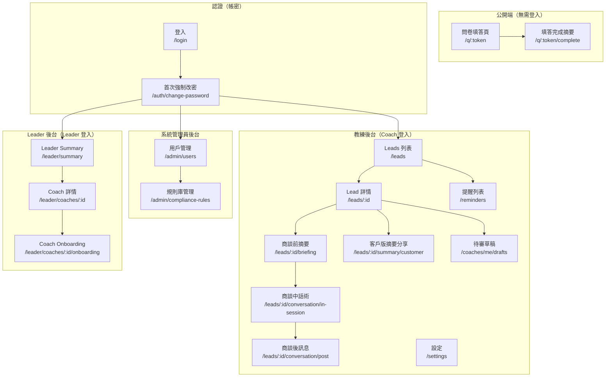
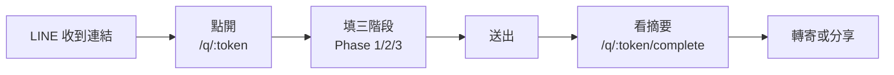
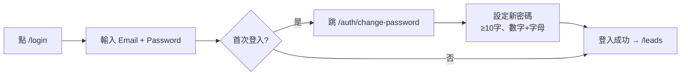
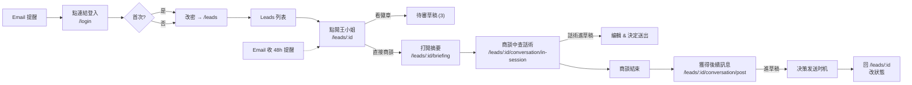
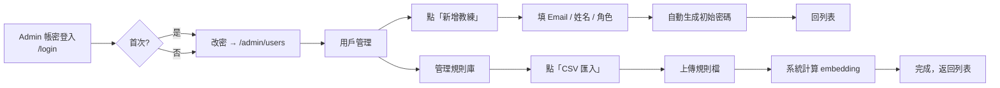
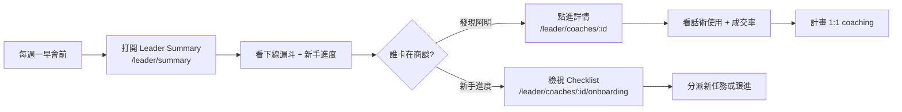

# 前端資訊架構 — Synergy AI Closer's Copilot

> **版本:** v3.1 | **更新:** 2026-05-08 | **對應 PRD:** `docs/01_prd.md` | **對應 Phase I MVP:** `docs/12_phase1_mvp.md` | **⚠️ v3.1 修訂：Magic Link → 帳密登入；新增 Admin 後台；教練即審核者**

---

## 1. 目的與範圍

**目的**：定義 Synergy AI Phase I MVP 前端的完整資訊架構，涵蓋教練端（Coach）、Admin 端與 Leader 端，作為開發與設計的 SSOT。

| 範圍 | 說明 |
| :--- | :--- |
| **包含** | 頁面 IA、使用者旅程、導航、URL 規範、資料傳遞、權限矩陣 |
| **不包含** | 視覺設計細節（走 Apple UI tokens）、元件實現、後端 API（見 `05_api.md`） |

---

## 2. 設計原則

**核心價值主張**：「**教練 5 分鐘就能準備好一場商談；Leader 一頁紙掌握全隊進度；教練在 UI 內即審核合規；Admin 後台集中管理用戶與規則**」

### 資訊架構原則

| 原則 | 說明 |
| :--- | :--- |
| **簡化** | 教練端：填問卷、看摘要、更新狀態、收提醒、決策草稿 / Leader 端：看漏斗、新手進度、合規監控 / Admin 端：用戶CRUD、規則庫管理 / **移除：獨立 HITL 佇列頁；Magic Link 登入** |
| **認知負荷** | 每頁 1 個主要目標；商談摘要頁是「單頁可讀完」的最高原則；Leader 報表一頁決策；**草稿編輯就地完成** |
| **架構模式** | **公開端**：扁平（問卷）/ **認證端**：帳密 login / **教練端**：層級化（CRM → Lead → 摘要 + 話術 + 草稿）/ **Leader 端**：聚合視角 / **Admin 端**：管理後台 |
| **行動優先** | 教練 80% 在手機上看摘要 + 決策草稿；Leader 40% 用平板+桌機看報表；Admin 主要桌機操作 |

---

## 3. 資訊架構總覽

### 系統層次結構

### 頁面總覽（25+ 頁）

#### 公開端（3 頁）

| # | 路由 | 頁面名稱 | 主要職責 | 層級 |
| :---: | :--- | :--- | :--- | :--- |
| 1 | `/q/:token` | 問卷填答 | 無登入完成三階段問卷 | L0 |
| 2 | `/q/:token/complete` | 填答完成摘要 | 呈現客戶版摘要、可轉寄 | L0 |
| 3 | `/login` | **帳密登入** | **⚠️ Email + Password（無 Magic Link）** | L0 |

#### 認證（1 頁） — ⚠️ v3.1 新增

| # | 路由 | 頁面名稱 | 說明 |
| :---: | :--- | :--- | :--- |
| 4 | **`/auth/change-password`** | **首次強制改密** | **首次登入後強制改密，設定新密碼** |

#### 教練端（10 頁）

| # | 路由 | 頁面名稱 | 主要職責 | 使用者目標 | 層級 |
| :---: | :--- | :--- | :--- | :--- | :--- |
| 5 | `/leads` | Leads 列表（CRM） | 教練看全部客戶、搜尋、篩選 | 30 秒找到要跟進的人 | L1 |
| 6 | `/leads/:id` | Lead 詳情（★含草稿卡片） | 客戶完整資料 + **待審草稿計數** + 狀態操作 | 掌握客戶脈絡 + 決策草稿 | L2 |
| 7 | `/leads/:id/briefing` | 商談前摘要（★ 核心） | 單頁 AI 摘要（痛點/推薦/異議/切入） | 商談前 5 分鐘準備 | L3 |
| 8 | `/leads/:id/conversation/in-session` | 商談中話術 | 實時話術提示、異議回覆、成交邀約（進草稿） | 臨場不卡住 | L3 |
| 9 | `/leads/:id/conversation/post` | 商談後訊息 | 下一步建議、跟進排程、草稿（進草稿） | 知道何時跟進 | L3 |
| 10 | `/leads/:id/summary/customer` | 客戶版摘要分享 | 可分享的友善版、email 連結 | 給客戶看或分享 | L3 |
| **11** | **`/coaches/me/drafts`** | **待審草稿清單（新增）** | **教練全局待審草稿清單、編輯、決策** | **集中審核所有草稿** | **L1** |
| 12 | `/reminders` | 提醒列表 | 查看所有待處理/已發送提醒 | 看哪些名單要追 | L1 |
| 13 | `/settings` | 設定 | Email、時區、通知開關、改密碼 | 調整個人偏好 | L1 |

#### Admin 端（5 頁）— ✨ v3.1 新增

| # | 路由 | 頁面名稱 | 主要職責 | 使用者目標 | 層級 |
| :---: | :--- | :--- | :--- | :--- | :--- |
| **14** | **`/admin/users`** | **用戶管理列表** | **Admin 查看全部教練、搜尋、篩選** | **快速找到要編輯的教練** | **L1** |
| **15** | **`/admin/users/new`** | **新增教練** | **Admin 建立教練帳號、設初始密碼** | **快速新增教練** | **L2** |
| **16** | **`/admin/users/:id/edit`** | **編輯教練** | **Admin 修改教練資料、重設密碼** | **更新教練資訊** | **L2** |
| **17** | **`/admin/compliance-rules`** | **規則庫列表** | **Admin 查看合規規則、CRUD、CSV 匯入** | **管理合規詞庫與向量** | **L1** |
| **18** | **`/admin/compliance-rules/import`** | **規則批量匯入** | **Admin CSV 匯入新規則、計算 embedding** | **批量上傳規則** | **L2** |

#### Leader 端（5 頁）

| # | 路由 | 頁面名稱 | 主要職責 | 使用者目標 | 層級 |
| :---: | :--- | :--- | :--- | :--- | :--- |
| 19 | `/leader/summary` | Leader Summary | 下線教練本週漏斗 + 新手進度 + 高風險統計 | 快速找出需要 1:1 coaching 的教練 | L1 |
| 20 | `/leader/coaches/:id` | 單一教練詳情 | 某位教練的問卷/商談/成交數、跟進執行率、話術使用 | 深化了解該教練進度 | L2 |
| 21 | `/leader/coaches/:id/onboarding` | 新手教練進度 | Onboarding checklist + Leader 分派、自動標記 | 追蹤新手成長 | L2 |
| — | `/404`、`/error` | 錯誤頁 | 404 + 通用錯誤 | 回首頁或登入 | — |

**⚠️ v3.1 變更**：
- ❌ `/login`：Magic Link → ✅ **帳密登入**
- ✅ **新增** `/auth/change-password`（首次強制改密）
- ✅ **新增** `/admin/*` 系列（Admin 後台）
- ❌ 移除 `/compliance/queue` HITL 獨立頁 → **改為 `/coaches/me/drafts` 集中式草稿管理**

---

## 4. 核心使用者旅程

### 旅程 A：潛在客戶填問卷

| 階段 | 頁面 | 使用者心理 | 設計目標 | 主要 CTA | 轉換目標 |
| :--- | :--- | :--- | :--- | :--- | :--- |
| 點入 | `/q/:token` | 好奇但警戒 | 降低心理門檻 | 開始填寫 | 60%+ 開始填 |
| Phase 1 | `/q/:token` | 快速分類 | 10 秒內完成 | 下一題 | — |
| Phase 2 | `/q/:token` | 細化回答 | 進度視覺化 + 可跳題 | 下一題 / 標記不便說 | — |
| Phase 3 | `/q/:token` | 邊填邊猶豫 | 動態題目（相關才問）| 下一題 | 50%+ 填完 |
| 送出 | `/q/:token` | 有點焦慮 | 清楚說明後續 | 送出 | 95%+ 完成率 |
| 看結果 | `/q/:token/complete` | 想看結果 | 摘要易讀 + 強調專業性 | 轉寄給朋友 | 10%+ 轉寄率 |

### 旅程 B：教練帳密登入 + 首次改密（⚠️ v3.1）

| 階段 | 頁面 | 設計目標 | 主要 CTA |
| :--- | :--- | :--- | :--- |
| **帳密登入** | **`/login`** | **簡潔表單（Email + Password），無 Magic Link**；失敗 5 次鎖 15min | **登入** |
| **首次強制改密** | **`/auth/change-password`** | **清晰密碼政策提示，實時驗證**；新舊密碼對比檢查 | **設定新密碼** |
| **登入成功** | `/leads`（Coach）或 `/leader/summary`（Leader）或 `/admin/users`（Admin） | 依角色重導向至相應首頁 | — |

### 旅程 C：教練商談前/中/後完整流程（含草稿決策）

| 階段 | 頁面 | 設計目標 | 主要 CTA |
| :--- | :--- | :--- | :--- |
| **登入** | `/login` → `/auth/change-password` | **帳密登入（無 Magic Link）+ 首次改密** | **送出** |
| 找人 | `/leads` | 搜尋 + 篩選快、預設按最近聯繫排序 | 點客戶姓名 |
| **掌握脈絡** | `/leads/:id` | **問卷答案清晰、摘要連結明顯、待審草稿計數徽章** | **打開商談摘要 / 查看草稿** |
| 商談準備 | `/leads/:id/briefing` | **單頁可滑完**、深色模式讀取清晰 | — |
| **商談中提示** | **`/leads/:id/conversation/in-session`** | **實時話術 + 進草稿，教練控制何時對客戶說** | **複製 / 發送話術** |
| **商談後** | **`/leads/:id/conversation/post`** | **自動生成訊息 + 進草稿、帶入 48h 提醒** | **編輯 / 送出** |
| 決策草稿 | **`/coaches/me/drafts`** | **集中看所有待審草稿、編輯、按下才送** | **送出 / 丟棄 / 編輯** |
| 收尾 | `/leads/:id` | 狀態切換一鍵 | 改狀態 |
| 跟進 | Email → `/leads/:id` | 深連結快速回到 Lead | 檢視並跟進 |

### 旅程 D：Admin 管理用戶與規則庫

### 旅程 E：Leader 巡視與新手教練監督

---

## 5. 導航結構

### 教練端主導航（Sidebar + 認證）

**未登入時**：自動跳 `/login`

| 項目 | 連結 | 圖示 | Badge | 顯示條件 |
| :--- | :--- | :--- | :--- | :--- |
| **客戶名單** | `/leads` | Users | — | 登入 |
| **待審草稿** | `/coaches/me/drafts` | FileText | 待審數 | 登入 + 有草稿 |
| **提醒** | `/reminders` | Bell | 未處理數 | 登入 |
| **設定** | `/settings` | Settings | — | 登入 |
| **登出** | — | LogOut | — | 登入 |

### Admin 端主導航（Sidebar + 認證）

| 項目 | 連結 | 圖示 | Badge | 顯示條件 |
| :--- | :--- | :--- | :--- | :--- |
| **用戶管理** | `/admin/users` | Users | — | 登入 + Admin 角色 |
| **規則庫** | `/admin/compliance-rules` | BookOpen | — | 登入 + Admin 角色 |
| **設定** | `/settings` | Settings | — | 登入 |
| **登出** | — | LogOut | — | 登入 |

### Leader 端主導航（Sidebar + 認證）

| 項目 | 連結 | 圖示 | Badge | 顯示條件 |
| :--- | :--- | :--- | :--- | :--- |
| **下線概覽** | `/leader/summary` | BarChart3 | — | 登入 + Leader 角色 |
| **設定** | `/settings` | Settings | — | 登入 |
| **登出** | — | LogOut | — | 登入 |

### 輔助導航

- **麵包屑**：`Leads > 王小姐 > 商談摘要` / `Coaches > 阿明 > Onboarding`（L3 顯示）
- **Mobile Bottom Bar**（Coach）：`/leads` + `/coaches/me/drafts`（若有草稿） + `/reminders` + `/settings`
- **Mobile Bottom Bar**（Leader）：`/leader/summary` + `/settings`
- **Mobile Bottom Bar**（Admin）：`/admin/users` + `/admin/compliance-rules` + `/settings`
- **快速動作**（Coach）：Lead 詳情右上角「打開商談摘要」按鈕（橘色浮動）+ **「待審草稿」徽章** + 「分享客戶摘要」按鈕

---

## 6. 頁面規格

### 6.1 `/login` — 帳密登入（⚠️ v3.1 改版）

| 項目 | 內容 |
| :--- | :--- |
| **職責** | Email + Password 輸入 → JWT 核發 + session 管理 |
| **使用者行動** | 輸入 Email、輸入密碼、送出 |
| **導航出口** | 登入成功 → `/auth/change-password`（首次）或 `/leads`（Coach）、`/leader/summary`（Leader）、`/admin/users`（Admin）；失敗 → 錯誤提示 |
| **關鍵 UX** | - 簡潔表單（只要 Email + Password） - 密碼顯示/隱藏切換 - **失敗 5 次鎖 15min，提示倒計時** - 「忘記密碼？」（Phase 2：暫時無此功能，教練聯絡 admin 重設） - 無 Magic Link、無第三方 OAuth |

### **✨ 6.2 `/auth/change-password` — 首次強制改密（新增，v3.1）**

| 項目 | 內容 |
| :--- | :--- |
| **職責** | 首次登入後強制修改密碼，確立新密碼 |
| **使用者行動** | 輸入舊密碼 → 驗證 → 輸入新密碼 → 確認 → 送出 |
| **導航出口** | 修改成功 → `/leads`（Coach）或 `/leader/summary`（Leader）或 `/admin/users`（Admin）；失敗 → 錯誤提示 |
| **關鍵 UX** | - 清晰密碼政策提示：「**至少 10 字元，包含數字與字母**」 - 實時驗證：綠勾/紅叉視覺反饋 - 新舊密碼對比檢查（不可重用） - 密碼強度 bar（可選） - 「返回登入」連結（防止卡住） |

### 6.3 `/q/:token` — 問卷填答（Phase 1/2/3）

| 項目 | 內容 |
| :--- | :--- |
| **職責** | 三階段問卷，每題一張卡片，Phase 3 動態根據前面答案調整題目 |
| **資料需求** | `GET /v1/questionnaires/:token`（含當前 Phase 題目） |
| **使用者行動** | Phase 1 快速選擇 → Phase 2 逐項評分 → Phase 3 動態追問 → 送出 |
| **關鍵 UX** | - 頂部進度條（Phase 1: 5/5 → Phase 2: 12/12 → Phase 3: 3/8 等） - 「隱私保護」標籤在敏感題旁 - 每 2 題自動儲存 - 可返回上一題修改 - Phase 3 題目條件顯示（「根據你的回答，額外詢問...」） |
| **狀態** | 載入中 / 填答中 / 驗證錯誤 / 送出中 / 完成 |

### 6.4 `/q/:token/complete` — 填答完成摘要（客戶版）

| 項目 | 內容 |
| :--- | :--- |
| **職責** | 呈現填答者個人健康摘要（友善版本，不含商業語氣、診斷用語） |
| **資料需求** | 送出回應中的 `public_summary` |
| **使用者行動** | 轉寄給朋友 / 印出 / 刪除我的資料 |
| **關鍵 UX** | - 健康等級視覺化（A/B/C 徽章） - 3 點主要發現（友善語言） - 聲明：「本資料僅供健康參考，非醫療診斷」 - 可愛 emoji 強調正向 - 下方「推薦教練聯繫」（可選） |

### 6.5 `/leads` — Leads 列表（CRM 核心）

| 項目 | 內容 |
| :--- | :--- |
| **職責** | 表格式（桌機）+ 卡片式（手機）雙檢視，搜尋與篩選、快速狀態更新 |
| **資料需求** | `GET /v1/leads?status=...&health_level=...&page=1` |
| **使用者行動** | 搜尋 / 篩選狀態/健康等級 / 排序 / 點進 Lead / 手機版 swipe 改狀態 |
| **關鍵 UX** | - **桌機**：表格顯示 姓名\|狀態\|健康等級\|問卷日期\|最後聯繫\|備註 - **手機**：卡片+底部 action 條，可 swipe 改狀態 - Sticky 搜尋列 - 預設排序：`last_contact_at desc` - 空狀態：「還沒有名單，分享問卷給朋友」 + 按鈕「產生問卷連結」 |

### 6.6 `/leads/:id` — Lead 詳情（★含待審草稿卡片）

| 項目 | 內容 |
| :--- | :--- |
| **職責** | 客戶完整資料 + 問卷答案 + **待審草稿計數徽章** + 狀態操作 + 跳到摘要/話術 |
| **資料需求** | `GET /v1/leads/:id`（含 QuestionnaireResponse + answers） + `GET /v1/coaches/me/drafts?lead_id=xxx`（該 lead 相關草稿） |
| **使用者行動** | 查看問卷答案 / **點待審草稿卡片跳 `/coaches/me/drafts`** / 改狀態 + 時間 / 改備註 / 打開商談摘要 / 打開商談話術 / 分享客戶摘要 |
| **關鍵 UX** | - 頂部：姓名 + 健康徽章 + 狀態 pill + **待審草稿計數徽章（有草稿時）** - 中段：問卷答案（依 Phase 分組、可摺疊） - **新增區塊**：「AI 建議草稿」卡片（若有 pending drafts，顯示內容預覽 + 「審核」按鈕） - 下段：狀態轉換（10 種狀態單選）+ 備註欄 - 右上浮動按鈕：**「打開商談摘要」**（橘色） - 下方快捷：「商談中話術」、「商談後訊息」、「分享給客戶」 |

### 6.7 `/leads/:id/briefing` — 商談前摘要（★ 核心頁 ★）

| 項目 | 內容 |
| :--- | :--- |
| **職責** | 教練商談前 5 分鐘打開就能看完的單頁摘要 |
| **資料需求** | `GET /v1/leads/:id/briefing` |
| **使用者行動** | 滾動閱讀 / 重新生成 / 返回 Lead / 分享客戶版 |
| **關鍵 UX** | - **單頁可滑完，一頁結束** - 區塊順序（從上到下）： &nbsp;&nbsp;1. 客戶姓名 + 上次商談時間 &nbsp;&nbsp;2. **三句話痛點**（大字、醒目） &nbsp;&nbsp;3. **推薦產品組合**（卡片 + 理由） &nbsp;&nbsp;4. **預期異議 + 回覆建議**（對話框式） &nbsp;&nbsp;5. **切入角度** &nbsp;&nbsp;6. 底部：重新生成 / 返回 / **商談中提示** (按鈕) - **預設深色模式**（商談場合光線不穩） - 3G 網路 ≤ 2s 載入 |

### 6.8 `/leads/:id/conversation/in-session` — 商談中話術（進草稿）

| 項目 | 內容 |
| :--- | :--- |
| **職責** | 商談中實時查詢話術、異議回覆、成交邀約；所有話術進入草稿流程 |
| **資料需求** | `GET /v1/leads/:id/conversation/in-session` |
| **使用者行動** | 閱讀話術提示 / **複製後發送到 LINE（自動進草稿）** / 返回摘要 / 編輯並決定何時發 |
| **關鍵 UX** | - 簡潔卡片式：「產品銜接話術」、「可能異議」、「柔性成交邀約」各 2-3 條 - 每條話術：複製按鈕 + **「發送」按鈕（觸發草稿）** - **點「發送」後 → 進草稿、教練可編輯 → `/coaches/me/drafts` 或就地編輯視情況** - 返回按鈕回到 `/leads/:id/briefing` - 預設深色模式 |

### 6.9 `/leads/:id/conversation/post` — 商談後訊息（進草稿）

| 項目 | 內容 |
| :--- | :--- |
| **職責** | 商談後自動生成下一步訊息、帶入跟進排程；訊息進草稿待教練決策 |
| **資料需求** | `GET /v1/leads/:id/conversation/post` |
| **使用者行動** | **複製訊息 / 點「發送」進草稿** / 更新狀態 |
| **關鍵 UX** | - 預設產生 48h 後跟進提醒 - 訊息草稿含客戶名字 + 上次痛點回顧 - **「發送」按鈕 → 進 `/coaches/me/drafts`（或就地確認後送）** - 確認後自動改狀態為「已推薦」或「試用中」（取決於教練選擇） |

### 6.10 `/leads/:id/summary/customer` — 客戶版摘要分享

| 項目 | 內容 |
| :--- | :--- |
| **職責** | 可直接分享給客戶的版本（email 或 QR code） |
| **資料需求** | 同 `/q/:token/complete` 的 `public_summary` |
| **使用者行動** | 複製連結 / 轉寄 email / 列印 / QR code 分享 |
| **關鍵 UX** | - URL 格式 `/leads/:id/summary/customer?share_token=xxx`（匿名存取） - 呈現同 `/q/:token/complete`（友善版摘要） - 不顯示客戶 ID 或教練名稱（隱私） - 底部「由教練 [姓名] 為您推薦」（可選） |

### **✨ 6.11 `/coaches/me/drafts` — 待審草稿清單（新增 v3.0.1）**

| 項目 | 內容 |
| :--- | :--- |
| **職責** | **教練全局待審草稿清單、編輯、決策；取代舊 HITL 佇列** |
| **資料需求** | `GET /v1/coaches/me/drafts?status=pending_coach_review&page=1` |
| **使用者行動** | **查看待審清單 / 篩選（context）/ 點進草稿編輯 / 決策送出 or 丟棄** |
| **關鍵 UX** | - **主檢視：草稿卡片列表**（可按 context 篩選：briefing / reminder / conversation / invitation） - **每張卡片顯示**：來源 \| 原文預覽（截斷） \| 改寫版本 \| 風險標記（顏色：低/中/高） \| quality_score \| created_at - **點卡片 → 詳情抽屜**： &nbsp;&nbsp;- 左側：原文 + 改寫文（並排對比） &nbsp;&nbsp;- 右側：編輯文本框 + 風險標記詳情 + quality_score bar &nbsp;&nbsp;- 底部：「編輯」（改寫文） → 「送出」or「丟棄」按鈕 - **空狀態**：「全部教練審核完畢！」+ 連結回 `/leads` - **Sticky 篩選列**：context、status 快速切換 - **計數徽章**：Sidebar `/coaches/me/drafts` 顯示待審數 |

### 6.12 `/reminders` — 提醒列表（既有）

| 項目 | 內容 |
| :--- | :--- |
| **職責** | 查看所有待處理/已發送提醒 |
| **資料需求** | `GET /v1/reminders?status=pending` |
| **使用者行動** | 查看內容 / 標記完成 / 修改時間 |

### 6.13 `/settings` — 設定（既有 + v3.1 擴充）

| 項目 | 內容 |
| :--- | :--- |
| **職責** | 個人設定、時區、通知開關、**密碼管理** |
| **使用者行動** | 修改個人設定、改密碼 |
| **新增內容** | **「改變密碼」tab：舊密碼驗證 → 新密碼設定（同 `/auth/change-password` 密碼政策）** |

### **✨ 6.14-6.18 Admin 端頁面（新增 v3.1）**

#### **6.14 `/admin/users` — 用戶管理列表**

| 項目 | 內容 |
| :--- | :--- |
| **職責** | Admin 查看全部教練、搜尋、篩選、狀態檢查 |
| **資料需求** | `GET /v1/admin/users?page=1&search=...` |
| **使用者行動** | 搜尋 / 篩選角色 / 點進編輯 / 新增教練 / 查看最後登入時間 |
| **關鍵 UX** | - 表格：姓名 \| Email \| 角色 \| 建立日期 \| 最後登入 \| 操作（編輯/重設密碼） - 頂部「+ 新增教練」按鈕 - 搜尋框（Email / 姓名） - 角色篩選：coach / leader / admin |

#### **6.15 `/admin/users/new` — 新增教練**

| 項目 | 內容 |
| :--- | :--- |
| **職責** | Admin 建立教練帳號、指派角色、初始密碼生成 |
| **使用者行動** | 填 Email、姓名、選角色 → 送出 |
| **關鍵 UX** | - 表單：Email（驗證）、姓名、角色（dropdown）、備註 - 提交後自動生成初始密碼顯示（或系統寄 Email） - 「複製密碼」按鈕 + 「教練可首次登入後自行改密」提示 |

#### **6.16 `/admin/users/:id/edit` — 編輯教練**

| 項目 | 內容 |
| :--- | :--- |
| **職責** | Admin 修改教練資料、重設密碼、禁用帳號 |
| **使用者行動** | 編輯姓名、角色 / 重設密碼 / 禁用帳號 → 送出 |
| **關鍵 UX** | - 表單同新增（Email 唯讀） - **「重設密碼」按鈕**：確認對話 → 生成新密碼 - **「禁用帳號」checkbox**：無法登入 |

#### **6.17 `/admin/compliance-rules` — 規則庫列表**

| 項目 | 內容 |
| :--- | :--- |
| **職責** | Admin 查看合規規則、搜尋、CRUD、批量匯入 |
| **資料需求** | `GET /v1/admin/compliance-rules?category=C1&page=1` |
| **使用者行動** | 搜尋 / 篩選類別（C1/C2/C3/C4） / 點進編輯 / 新增規則 / 批量匯入 CSV |
| **關鍵 UX** | - 表格：編號 \| 類別 \| Phrase \| Severity \| Suggested Rewrite \| Enabled \| 操作 - 頂部「+ 新增規則」按鈕 + **「CSV 匯入」按鈕** - 類別篩選：C1/C2/C3/C4 - 搜尋框（phrase 模糊查詢） |

#### **6.18 `/admin/compliance-rules/import` — CSV 批量匯入**

| 項目 | 內容 |
| :--- | :--- |
| **職責** | Admin 上傳 CSV 新規則、自動計算 embedding、批量插入 |
| **使用者行動** | 選檔案上傳 → 驗證格式 → 匯入 → 顯示進度 + 結果摘要 |
| **關鍵 UX** | - 拖拽上傳區或「選擇檔案」按鈕 - 預期 CSV 格式：category, phrase, severity, suggested_rewrite, enabled - 匯入進度條 + 成功數/失敗數 - 失敗項目可下載 error log 重新調整 |

### 6.19-6.21 Leader 端頁面（既有，保持不變）

- `/leader/summary` — Leader Summary
- `/leader/coaches/:id` — 單一教練詳情
- `/leader/coaches/:id/onboarding` — 新手教練進度

---

## 7. URL 結構與路由表

### 命名規範

- 小寫、連字符：`/leads`、`/reminders`
- 資源 ID：`/leads/:id`
- 巢狀：`/leads/:id/briefing`、`/leads/:id/conversation/in-session`
- 查詢參數：過濾/排序/分頁 `?status=talked&sort_by=-last_contact_at&page=1`

### 路由表（完整 v3.1）

| 路由 | 元件 | 認證 | 角色 | 載入策略 | Meta |
| :--- | :--- | :--- | :--- | :--- | :--- |
| `/login` | LoginPage | 否 | — | 預載 | index |
| `/auth/change-password` | ChangePasswordPage | 是 | Coach/Leader/Admin | CSR | noindex |
| `/q/:token` | QuestionnairePage | 否 | — | SSG shell + CSR | noindex |
| `/q/:token/complete` | QuestionnaireCompletePage | 否 | — | CSR | noindex |
| `/leads` | LeadsListPage | 是 | Coach | React Query | noindex |
| `/leads/:id` | LeadDetailPage | 是 | Coach | React Query | noindex |
| `/leads/:id/briefing` | BriefingPage | 是 | Coach | React Query（polling） | noindex |
| `/leads/:id/conversation/in-session` | ConversationInSessionPage | 是 | Coach | React Query | noindex |
| `/leads/:id/conversation/post` | ConversationPostPage | 是 | Coach | React Query | noindex |
| `/leads/:id/summary/customer` | CustomerSummaryPage | 否 | — | CSR（share_token） | noindex |
| **`/coaches/me/drafts`** | **DraftsListPage** | **是** | **Coach** | **React Query** | **noindex** |
| `/reminders` | RemindersPage | 是 | Coach | 懶載入 | noindex |
| `/settings` | SettingsPage | 是 | Coach, Leader, Admin | 懶載入 | noindex |
| **`/admin/users`** | **AdminUsersPage** | **是** | **Admin** | **React Query** | **noindex** |
| **`/admin/users/new`** | **AdminUserCreatePage** | **是** | **Admin** | **預載** | **noindex** |
| **`/admin/users/:id/edit`** | **AdminUserEditPage** | **是** | **Admin** | **React Query** | **noindex** |
| **`/admin/compliance-rules`** | **AdminComplianceRulesPage** | **是** | **Admin** | **React Query** | **noindex** |
| **`/admin/compliance-rules/import`** | **AdminComplianceRulesImportPage** | **是** | **Admin** | **預載** | **noindex** |
| `/leader/summary` | LeaderSummaryPage | 是 | Leader | React Query | noindex |
| `/leader/coaches/:id` | CoachDetailPage | 是 | Leader | React Query | noindex |
| `/leader/coaches/:id/onboarding` | OnboardingPage | 是 | Leader | React Query | noindex |

---

## 8. 權限矩陣（v3.1 修訂）

| 功能 | Coach（自己） | Coach（他人） | Leader（下線） | Admin | Visitor |
| :--- | :--- | :--- | :--- | :--- | :--- |
| **登入（帳密）** | ✅ | ✅ | ✅ | ✅ | — |
| **首次改密** | ✅ | ✅ | ✅ | ✅ | — |
| 填問卷（公開） | ✅ | ✅ | ✅ | ✅ | ✅ |
| 查看 Lead | ✅ | ❌ | ✅（聚合，無 PII） | ✅ | ❌ |
| 修改 Lead 狀態 | ✅ | ❌ | ❌（唯讀） | ✅ | ❌ |
| 查看 Briefing | ✅ | ❌ | ❌ | ✅ | ❌ |
| 查看商談話術 | ✅ | ❌ | ❌ | ✅ | ❌ |
| **查看待審草稿** | **✅（自己）** | **❌** | **❌（隱私）** | **✅** | ❌ |
| **編輯草稿** | **✅（自己）** | **❌** | **❌** | **✅** | ❌ |
| **決策草稿（送出/丟棄）** | **✅（自己）** | **❌** | **❌** | **✅** | ❌ |
| 生成邀約文案 | ✅ | ❌ | ❌ | ✅ | ❌ |
| **進入 Admin 後台** | ❌ | ❌ | ❌ | **✅** | ❌ |
| **管理教練帳號** | ❌ | ❌ | ❌ | **✅** | ❌ |
| **管理規則庫** | ❌ | ❌ | ❌ | **✅** | ❌ |
| 進入 Leader Summary | ❌ | ❌ | ✅ | ✅ | ❌ |
| 進入 Onboarding | ❌ | ❌ | ✅（下線） | ✅ | ❌ |

**重點變更（v3.1）**：
- ⚠️ **移除 Magic Link，改帳密登入**
- ⚠️ **新增首次強制改密流程**
- ⚠️ **新增 Admin 角色權限**
- ✅ **Coach 可看自己的 `/coaches/me/drafts` 集中式清單**
- ✅ **Leader 無法看下線 draft（隱私保護）**

---

## 9. 資料流與狀態

### 頁面間資料傳遞

| 來源 | 目標 | 傳遞方式 | 資料 |
| :--- | :--- | :--- | :--- |
| `/login` | `/auth/change-password` | JWT cookie | — |
| `/auth/change-password` | `/leads` / `/leader/summary` / `/admin/users` | 角色判定 | role |
| `/q/:token`（送出） | `/q/:token/complete` | API 回應 + React Query cache | public_summary |
| `/leads` | `/leads/:id` | URL param + React Query prefetch | lead_id、list cache |
| `/leads/:id` | `/leads/:id/briefing` | URL param | lead_id |
| `/leads/:id` | **`/coaches/me/drafts`** | **徽章點擊** | **lead_id 的 draft 篩選** |
| `/leads/:id` | `/leads/:id/conversation/*` | URL param | lead_id |
| `/leads/:id/conversation/*` | **`/coaches/me/drafts`** | **自動進草稿** | **draft_id + 內容** |
| **`/coaches/me/drafts`** | **就地編輯 → 送出** | **草稿編輯抽屜** | **edited_text + 決策** |
| Email 連結 | `/leads/:id` | Deep link | lead_id |
| `/leader/summary` | `/leader/coaches/:id` | URL param | coach_id |
| `/leader/coaches/:id` | `/leader/coaches/:id/onboarding` | URL param | coach_id |
| **`/admin/users`** | **`/admin/users/:id/edit`** | **URL param** | **user_id** |
| **`/admin/compliance-rules`** | **CSV 匯入** | **拖拽上傳** | **CSV file** |

### 全局狀態

- **Auth**：JWT session（HttpOnly cookie）+ 角色檢查
- **API 快取**：React Query（`staleTime: 30s` 預設；Briefing pending 時 5s 輪詢）
- **表單**：React Hook Form + Zod 驗證
- **通知**：Toast / Dialog（成功/失敗提示）
- **Draft 決策**：即時 UI 更新，POST `/drafts/:id/send` 或 `DELETE /drafts/:id`

---

## 10. 響應式斷點

| 斷點 | 寬度 | 主要設計對象 |
| :--- | :--- | :--- |
| sm | < 640px | 手機（教練商談實際場景 + 客戶填問卷 + 草稿決策） |
| md | 640-1024px | 平板 |
| lg | > 1024px | 桌機（CRM 大量瀏覽 + Leader 報表 + Admin 操作） |

**優先級**：
- `/q/*` 與 `/leads/:id/briefing`、`/leads/:id/conversation/*` **純手機設計**（mobile-first）
- `/leads` 列表桌機優化（手機卡片、桌機表格）
- **`/coaches/me/drafts` 手機友善（卡片 + 抽屜式編輯）**
- `/admin/*` 桌機主力（Admin 通常在辦公室）
- `/leader/*` 平板+桌機主力

---

## 11. 無障礙與效能

### A11y
- 所有按鈕有 `aria-label`
- Form 有 `<label>` 對應
- 色彩對比 WCAG AA
- 鍵盤可完全操作
- 深色模式自動支援（`prefers-color-scheme`）

### 效能預算
- 首屏 JS ≤ 250 KB（gzipped）
- LCP < 2.5s（3G）
- CLS < 0.1
- TTI < 3.5s
- Briefing 頁 Polling 延遲 < 5s（pending 時）
- **Draft 編輯 → 決策延遲 ≤ 100ms**（UI 即時感）
- **Admin CRUD 響應 ≤ 1s**

---

## 12. 檢查清單

### 資訊架構
- [x] 所有頁面已定義職責與使用者目標
- [x] 核心使用者旅程已映射（5 條：客戶、教練含草稿決策、Admin、Leader、登入）
- [x] **未登入自動跳 `/login`**
- [x] **帳密登入 + 首次改密流程已定義**
- [x] **Admin 後台隔離（`/admin/*` 僅 Admin 可見）**
- [x] 導航結構清晰且一致（Coach/Leader/Admin 分離）
- [x] URL 結構語義化
- [x] **權限矩陣簡化（無 Reviewer）**

### 可用性
- [x] 導航深度 ≤ 3 層
- [x] 每頁只有 1-2 個主要 CTA
- [x] 麵包屑導航可回溯
- [x] 404/錯誤頁面有引導
- [x] Mobile-first 且快速
- [x] **草稿決策集中在 `/coaches/me/drafts`**
- [x] **Admin 操作直觀且安全（確認對話）**

### Phase I v3.1 新增
- [x] **新增 `/login`（帳密登入）+ `/auth/change-password`（首次改密）**
- [x] 新增 `/coaches/me/drafts`（待審草稿集中式管理）
- [x] **新增 `/admin/users`、`/admin/users/new`、`/admin/users/:id/edit`（用戶 CRUD）**
- [x] **新增 `/admin/compliance-rules`、`/admin/compliance-rules/import`（規則庫管理）**
- [x] 商談中/後話術進草稿流程
- [x] Lead 詳情頁加待審草稿計數徽章
- [x] **移除 `/compliance/queue` HITL 獨立頁**
- [x] Leader 端保留 3 頁（不含 compliance queue）

---

**版本履歷**

| 版本 | 日期 | 變更 |
| :--- | :--- | :--- |
| v1.0 | 2026-04-24 | 11 頁教練端（問卷 + CRM + 摘要 + 提醒） |
| v3.0 | 2026-05-08 | +5 頁教練端（商談話術、客戶摘要分享）+ 4 頁 Leader 端（Summary、Coaches、Onboarding、HITL）= 20+ 頁 |
| **v3.0.1** | **2026-05-08** | **⚠️ 新增 `/login`、`/auth/callback`、`/coaches/me/drafts`（草稿集中管理）；移除 `/compliance/queue` 獨立頁；Leader 端無權看 draft（隱私）；權限矩陣移除 Reviewer** |
| **v3.1** | **2026-05-08** | **⚠️ Magic Link → 帳密登入；新增 `/auth/change-password`；新增 5 頁 Admin 後台（用戶、規則庫、CSV 匯入）；頁面總數升至 25+ 頁** |
