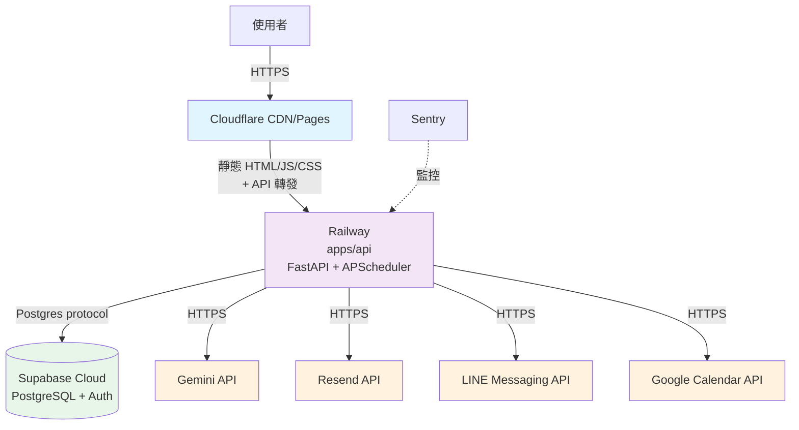

# 部署與維運指南 — Synergy AI Closer's Copilot

> **版本:** v3.0 | **更新:** 2026-05-08 | **對應架構：** `docs/04_architecture.md §5` | **對應決策：** ADR-013（Cloudflare Pages）

---

## 1. 部署拓撲



**v3.0 變更（ADR-013）**：
- Vercel（Next.js 專優化） → **Cloudflare Pages**（Vite 純靜態）
- 原因：無 SSR 需求、Vite 產出 static 最佳化、Cloudflare Pages 成本低且 CDN 最快

---

## 2. 環境矩陣

| 環境 | 用途 | Frontend URL | Backend URL | 資料 | 部署觸發 |
| :--- | :--- | :--- | :--- | :--- | :--- |
| **local** | 開發 | localhost:5173（Vite） | localhost:8000 | Supabase local 或 staging | `pnpm dev` + `uv run uvicorn` |
| **staging** | 內部驗證 | staging.synergy-ai.tw | api-staging.synergy-ai.tw | Supabase staging project | push to `main` |
| **production** | Pilot 教練 | app.synergy-ai.tw | api.synergy-ai.tw | Supabase Pro | Git tag `v*.*.*` |

---

## 3. CI/CD Pipeline

### 3.1 Local 開發（Vite）

**啟動前端開發伺服器**：
```bash
cd apps/web
pnpm install  # 或 npm install / bun install，依 .claude/taskmaster-data/package-manager.json
pnpm dev      # Vite dev server 監聽 localhost:5173
```

**啟動後端開發伺服器**：
```bash
cd apps/api
uv sync       # 初次或更新依賴
uv run uvicorn src.main:app --reload --port 8000
```

**環境檔**（`.env.local`）：
```bash
# apps/web/.env.local
VITE_API_BASE_URL=http://localhost:8000
VITE_SUPABASE_URL=https://xxxx.supabase.co
VITE_SUPABASE_ANON_KEY=eyJxx...

# apps/api/.env
SUPABASE_URL=https://xxxx.supabase.co
SUPABASE_KEY=eyJxx...（service role）
LLM_API_KEY=sk-xxxx（Gemini）
LINE_CHANNEL_ACCESS_TOKEN=xxxx
RESEND_API_KEY=xxxx
GOOGLE_CALENDAR_CLIENT_ID=xxxx
SENTRY_DSN=xxxx（可選）
```

### 3.2 PR 檢查流程（`.github/workflows/pr.yml`）

```yaml
name: PR Checks
on: pull_request

jobs:
  frontend:
    runs-on: ubuntu-latest
    steps:
      - uses: actions/checkout@v4
      - uses: oven-sh/setup-bun@v1  # 或 pnpm/action-setup，依 PM 設定
      - run: bun install --frozen-lockfile  # 對應 PM
      - run: bun run --cwd apps/web lint
      - run: bun run --cwd apps/web typecheck
      - run: bun run --cwd apps/web test
      - run: bun run --cwd apps/web build

  backend:
    runs-on: ubuntu-latest
    steps:
      - uses: actions/checkout@v4
      - uses: astral-sh/setup-uv@v3
      - run: uv sync --directory apps/api
      - run: uv run --directory apps/api ruff check
      - run: uv run --directory apps/api mypy src
      - run: uv run --directory apps/api pytest --cov --cov-fail-under=80

  security:
    runs-on: ubuntu-latest
    steps:
      - uses: actions/checkout@v4
      - uses: gitleaks/gitleaks-action@v2
      - run: bun audit  # 對應 PM
      - run: uv run --directory apps/api pip-audit
```

### 3.3 Merge to main（Staging 部署）

**Staging 環境自動部署到** `staging.synergy-ai.tw`：

1. **前端（Cloudflare Pages for Staging）**：
   - 設定 Cloudflare Pages project 監聽 `main` branch
   - Build 指令：`cd apps/web && pnpm build`（對應 PM）
   - Output directory：`apps/web/dist`
   - 環境變數：
     ```
     VITE_API_BASE_URL=https://api-staging.synergy-ai.tw
     VITE_SUPABASE_URL=https://xxxx.supabase.co
     VITE_SUPABASE_ANON_KEY=<Secret>
     ```

2. **後端（Railway Staging）**：
   - Railway project 監聽 `apps/api` 路徑變更
   - 自動部署到 staging service
   - 環境變數在 Railway dashboard 設定（所有 `SUPABASE_*`、`LLM_API_KEY` 等）

3. **資料庫遷移（手動）**：
   ```bash
   ./scripts/migrate.sh staging
   # 或手動在 Supabase dashboard 執行 SQL
   ```

### 3.4 Tag v* → Production（`.github/workflows/deploy-prod.yml`）

```yaml
name: Production Deploy
on:
  push:
    tags: ['v*.*.*']

jobs:
  deploy-frontend:
    runs-on: ubuntu-latest
    steps:
      - uses: actions/checkout@v4
      - name: Deploy to Cloudflare Pages
        run: |
          cd apps/web
          bun install --frozen-lockfile
          bun run build
          # 使用 wrangler CLI 部署到 Cloudflare Pages（需 API token）
          npx wrangler pages deploy dist \
            --project-name=synergy-web \
            --branch=main

  deploy-backend:
    runs-on: ubuntu-latest
    steps:
      - uses: actions/checkout@v4
      - name: Deploy to Railway Production
        run: |
          # Railway CLI 部署
          railway up \
            --service apps/api \
            --environment production

  migrate-db:
    needs: deploy-backend
    runs-on: ubuntu-latest
    steps:
      - uses: actions/checkout@v4
      - name: Run migrations
        run: ./scripts/migrate.sh production
        env:
          SUPABASE_KEY: ${{ secrets.SUPABASE_SERVICE_KEY }}
```

---

## 4. 部署平台詳述

### 4.1 Cloudflare Pages（前端 — v3.0 新增）

**為什麼選 Cloudflare Pages（ADR-013）**：
- Vite 產出純靜態檔案 → Pages 秒級部署
- CDN 全球加速，延遲最低
- Pricing：月費 0 NTD（無商用限制）
- API 轉發至後端（ `/api/*` proxy 到 Railway）

**設定步驟**：
1. 連結 GitHub repo（Cloudflare → Pages → Connect Git）
2. 選擇 `main` branch
3. Build 設定：
   - Framework：自訂
   - Build command：`cd apps/web && bun run build`
   - Build output directory：`apps/web/dist`
   - Root directory：`/`（不用改）
4. 環境變數設定在 Pages 設定面板
5. 自訂域名指向 Cloudflare Pages（DNS）

**自訂域名（DNS）**：
```
app.synergy-ai.tw  CNAME → synergy-web.pages.dev
```

**API 轉發設定**（`wrangler.toml` 在 Cloudflare Pages 側）：
```toml
# 內部設定，或使用 Cloudflare Workers 作 proxy
routes = [
  { pattern = "app.synergy-ai.tw/api/*", zone_name = "synergy-ai.tw" }
]
```

或用 Cloudflare Workers 轉發（更簡單）：
```javascript
export default {
  async fetch(request) {
    const url = new URL(request.url);
    if (url.pathname.startsWith('/api/')) {
      url.hostname = 'api.synergy-ai.tw';  // 後端 Railway
      return fetch(new Request(url, request));
    }
    // 其他請求走 Pages
    return fetch(request);
  }
};
```

### 4.2 Railway（後端）

**FastAPI + APScheduler 部署**：

1. 連結 GitHub repo（Railway dashboard）
2. 選擇 `apps/api` 目錄作為 root
3. Railway 自動偵測 `pyproject.toml`，設定為 Python project
4. 啟動指令：`uvicorn src.main:app --host 0.0.0.0 --port $PORT`
   - Railway 提供 `$PORT` 環境變數
5. 環境變數：設定所有 `SUPABASE_*`、`LLM_API_KEY` 等
6. PostgreSQL 可選（用 Supabase，不需要 Railway DB）

**域名**：
```
api.synergy-ai.tw  CNAME → xxx.railway.app
```

或用 Railway 內置域名：`api-prod.up.railway.app`

### 4.3 Supabase（資料庫 + Auth）

**現有設定保持不變**（ADR-003）：
- Free tier 或 Pro tier
- PostgreSQL + pgvector + Auth
- RLS policy（已寫好，MVP 不啟用）

**環境變數（後端）**：
```bash
SUPABASE_URL=https://xxxx.supabase.co
SUPABASE_KEY=eyJ... (service role key)
```

**環境變數（前端）**：
```bash
VITE_SUPABASE_URL=https://xxxx.supabase.co
VITE_SUPABASE_ANON_KEY=eyJ... (anon key)
```

---

## 5. 環境變數清單（v3.0 Vite 更新）

### 前端（`apps/web`）

| 變數名 | 值範例 | 用途 | 環境 |
| :--- | :--- | :--- | :--- |
| `VITE_API_BASE_URL` | http://localhost:8000 | 後端 API 位置 | all |
| `VITE_SUPABASE_URL` | https://xxxx.supabase.co | Supabase 專案 URL | all |
| `VITE_SUPABASE_ANON_KEY` | eyJ... | Supabase anon key（Secret） | all |
| `VITE_COMPLIANCE_MAX_RETRIES` | 3 | 合規檢查重試次數 | all |

### 後端（`apps/api`）

| 變數名 | 值範例 | 用途 | 環境 |
| :--- | :--- | :--- | :--- |
| `SUPABASE_URL` | https://xxxx.supabase.co | Supabase 專案 URL | all |
| `SUPABASE_KEY` | eyJ... | Supabase service role key（Secret） | all |
| `LLM_API_KEY` | sk-... | Gemini API key（Secret） | all |
| `LINE_CHANNEL_ACCESS_TOKEN` | U+xxxx | LINE OA token（Secret） | all |
| `RESEND_API_KEY` | re_xxxx | Resend API key（Secret） | all |
| `GOOGLE_CALENDAR_CLIENT_ID` | xxxx.apps.googleusercontent.com | OAuth client ID | all |
| `GOOGLE_CALENDAR_CLIENT_SECRET` | xxxx | OAuth secret（Secret） | all |
| `SENTRY_DSN` | https://xxxx@xxxx.ingest.sentry.io/yyyy | 錯誤追蹤（可選） | staging / prod |
| `ENVIRONMENT` | development / staging / production | 執行環境標識 | all |
| `LOG_LEVEL` | DEBUG / INFO / WARNING | 日誌等級 | all |

---

## 6. 監控與告警

### 6.1 Sentry（錯誤追蹤）

**後端集成**：
```python
import sentry_sdk
sentry_sdk.init(
    dsn=os.getenv("SENTRY_DSN"),
    environment=os.getenv("ENVIRONMENT"),
    traces_sample_rate=0.1
)
```

**前端集成**（react-sentry）：
```tsx
import * as Sentry from "@sentry/react";
Sentry.init({
  dsn: import.meta.env.VITE_SENTRY_DSN,
  environment: import.meta.env.MODE,
  tracesSampleRate: 0.1
});
```

### 6.2 重要指標監控

| 指標 | 目標 | 監控位置 |
| :--- | :--- | :--- |
| `compliance_check_p95_latency` | ≤ 5s | APScheduler / Sentry |
| `hitl_queue_depth` | ≤ 10 items | API endpoint + dashboard |
| `auto_pass_rate` | > 80% | ComplianceLog 統計 |
| `api_error_rate` | < 1% | Sentry / Railway metrics |
| `db_connection_pool` | ≥ 5 available | Supabase monitoring |

### 6.3 告警規則

- API error rate > 5% → 30 min 內告警
- Compliance latency p95 > 5s → 1 hour 內改善
- Database storage > 80% quota → 立即告警

---

## 7. 回滾策略

### 前端回滾（Cloudflare Pages）

1. 在 Cloudflare Pages 設定面板選擇「Deployments」
2. 選擇之前的正常版本，點「Rollback」
3. 自動 rollback 至該 commit

### 後端回滾（Railway）

1. 在 Railway dashboard 點「Deployments」
2. 選擇之前的正常版本，點「Redeploy」

### 資料庫回滾（Supabase）

1. 檢查 migration 歷史（`src/infrastructure/db/migrations/`）
2. 確認回滾 SQL（已附加 `-- ROLLBACK:` 註解）
3. 在 Supabase SQL editor 手動執行或用 CLI：
   ```bash
   supabase migration down
   ```

---

## 8. 維運檢查清單

### 部署前（Release 前）

- [ ] Staging 環境完全測試通過
- [ ] 所有 migration 檔已編寫並在 staging 測試
- [ ] 環境變數已在 prod 設定（不含默認值）
- [ ] Sentry project 已建立
- [ ] LINE OA 帳號已審核通過（若需要）
- [ ] Google Calendar OAuth 已授權
- [ ] 資料庫備份已排程（Supabase 自動，檢查確認）

### 部署後（Release 後）

- [ ] 前端 static files 已在 CDN 快取（Cloudflare）
- [ ] 後端服務正常啟動（Railway）
- [ ] Database migrations 已執行
- [ ] SEO meta tags 可正確渲染（react-helmet）
- [ ] LINE 提醒、Email、Google Calendar 整合可用
- [ ] 完整端到端流程（問卷 → 摘要 → 提醒 → HITL 審核）

### 每週維運檢查

- [ ] 監控儀表板無告警
- [ ] Sentry 錯誤率 < 1%
- [ ] 合規檢查 latency p95 < 5s
- [ ] HITL 隊列深度 < 10
- [ ] 資料庫存儲 < 80% quota
- [ ] 教練反饋無重大 BUG 回報

---

## 9. Scaling 規劃（Phase 2）

### 前端 Scaling

- Vite 產出靜態檔案 → 無狀態，Cloudflare CDN 原生支援
- 預期支援 10,000+ 併發用戶無問題

### 後端 Scaling

1. **單機 APScheduler → Celery（Redis）**（若 reminder 量 > 1,000/hr）
2. **FastAPI 單機 → Railway auto-scaling**（可配置 max instances）
3. **資料庫 → Supabase Pro tier + read replicas**（若 QPS > 100）

### 部署調整

- 前端：無變（Cloudflare CDN 自動）
- 後端：Railway 設定 auto-scaling rules
- DB：Supabase 升級 tier（成本線性）

---

## 10. 安全設定（Deployment 層）

- [ ] HTTPS everywhere（Cloudflare / Railway 原生）
- [ ] 環境變數絕不簽入 git（`.env` 在 `.gitignore`）
- [ ] Supabase RLS policy 預留但未啟用（Phase 2）
- [ ] API rate limiting 已設（每 IP 100 req/min）
- [ ] CORS 已限制（只允許 `https://app.synergy-ai.tw`）
- [ ] Database backup 每日自動（Supabase 內置）

---

## v3.0 部署變更總結（ADR-013）

| 項目 | v2.0（Next.js） | v3.0（React+Vite） |
| :--- | :--- | :--- |
| **部署平台** | Vercel | Cloudflare Pages |
| **Build 指令** | `next build` | `vite build` |
| **輸出格式** | SSR 伺服器 | 純靜態 HTML/JS/CSS |
| **Node.js 需求** | 運行時必需 | 建置時只需 |
| **啟動時間** | ~3-5s | <1s（無 build） |
| **環境變數** | `NEXT_PUBLIC_*` | `VITE_*` |
| **SEO 處理** | next/head | react-helmet-async |
| **Auth Middleware** | middleware.ts | ProtectedRoute HOC |
| **成本** | $15-25/月（Vercel） | $0/月 + Railway $5/月 |
